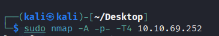
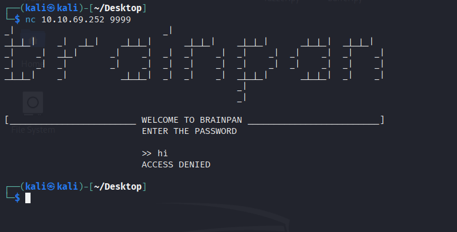
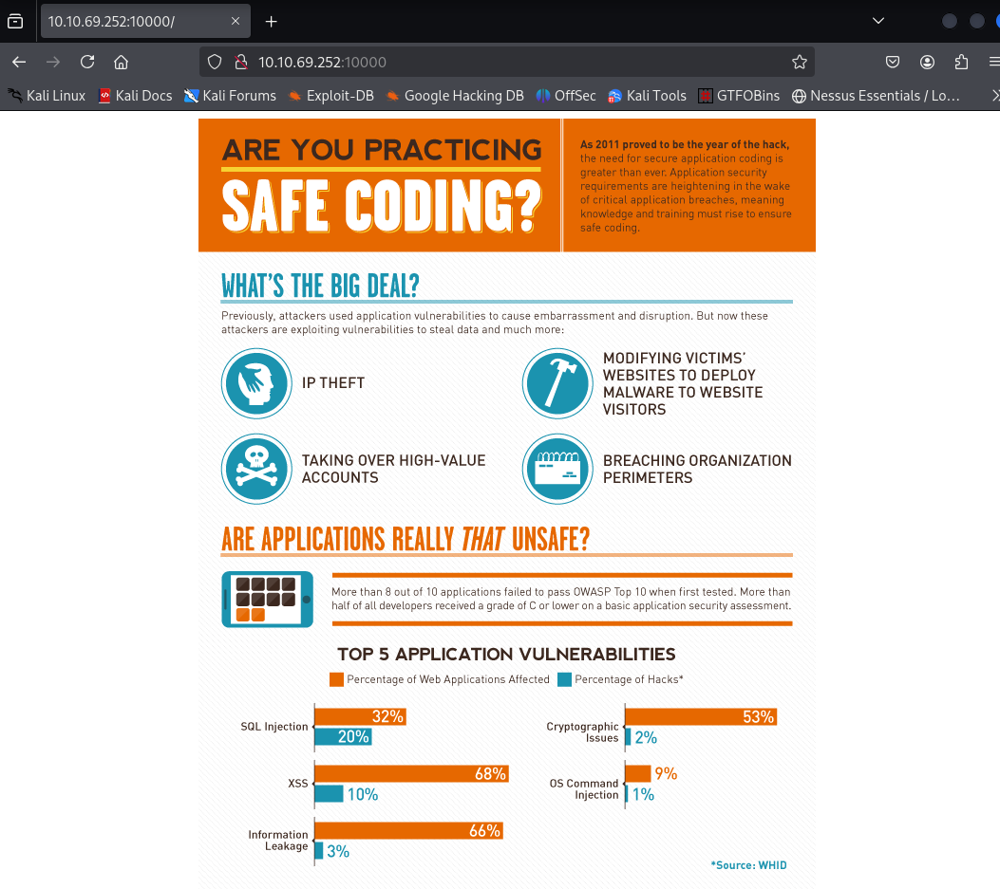
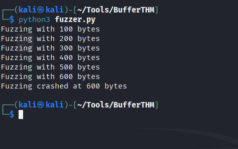
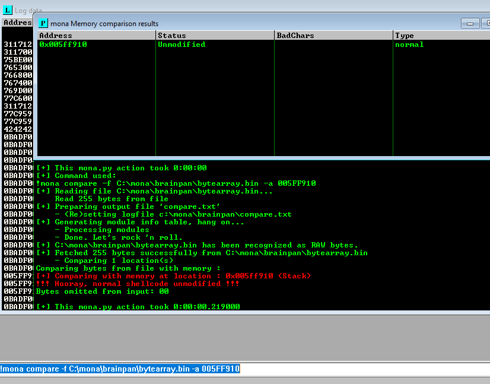
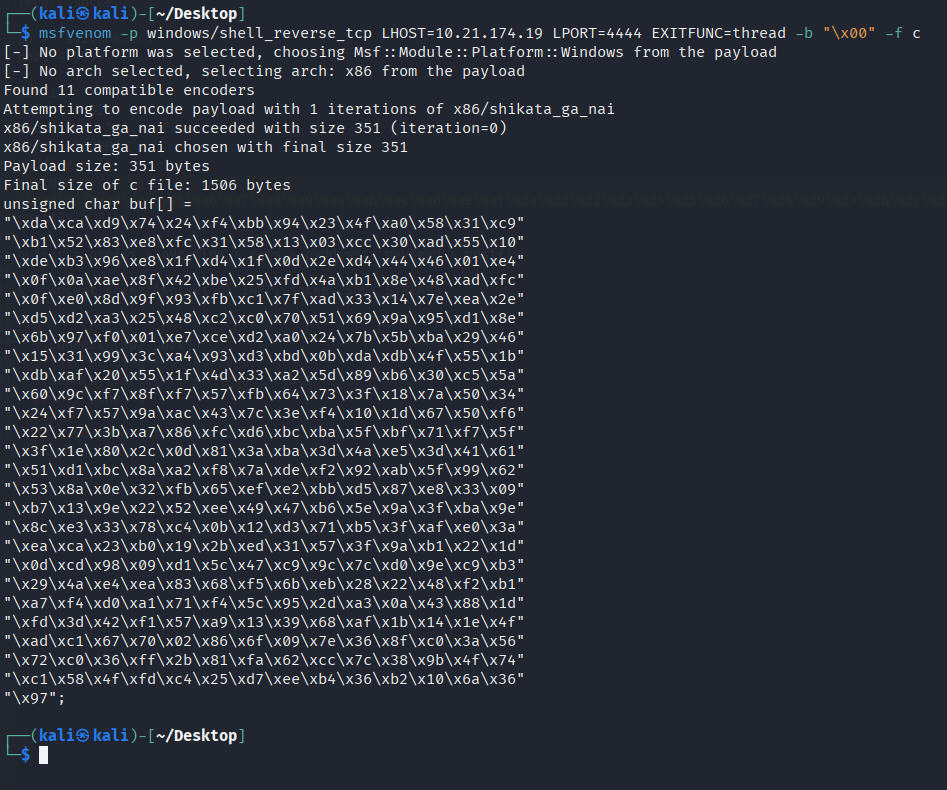
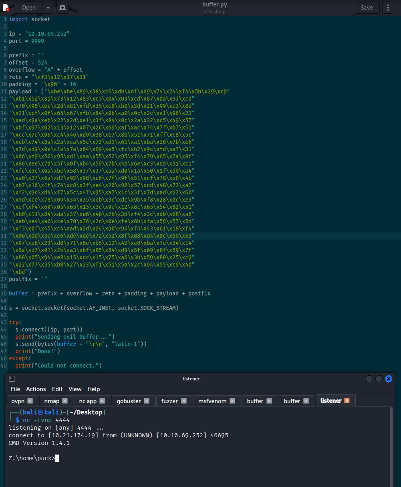
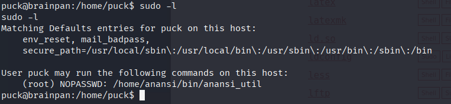
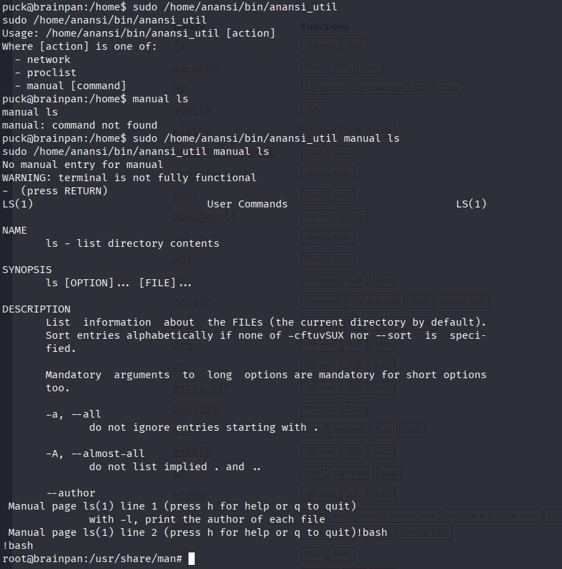

Reverse engineer a Windows executable, find a buffer overflow and exploit it on a Linux machine.

## **Deploy and compromise the machine**

Brainpan is perfect for OSCP practice and has been highly recommended to complete before the exam. Exploit a buffer overflow vulnerability by analyzing a Windows _exe_cutable on a Linux machine. If you get stuck on this machine, don't give up (or look at writeups), just try harder. 

  
All credit to [superkojiman](https://www.vulnhub.com/entry/brainpan-1,51/) - This machine is used here with the explicit permission of the creator <3

###### Answer the questions below

Deploy the machine.

Gain initial access

Escalate your privileges to root.

