## **Deploy the vulnerable machine**

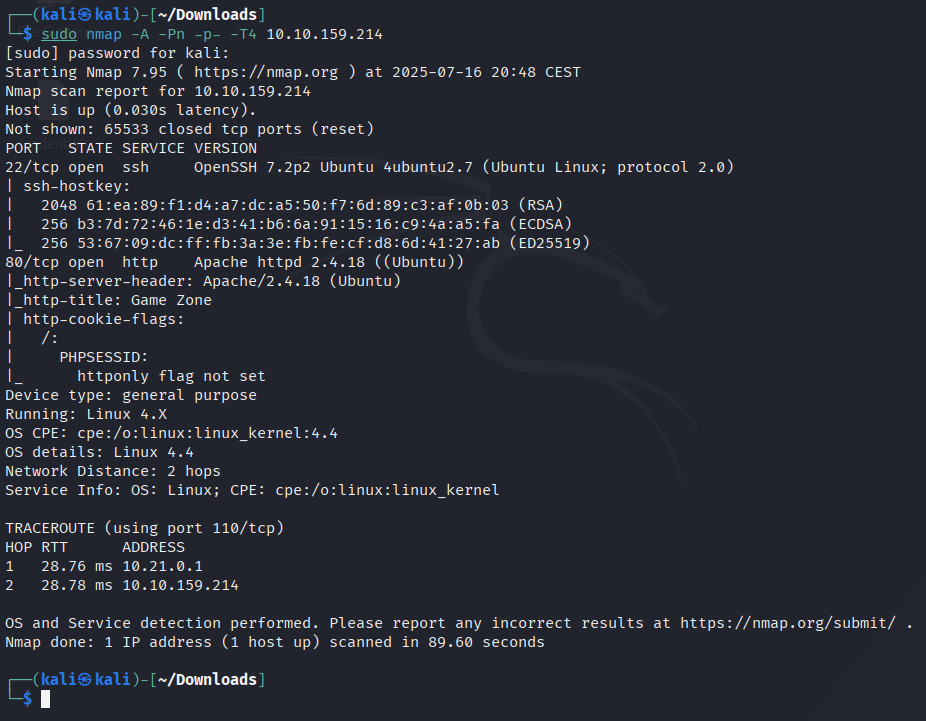
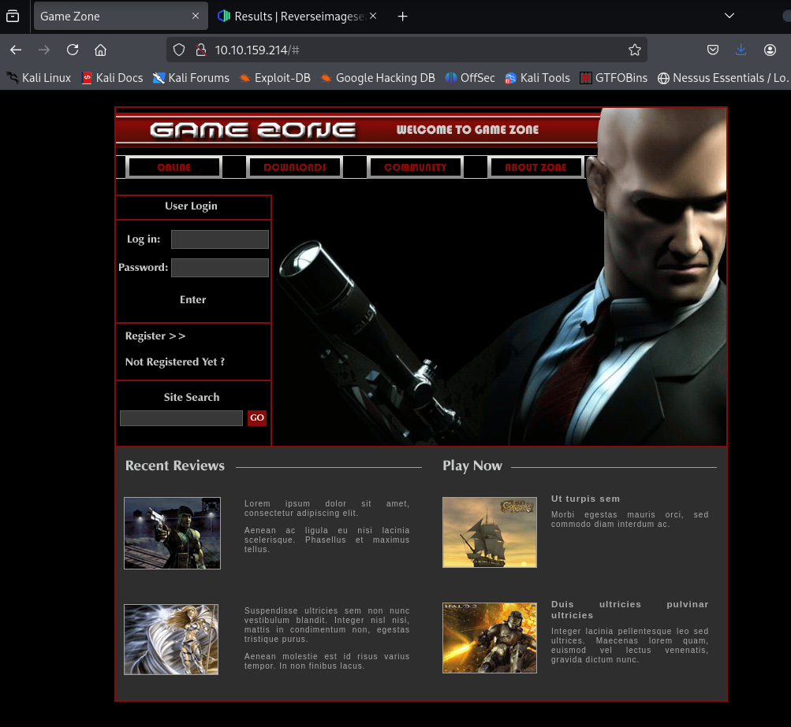

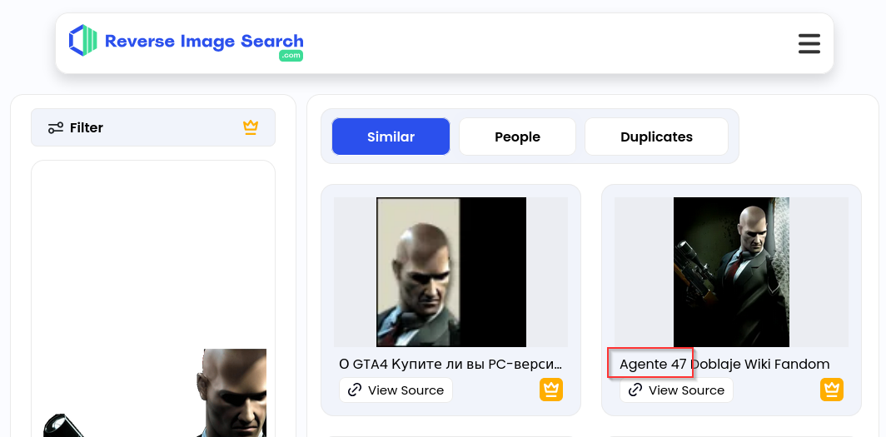

## **Obatin access via SQLi**

**SELECT * FROM users WHERE username = :username AND password := password**

In our GameZone machine, when you attempt to login, it will take your inputted values from your username and password, then insert them directly into the query above. If the query finds data, you'll be allowed to login otherwise it will display an error message.

Here is a potential place of vulnerability, as you can input your username as another SQL query. This will take the query write, place and execute it.

Lets use what we've learnt above, to manipulate the query and login without any legitimate credentials.

If we have our username as admin and our password as: **' or 1=1 -- -** it will insert this into the query and authenticate our session.

The SQL query that now gets executed on the web server is as follows:

**SELECT * FROM users WHERE username = admin AND password := ' or 1=1 -- -**

The extra SQL we inputted as our password has changed the above query to break the initial query and proceed (with the admin user) if 1==1, then comment the rest of the query to stop it breaking.

GameZone doesn't have an admin user in the database, however you can still login without knowing any credentials using the inputted password data shown above.

Use ' or 1=1 -- - as your username and leave the password blank.

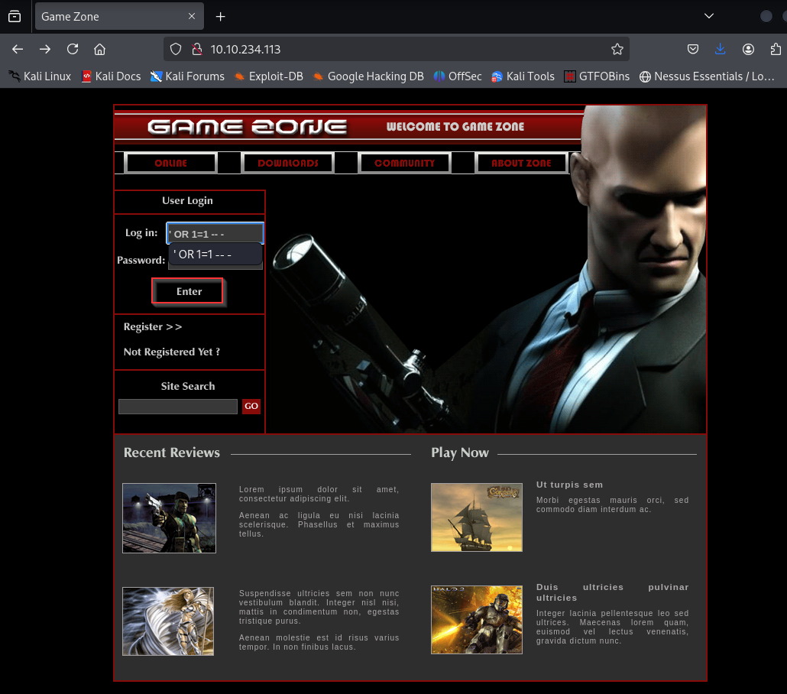

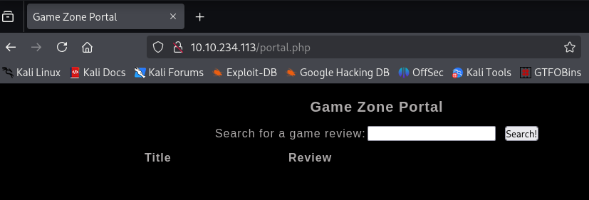

## **Using SQLMap**

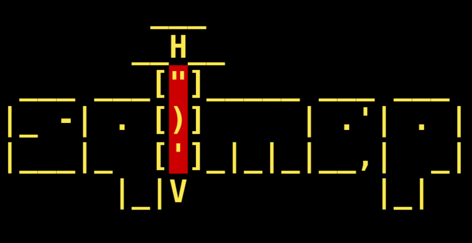

We're going to use SQLMap to dump the entire database for GameZone.

Using the page we logged into earlier, we're going point SQLMap to the game review search feature.  

First we need to intercept a request made to the search feature using [BurpSuite](https://tryhackme.com/room/learnburp).

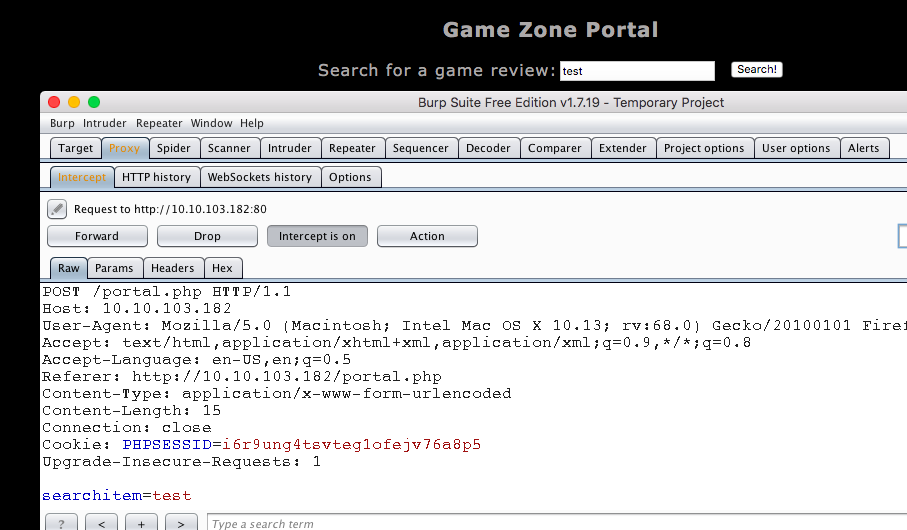

Save this request into a text file. We can then pass this into SQLMap to use our authenticated user session.

**-r** uses the intercepted request you saved earlier  
**--dbms** tells SQLMap what type of database management system it is  
**--dump** attempts to outputs the entire database

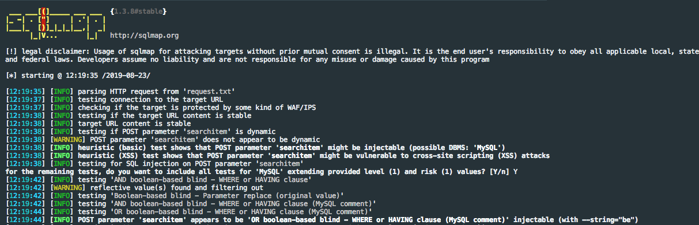

SQLMap will now try different methods and identify the one thats vulnerable. Eventually, it will output the database.

ab5db915fc9cea6c78df88106c6500c57f2b52901ca6c0c6218f04122c3efd14

agent47

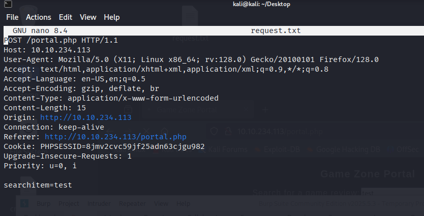
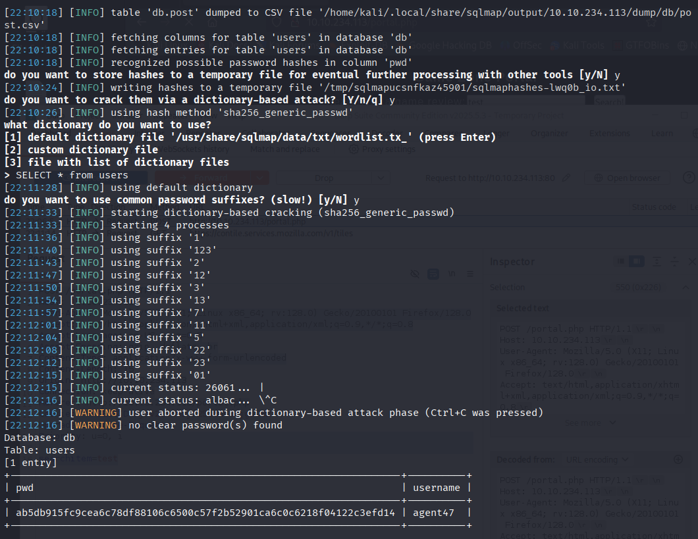

## **Cracking a password with JohnTheRipper**

We will use this program to crack the hash we obtained earlier. JohnTheRipper is 15 years old and other programs such as HashCat are one of several other cracking programs out there. 

Once you have JohnTheRipper installed you can run it against your hash using the following arguments:

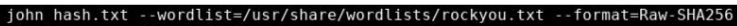

hash.txt - contains a list of your hashes (in your case its just 1 hash)  
--wordlist - is the wordlist you're using to find the dehashed value  
--format - is the hashing algorithm used. In our case its hashed using SHA256.

videogamer124

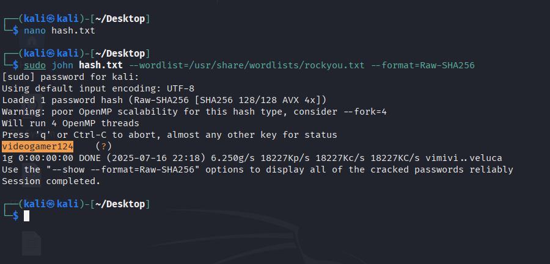

Now you have a password and username. Try SSH'ing onto the machine.

649ac17b1480ac13ef1e4fa579dac95c

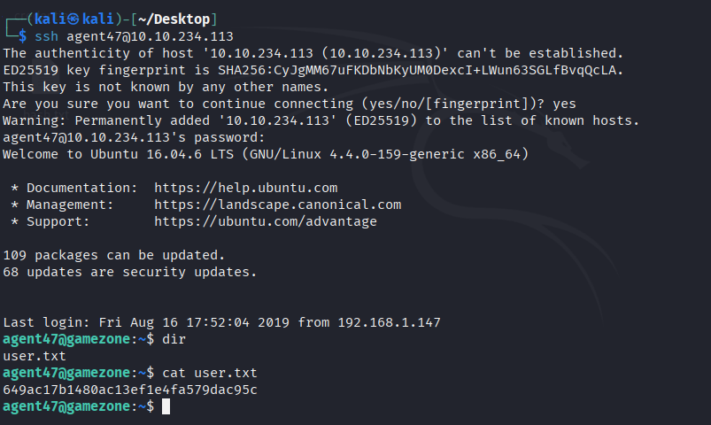

## **Exposing services with reverse SSH tunnels**

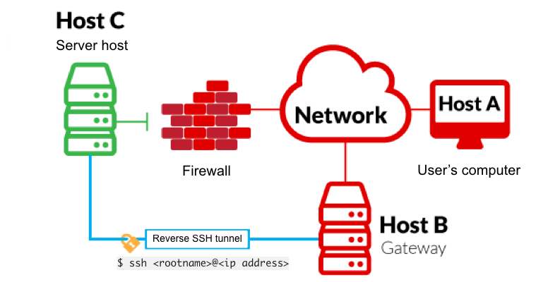

**-L** is a local tunnel (YOU <-- CLIENT). If a site was blocked, you can forward the traffic to a server you own and view it. For example, if imgur was blocked at work, you can do **ssh -L 9000:imgur.com:80 user@example.com.** Going to localhost:9000 on your machine, will load imgur traffic using your other server.

**-R** is a remote tunnel (YOU --> CLIENT). You forward your traffic to the other server for others to view. Similar to the example above, but in reverse.

We will use a tool called **ss** to investigate sockets running on a host.

If we run **ss -tulpn** it will tell us what socket connections are running

|   |   |
|---|---|
|**Argument**|**Description**|
|-t|Display TCP sockets|
|-u|Display UDP sockets|
|-l|Displays only listening sockets|
|-p|Shows the process using the socket|
|-n|Doesn't resolve service names|

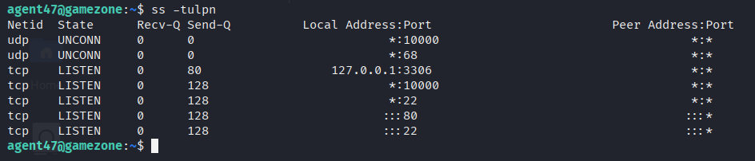

We can see that a service running on port 10000 is blocked via a firewall rule from the outside (we can see this from the IPtable list). However, Using an SSH Tunnel we can expose the port to us (locally)!

From our local machine, run `**ssh -L 10000:localhost:10000 <username>@<ip>**`

Once complete, in your browser type "localhost:10000" and you can access the newly-exposed webserver.

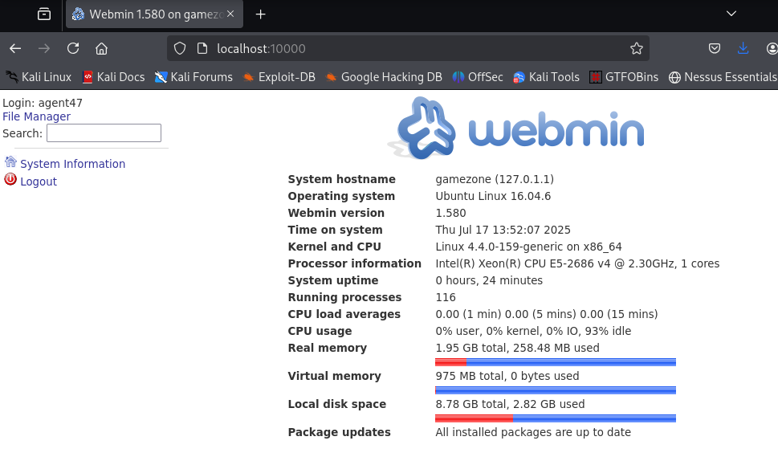

Webmin

1.580

## **Privilege Escalation with Metasploit**

Using the CMS dashboard version, use Metasploit to find a payload to execute against the machine.

a4b945830144bdd71908d12d902adeee

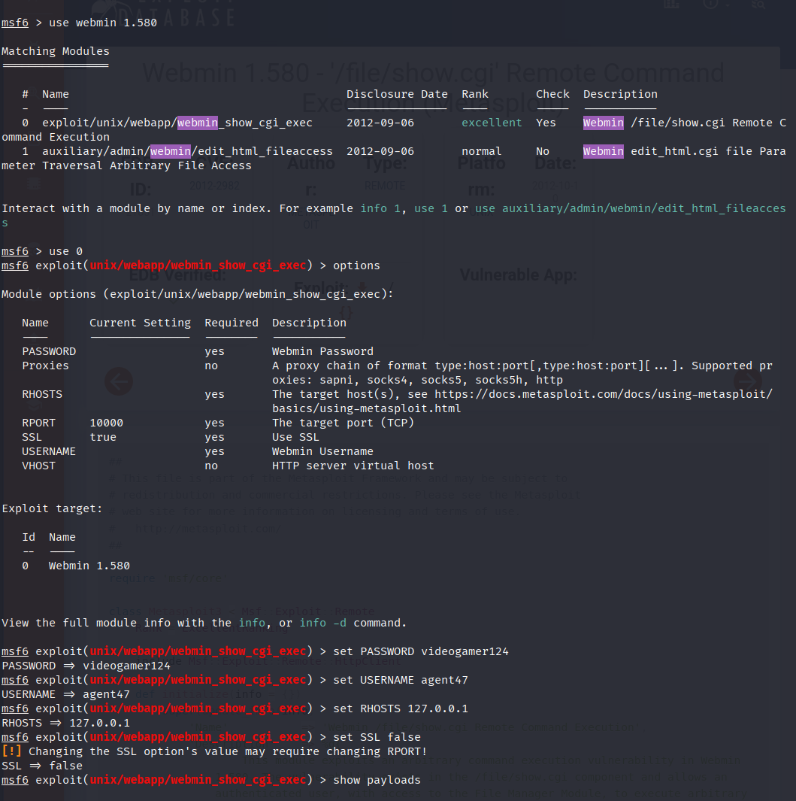
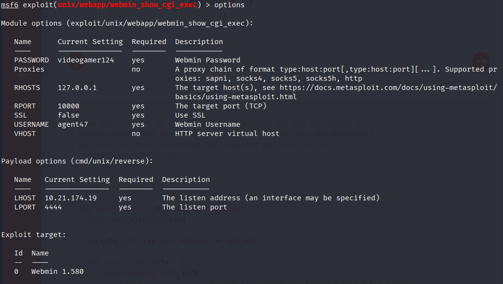
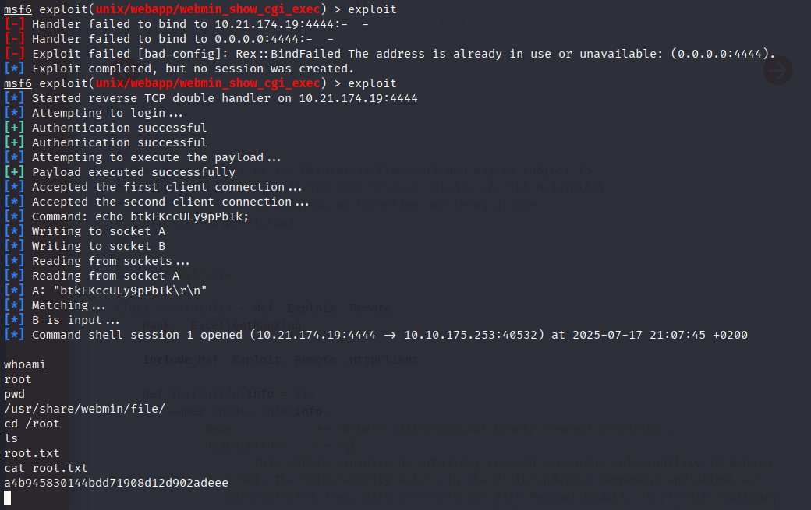

