## **Deploy the vulnerable machine**

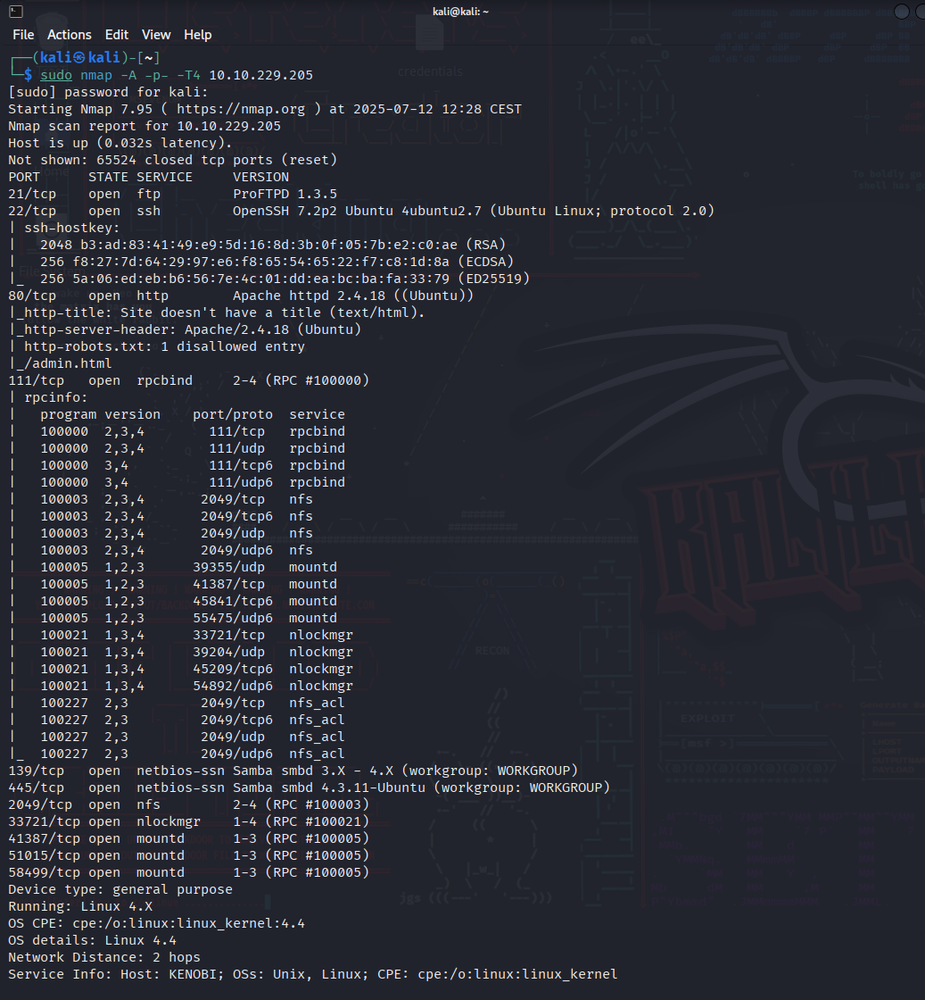

## **Enumerating Samba for shares**

Using nmap we can enumerate a machine for SMB shares.

```
nmap -p 445 --script=smb-enum-shares.nse,smb-enum-users.nse 10.10.229.205
```

SMB has two ports, 445 and 139.

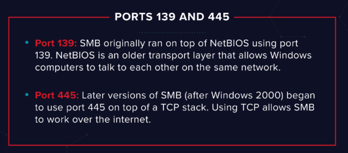

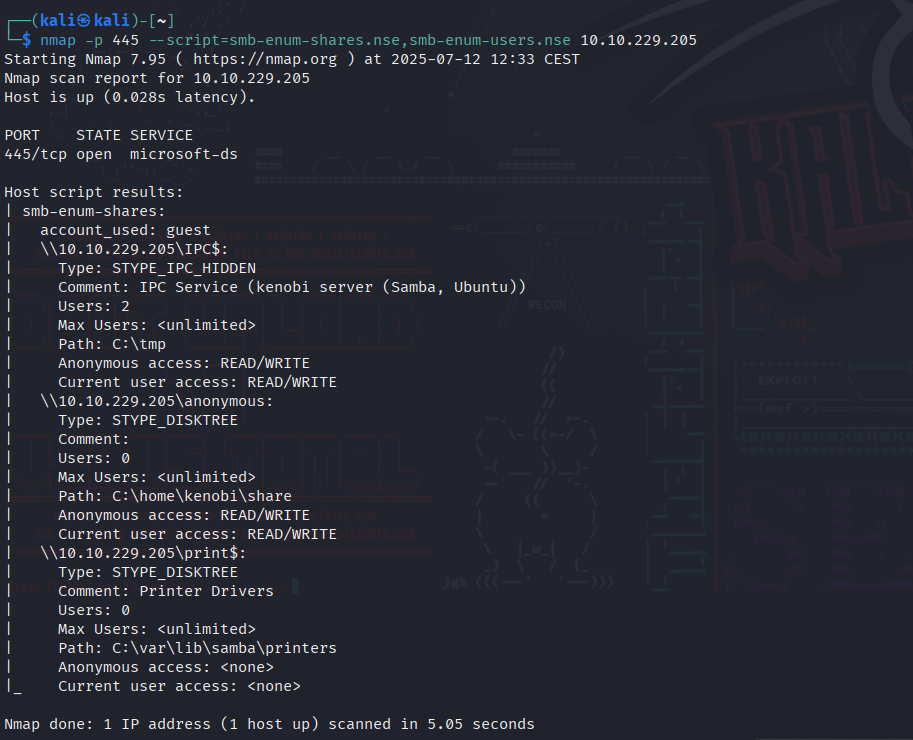

On most distributions of Linux smbclient is already installed. Lets inspect one of the shares.

```
smbclient //10.10.229.205/anonymous
```

Using your machine, connect to the machines network share.

log.txt

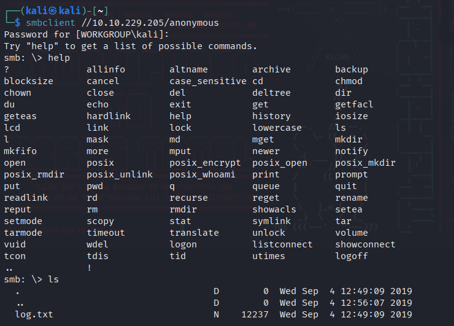

You can recursively download the SMB share too. Submit the username and password as nothing.

```
smbget -R smb://10.10.229.205/anonymous
```

Open the file on the share. There is a few interesting things found.

- Information generated for Kenobi when generating an SSH key for the user
- Information about the ProFTPD server.

21
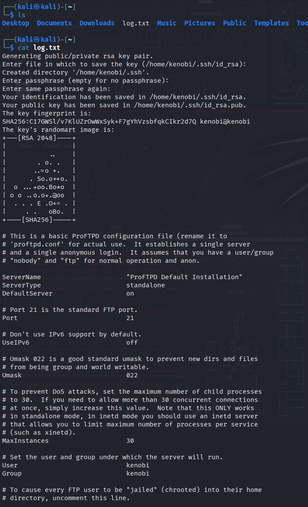

In our case, port 111 is access to a network file system. Lets use nmap to enumerate this.

```
nmap -p 111 --script=nfs-ls,nfs-statfs,nfs-showmount 10.10.229.205
```

/var
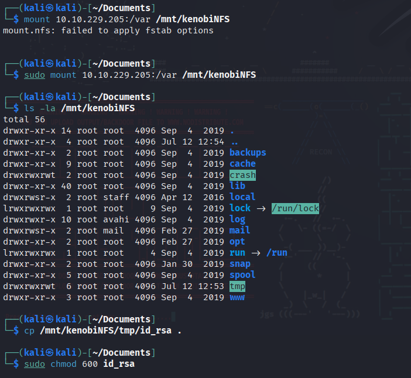

## **Gain initial access with ProFtpd**

Lets get the version of ProFtpd. Use netcat to connect to the machine on the FTP port.

1.3.5

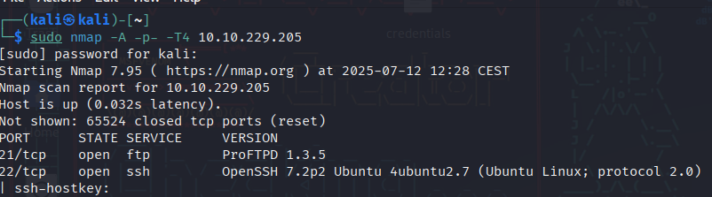

We can use searchsploit to find exploits for a particular software version.

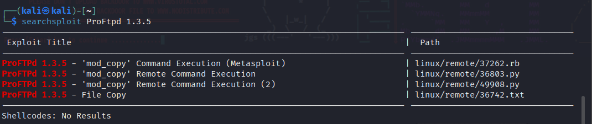

You should have found an exploit from ProFtpd's [mod_copy module](http://www.proftpd.org/docs/contrib/mod_copy.html). 

The mod_copy module implements **SITE CPFR** and **SITE CPTO** commands, which can be used to copy files/directories from one place to another on the server. Any unauthenticated client can leverage these commands to copy files from any part of the filesystem to a chosen destination.

We know that the FTP service is running as the Kenobi user (from the file on the share) and an ssh key is generated for that user.

We're now going to copy Kenobi's private key using SITE CPFR and SITE CPTO commands.

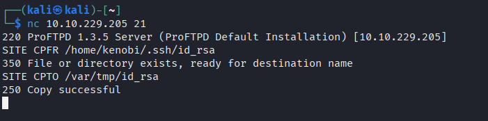

We knew that the /var directory was a mount we could see. So we've now moved Kenobi's private key to the /var/tmp directory.

Lets mount the /var/tmp directory to our machine

```
mkdir /mnt/kenobiNFS  
mount 10.10.229.205:/var /mnt/kenobiNFS  
ls -la /mnt/kenobiNFS
```


We now have a network mount on our deployed machine! We can go to /var/tmp and get the private key then login to Kenobi's account.

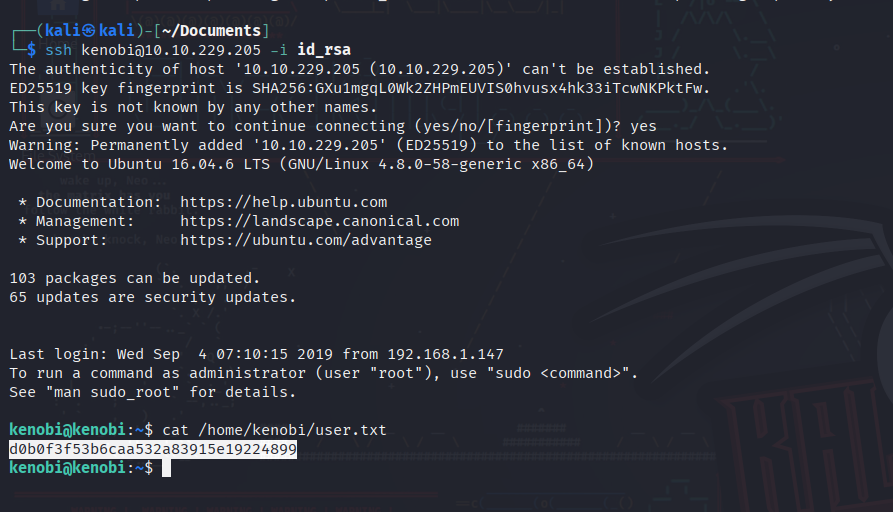

d0b0f3f53b6caa532a83915e19224899

## **Privilege Escalation with Path Variable Manipulation**

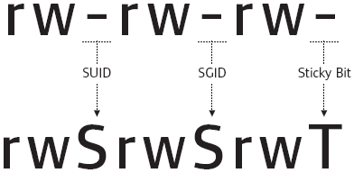

To search the a system for these type of files run the following: find / -perm -u=s -type f 2>/dev/null

/usr/bin/menu

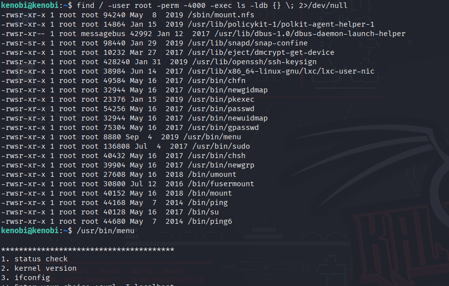

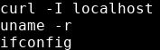

This shows us the binary is running without a full path (e.g. not using /usr/bin/curl or /usr/bin/uname).

As this file runs as the root users privileges, we can manipulate our path gain a root shell.

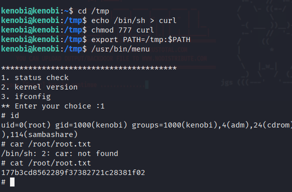

We copied the /bin/sh shell, called it curl, gave it the correct permissions and then put its location in our path. This meant that when the /usr/bin/menu binary was run, its using our path variable to find the "curl" binary.. Which is actually a version of /usr/sh, as well as this file being run as root it runs our shell as root!

177b3cd8562289f37382721c28381f02

