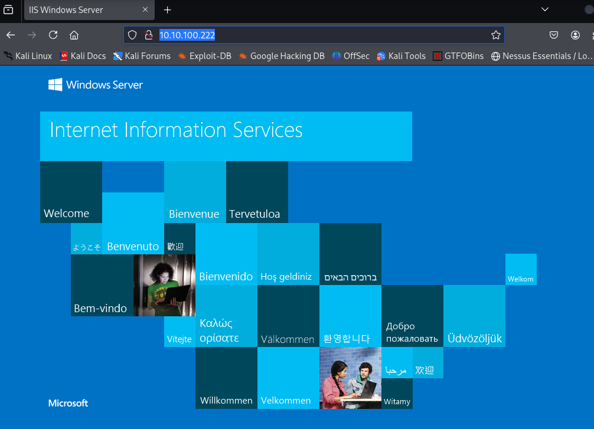
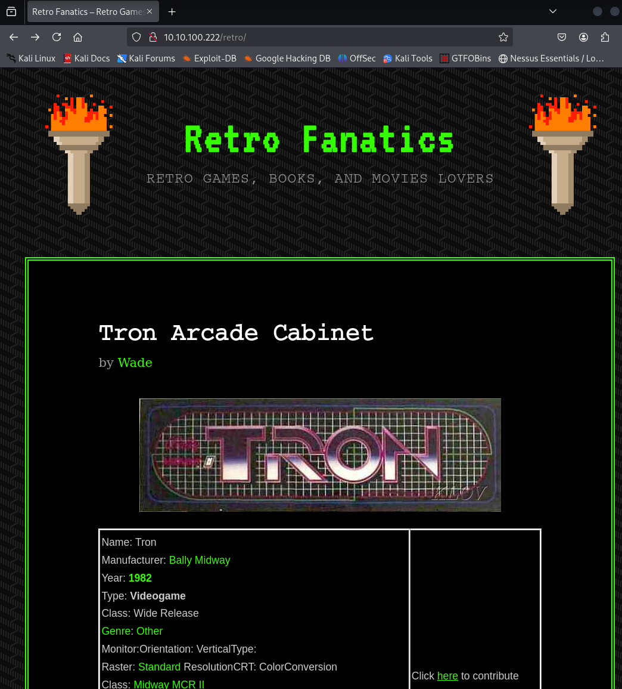
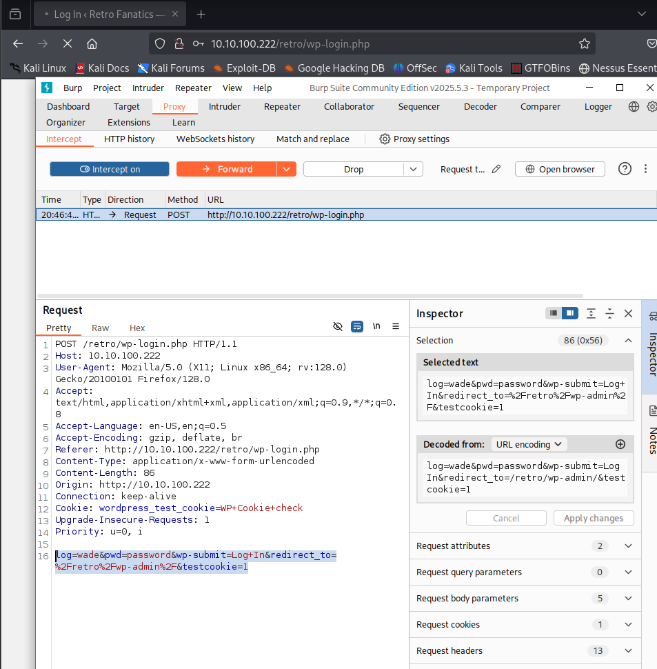
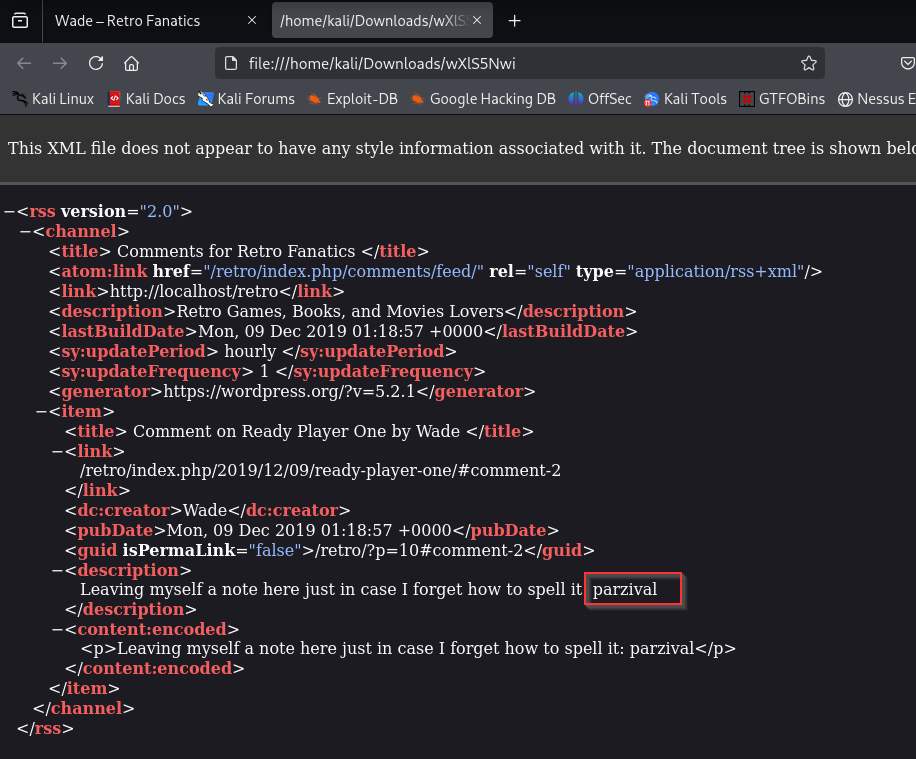
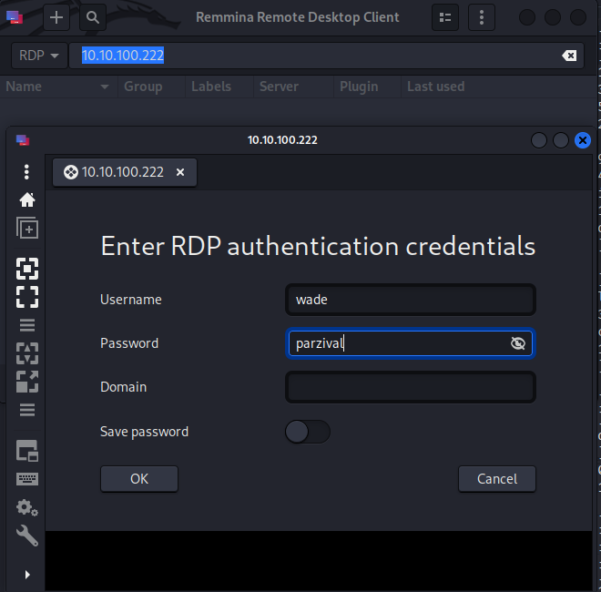

## **Pwn**

Can you time travel? If not, you might want to think about the next best thing.

Please note that this machine does not respond to ping (ICMP) and may take a few minutes to boot up.

-------------------------------------

  

_There are two distinct paths that can be taken on Retro. One requires significantly less trial and error, however, both will work. Please check writeups if you are curious regarding the two paths. An alternative version of this room is available in it's remixed version [Blaster](https://tryhackme.com/room/blaster)._

###### Answer the questions below

A web server is running on the target. What is the hidden directory which the website lives on?
/retro

user.txt
3b99fbdc6d430bfb51c72c651a261927

root.txt
7958b569565d7bd88d10c6f22d1c4063

https://github.com/jas502n/CVE-2019-1388/blob/master/CVE-2019-1388.gif

