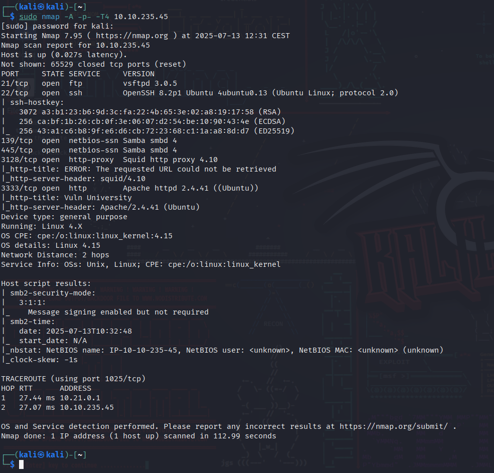
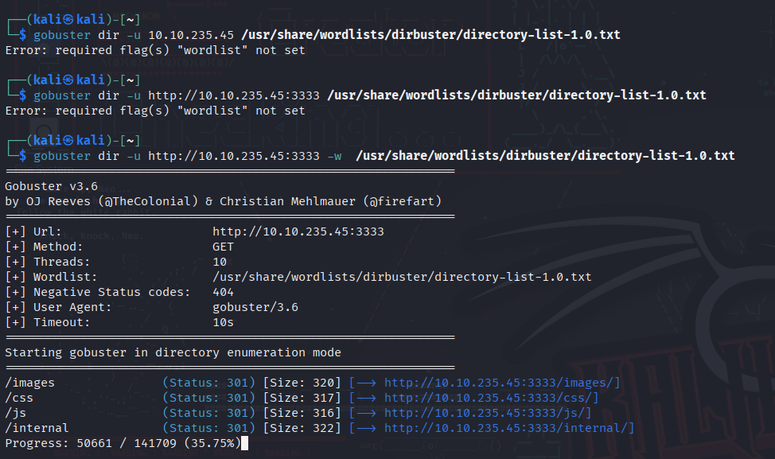
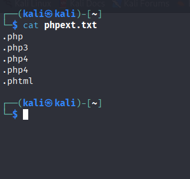
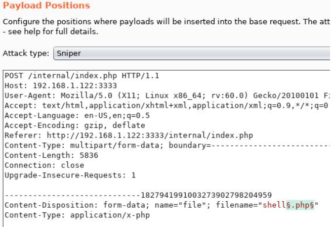
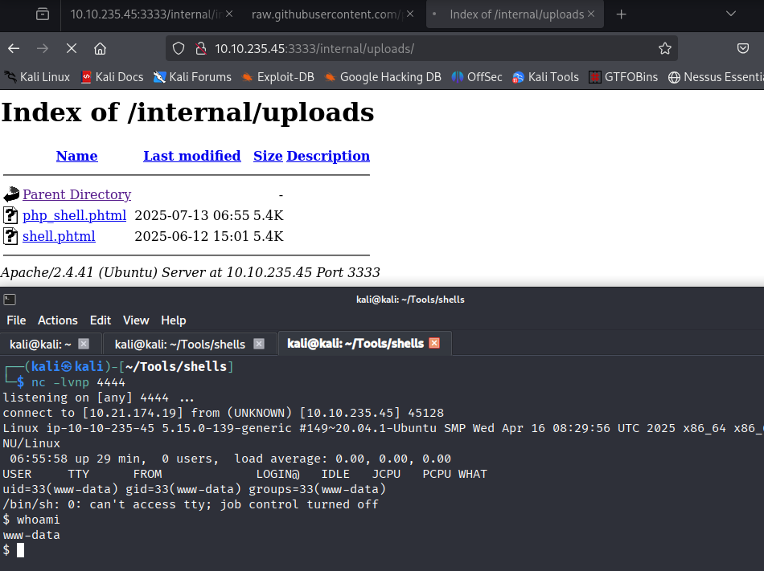
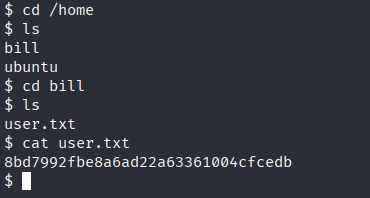
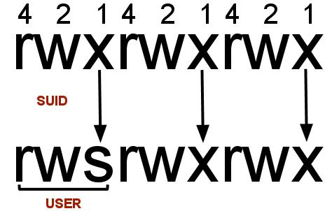
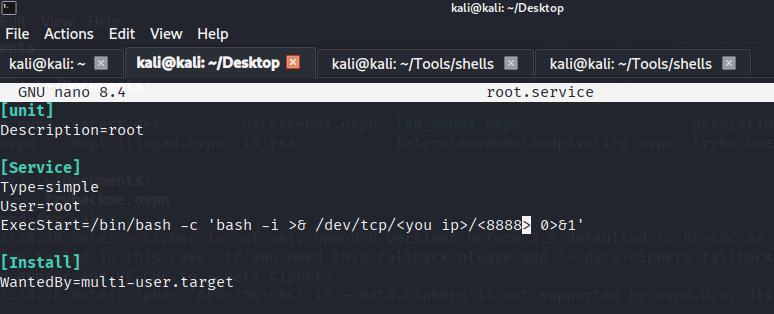

## **Reconnaissance**

## Scan the box

nmap -sV MACHINE_IP.

## **Locating directories using Gobuster**

Ran Gobuster against the web server on port 3333 to find hidden directories:

`gobuster dir -u http://10.10.235.45:3333 -w <wordlist>`

The directory with the upload form is `/internal/`.

## **Compromise the Webserver**

Now that you have found a form to upload files, we can leverage this to upload and execute our payload, which will lead to compromising the web server. We will fuzz the upload form to identify which extensions are not blocked.

Using BurpSuite

We're going to use Intruder (used for automating customised attacks). To begin, make a wordlist with the following extensions:

- .php
- .php3
- .php4
- .php5
- .phtml

Now, make sure BurpSuite is configured to intercept all your browser traffic. Upload a file. Once this request is captured, send it to the Intruder. Click on "`Payloads`" and select the "`Sniper`" attack type.

Click the "`Position`s" tab now, find the filename and "`Add §`" to the extension. It should look like this:

Now that we know what extension we can use for our payload, we can progress.

Getting a Reverse Shell

We are going to use a PHP reverse shell as our payload. A reverse shell works by being called on the remote host and forcing this host to make a connection to you. So you'll listen for incoming connections, upload and execute your shell, which will beacon out to you to control! You can download the following reverse PHP shell [here](https://github.com/pentestmonkey/php-reverse-shell/blob/master/php-reverse-shell.php).

To gain remote access to this machine, follow these steps:  

1. Edit the php-reverse-shell.php file and edit the ip to be your tun0 ip (you can get this by going to [http://10.10.10.10](http://10.10.10.10/) in the browser of your TryHackMe connected device).  
2. Rename this file to `php-reverse-shell.phtml`.  
3. We're now going to listen to incoming connections using netcat. Run the following command: `nc -lvnp 1234`.  
4. Upload your shell and navigate to `http://10.10.235.45:3333/internal/uploads/php-reverse-shell.phtml` - This will execute your payload.

You should see a connection on your Netcat session.

## **Privilege Escalation**

Now that you have compromised this machine, we will escalate our privileges and become the superuser (root).

In Linux, SUID (**set owner userId upon execution**) is a particular type of file permission given to a file. SUID gives temporary permissions to a user to run the program/file with the permission of the file owner (rather than the user who runs it).

For example, the binary file to change your password has the SUID bit set on it (`/usr/bin/passwd`). This is because to change your password, you will need to write to the shadowers file that you do not have access to. `root` does, so it has root privileges to make the right changes.

The SUID binary that stands out is `/bin/systemctl`. It can be abused to run a service as root, which gives the root flag:

`a58ff8579f0a9270368d33a9966c7fd5`

